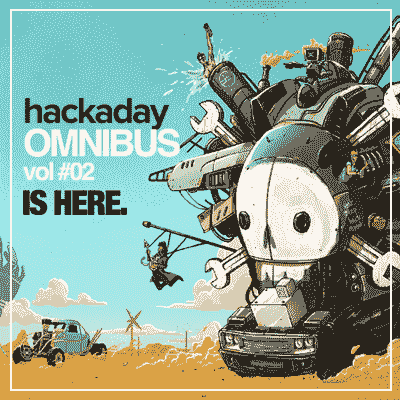
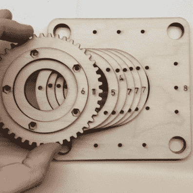
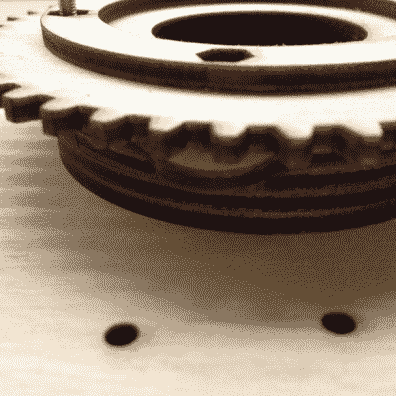
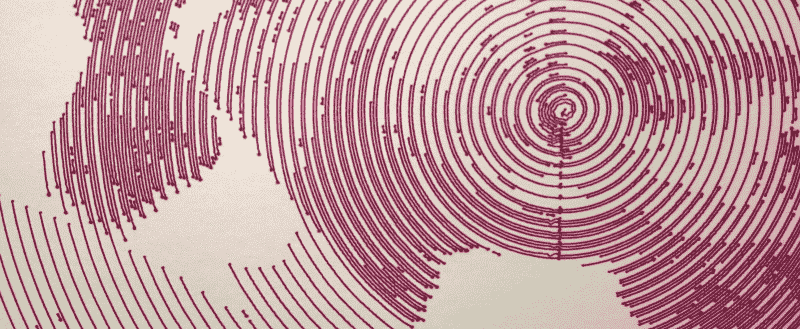
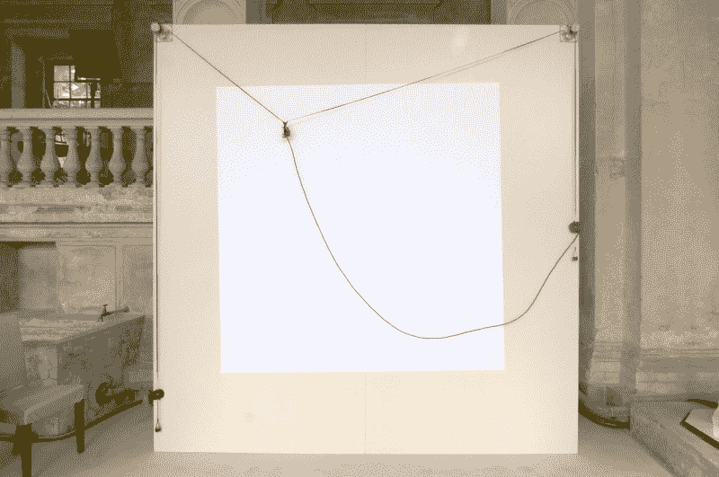
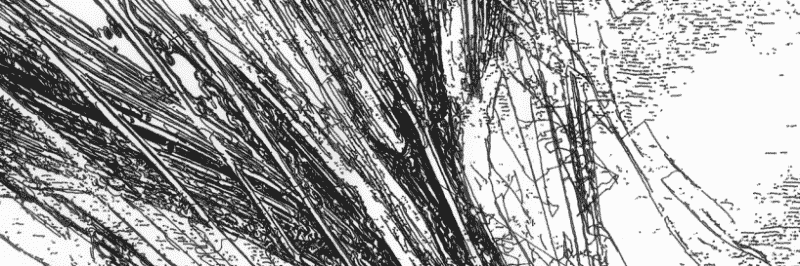
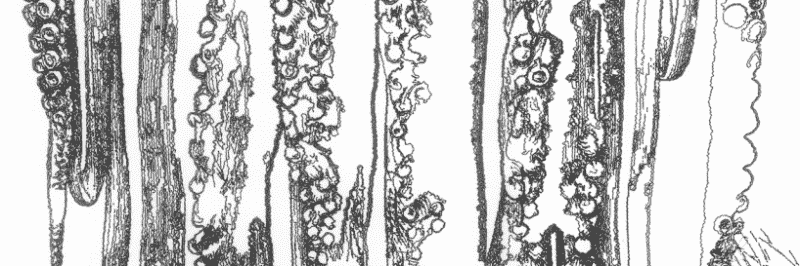
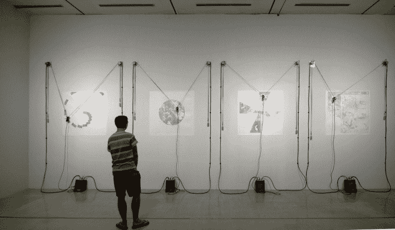
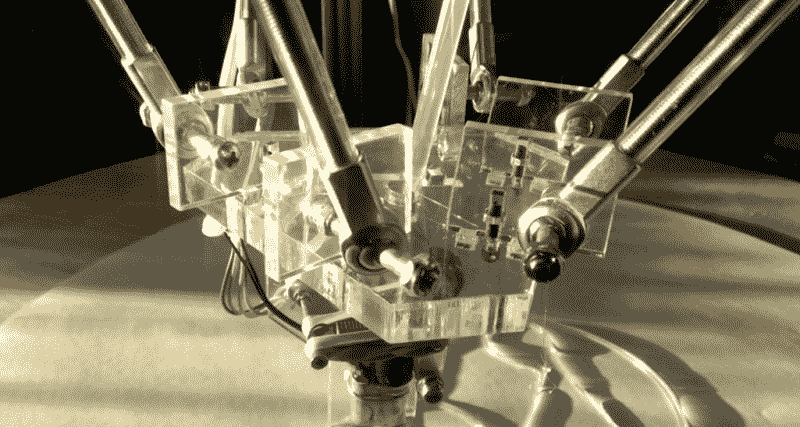
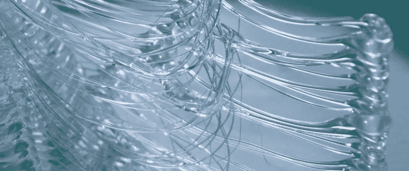

# 因为艺术:机器能有创造力吗？

> 原文：<https://hackaday.com/2015/12/01/because-art-can-machines-be-creative/>

你走过一个画廊，停下来欣赏两件看似不相关的作品，它们并排悬挂着。其中一幅画的是一只鸟，画得如此精确，以至于它的羽毛很容易从纸上掉下来。另一张是看起来是同一只鸟的草图，但是由于线条质量不一致和部分完全缺失，它几乎无法辨认。

This article was written for the Omnibus vol #02
[Order yours now](http://store.hackaday.com/products/hackaday-omnibus-2015)

盯着这张完美的鸟的照片，你会惊叹于制作它所需要的技术能力。你也花同样长的时间研究这个潦草的草图，挑出它的每一个缺点，但是决定你喜欢这只奇怪的鸟的图像，因为这些错误对你来说是有趣的。

当你俯身阅读贴在他们之间墙上的标题卡片时，你会震惊地发现这两幅截然不同的图像出自同一位艺术家之手；不是他们自己，而是他们建造的一台机器，以两种不同的风格创作两幅画。

作为一名插画师，我对绘图机非常着迷，因为它们的目的是模拟一种行为，对我来说，这一直是一种高度个性化的自我表达形式。绘图机和它们的创造者在某种意义上是我的同龄人。

通常绘画的机器或机器人，不管是什么类型，都受到它们的创造者的人类影响的约束。这导致我们大多数人将他们视为复杂的工具，而不是合作者……尽管人类更有可能依赖机器的能力来完成工作。

实际上，机器是他们自己创造图像的功能能力和他们的制造者的程序之间的联系；两者之间的一种相互依赖的能力关系。就像完美的鸟一样，这台机器不需要像它的制造者那样发展更强的空间敏锐度来绘制照片般逼真的图像。它依赖于编程，这种编程利用了计算机思维的优势，作为一种捷径，产生了我们人类难以应对的那种真实感。

权衡是微妙的。机器在执行精度方面是摇滚明星，然而在人类绘制的图纸中发现的缺陷的重要质量是很难伪造的。就像在绘画程序中一样，模拟的黑貂画笔只有在软件作者关注每根纤维如何响应阻力和压力而潜在地移动和张开时才是可信的。如果不考虑这些特征，每一笔都将是一条扁平的线，缺乏你可能定义为感觉或表达的东西；像创造力这样不容易定义的更大的概念。

作为你的绘画机器背后的大脑，你如何纠正感觉或手势等东西，以产生像《奇怪的鸟》这样的表达作品？

## 作为工具的机器

去年，我和世界各地的机器人制造商一起，冒险去了圣马特奥创客节。在一片混乱中，我发现自己被引诱到一个摊位，后面的铁丝网上钉着一个壁挂式绘图仪。这种特殊类型的机器人唤起了我遥远过去的记忆，让我与它的创造者[ [丹·罗耶](https://twitter.com/aggrav8d) ]交谈。

我了解到[丹]从事机器人的设计工作，并将它们以套件的形式发布到世界上。通过允许他的大部分工作开源，[丹]希望开始与世界合作，这将导致他的机器人在未来更有能力的迭代。他的目的是让他的机器的未来版本登陆月球，要么作为有能力的工具，要么是他们已经进化成的任何东西。我自己有崇高的目标，我尊重这种雄心壮志。

为了以设计机器人为生，一个人必须以销售机器人为生。[Dan]利用他自己设计的作品的销售来提供一种永续发展的生活方式。然而，正因为如此，生产要素对他设计机器的方式有着重大影响。3D 打印是快速原型制作的绝佳工具，但当你必须制造一百个相同的零件时，它就不再可行了。

[丹]处理所有自己制造的解决方案是投资一台激光切割机。有了这个工具，他可以通过将几层较薄的材料堆叠在一起，快速创建复杂而密集的形状……就像机器人三明治一样。

    

他的三轴手臂套件熟练地实施了这种方法。几十个详细的横截面堆在一起，创造了一个机器人，它不仅仅是拿起东西并把它们放在某个地方。尽管是放射状操作，它也能产生精确的图形。

手臂在一个圆形平台上旋转，所以使用 X 和 Y 坐标会导致图像看起来像是被捣碎成一个漏斗。为了补救这一点，[Dan]为连接的机械臂实现了反向运动学，以创建成比例的图像。

当我和[丹]说话时，那只手臂正在涂鸦，但我的注意力却粘在几英尺外的墙上绘图仪上。这个特殊的机器人是他的第一次成功，被称为“ [Makelangelo](http://www.makelangelo.com/) ”。它的发明是[丹]自学如何控制步进电机的间接结果。为了测量精确度，他会将一个马达的轴与另一个马达的轴进行比较，看看它们是否能稳定地降落在正确的点上。自然，这种测试演变成了绘画作品。如果马达能够绘制出一系列坐标，并产生预期的图像，而不是乱涂乱画的老鼠窝，那么他知道自己正在取得进展。

从准确性的里程碑开始，[Dan]继续为 Makelangelo 和 ARM 开发其他绘画风格。像 Photoshop 中的滤镜一样，这些样式可以应用于任何图像，绘图仪将根据代码对结果进行换肤。

[丹]大部分工作的目标是创建一个平台，能够制作像《完美的鸟》这样的作品，以便其他人可以使用这个标准作为起点。就像制作一把理想的画笔，主人可以从中拔出刷毛来创造另一种笔触。

当设计机器的时候，如果完美从来都不是开始的重点呢？对意外收获的追求能带来什么样的慷慨？

## 作为艺术家的机器

几年前，在我去艺术学校远足的某个时候，我离开了插画，一头扎进了机器人课程。这是我第一次接触电子产品，感觉很像在不知道如何游泳的情况下接受高空潜水指导。

为了维持下去，我从其他经验丰富的技术老手那里汲取灵感。例如，坐在我对面的那个家伙，[ [哈维·穆恩](http://unanything.com/) ]，已经因为设计和制造他自己的绘图机而闻名。他的作品成为我着迷的对象，因为我把他看作是我的反面；我是一个画机器人的艺术家，他是一个制作会画画的机器人的艺术家。

[哈维的]绘图机自成一派，因为它们似乎毫不费力地创造出了一种类似人类的感觉和风格，这是由它们产生的图像中的缺陷赋予的品质……这些缺陷看起来是真实的，而不是预先固定或确定的。

通过将绘画的结果交给机器本身，[哈维]允许机器拥有自己的创造力。没错。让我告诉你怎么做。

### 壁挂架

当我来到[哈维]面前的时候，他的项目是一个壁挂式机器人。这看似简单，但元素被熟练地开发出来，完全按照他想要的方式工作。

这个小机器像地震仪一样在笔和纸之间产生微妙的张力。一条连续的轨迹蜿蜒曲折，成为一幅缺乏机器精度的图像，同时也不可能由人手复制。

几乎每个人都熟悉这种味道的密谋者。就是那种把笔拴在两个步进电机之间的绳子上的那种……与重力合作，就像蜘蛛织网一样。如今它们相当常见，但[哈维]在它们像现在这样被大量记录在互联网上之前就开始建造他的第一个原型。

像我们这些美术专业的学生一样，[哈维]最初的爱好是更传统的媒介，摄影。没有其他人的经验作为起点，他不得不从头开始，通过从旧打印机中回收步进电机来自学它们的来龙去脉。

这是他的第一个涉及微控制器和编程的项目，在他弄清楚如何哄一个步进器产生一幅画之前，要花好几年的时间。一路走来，[哈维]和他的作品之间反复试验的对话成为作品背后意义的一部分。

他开始意识到，当他的机器出现故障时，他比当它按他的预期工作时更高兴。如果输出总是未知的，就没有办法对它感到厌倦。由于这种对机会的吸引，他从来没有打算生产一台完美的机器。他在别处树立了自己的标准。

但是唉，你也不能真的强求一个“幸福的意外”。[哈维]的技术越好，他在工程不可预测性方面投入的工作就越多。他完成这个魔术的方法是通过使用聪明的算法。

大多数壁挂式绘图仪都有一个开始复制的图像，从而产生或多或少预先确定的输出，[哈维的]算法允许机器在行走时绘制路径。

为了举例说明这是如何工作的，机器同样提供了一个源图像，但是根据它被告知从哪个像素开始绘图，结果每次都会不同。为了达到这个目的，一个处理程序将图像的所有像素转换成灰度百分比。从选定的原点开始，机器将继续接近最暗的像素，到达后立即使其变白，这样它就不会再次跟踪它。

### 台湾壁挂

随着他的壁挂从一次迭代到另一次迭代，[哈维]继续尝试更多的方法来放弃他对绘图结果的控制。在国立台湾艺术博物馆最近的一次展览中，他决定放弃静态图像作为一种来源，而引入使用现场视频作为一种手段来收获不可预测的输入。

为了这个特殊的装置，[哈维]提前在台湾交通密度不同的地区安装了实时监控摄像机。三个月来，四个[哈维的]绘图机缓慢地突突前进，忠实地试图复制摄像机看到的不断变化的视图。由此产生的图像是一个由偶然的突发奇想创造的时间流逝的原始描述。

### 到第三次元！

在考虑放弃对他的机器产生的内容的控制的新方法时，[哈维]考虑了将维度带入他的工作等式的方法。这些想法导致建造了一个 delta 机器人作为新的实验平台。

德尔塔机器人没有像他用墙壁绘图仪那样过多地关注输入来获得随机输出，而是开辟了新的领域，用不同的媒介来创造不可预见的事物。

尽管 delta 机器人与工业级精度相关联，并因此被用作 3D 打印机，但[哈维]希望打破这种常见的联系。

与他尝试新的和不可控的媒介的愿望一致，他为末端效应器建造了一台挤压机，这台挤压机将喷出热胶而不是细丝。真的，没有什么比黏糊糊的、成串的、完全不可恢复的冷却熔融塑料堆更难控制的了。

为了得到这些有趣的半透明粘性物质，[哈维]编写了一个随机形状发生器，它可以实时运行，一边运行一边生成 g 代码。

## 那么，工具还是艺术家？

作为你的绘图机器背后的大脑，如果产生一种感觉或手势需要尽可能多地放弃你自己的控制…在什么时候你的机器应该因为它对你的创造而受到赞扬？

我想象着这样一种假想的情况，即[哈维]离开他在台湾的装置，再也不回来，就像科幻小说中的一段一样，这台机器继续生产图纸，这些图纸由社区中不再记得他的人保存了几十年。

在[哈维]远离这个等式的情况下，现在是谁在创作艺术呢？是重新进货的人吗？还是现场摄像的人提供的信息？还是因为哈维的原创想法应该归功于他？

## 所有权应该归出处吗？

想象一下这个场景。如果你复制了一幅自己创作的画，你把艺术和印刷品的功劳归于你自己，而不是印刷机的创造者或机器本身。你会走来走去，向人们展示复制品，并吹嘘道:“嘿，看看我做的插图！”。你对其创作所必需的创造力、能力和意图承担所有权，即使那张纸上的墨水从技术上来说不是由你的手涂抹的。

然而，如果在打印相同图像的过程中，纸张以一种有趣的方式卡住并把墨水涂得到处都是，然后你把它挂在你的墙上，因为事故比预期的打印更有趣…然后呢？

被抹黑的混乱是基于你提供的输入，在一台别人发明的机器上…但是产品实际上是它自己做的结果。当然，在它制造的东西背后没有智能设计；尽管如此，它还是根据所提供的数据、自身的功能以及恰当的机会比例采取行动。

缺乏有意识的决定，你的打印机的印刷错误可能不会表现出真正的创造力或想象力…然而，随着艺术生产的过程变得不断迭代和自动化，有了自己的生命，来源难道没有它演变成的东西重要吗？

## 所有权应该属于提供代码的人吗？

所以你可能会翻白眼，心想，“所有权总是属于提供代码的人，因为没有代码就没有绘图，更不用说迭代了。”

你也可以说，如果没有米开朗基罗的导师多年的教导，就不会有西斯廷教堂天花板上的杰作，因此功劳应该归于他的导师。显然，这个论点不成立，因为他的导师输入的合成导致了独立形成的输出，这使得我们非常容易决定米开朗基罗的艺术作品是他自己的，不管影响有多大。

当我们谈论越来越多的自主机器时，有人最初给机器人留下一些代码制品的事实可能越来越无关紧要。

## 所有权应该属于机器的制造者吗？

如果你相信自主与否，那么机器“创造”的荣誉应该永远属于建造它的人，那么把它作为工具出售的[丹]呢？他的机器在机械方面与[哈维的]没有太大的不同。那么，无论是在他的实验室还是在你的客厅里，他设计的机器所画的每一幅画都是他的功劳吗？

这显然不成立。如果我们说的是工具，那么所有权属于使用工具工作的人。但是，如果工具在使用自己呢？

## 为什么你认为你应该为你所做的事情获得荣誉？

一个可能的答案可能是，因为你在用你个人的能力库按照自己的想法行动，以产生想要的结果。你也可以说某样东西是你的，因为它是你创造性的结果。

创造力的一个定义是:一种新的有价值的东西被创造出来的现象。所以，难道机器不能满足艺术所有权的所有这些要求吗？当被问到时，几乎每个我问过的人似乎都认为答案是显而易见的，也许现在就是这样。机器是由我们人类制造的，所以机器的工作也是我们工作的间接结果。

然而，随着我们在工作中不断使用更复杂的设备，这个问题将会变得越来越难以回答。当这些工具被期望做出进一步远离人类思维影响的决策时，在什么情况下机器的创造力值得认可？

* * *

这篇文章是专门为黑客日综合卷#02 写的。[订购《Hackaday》的限量版印刷本](http://store.hackaday.com/products/hackaday-omnibus-2015)。