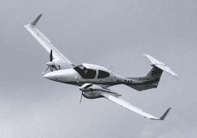
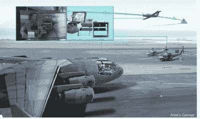

# 朝向可选驾驶的飞机

> 原文：<https://hackaday.com/2015/12/04/toward-the-optionally-piloted-aircraft/>

几十年来，航空业的权威杂志《航空周刊和太空技术》一直在发布新飞机的“飞行员报告”。它在一架名为“半人马座” ⁠was 的飞机上的飞行员报告，这是第一架飞行员从未接触过控制装置的飞机。半人马是一种可选驾驶飞机，或 OPA。

记者坐在小型双引擎飞机的后座上进行测试。前面坐着一个扮演安全驾驶员的人，他的手臂平静地放在膝盖上。坐在他旁边，通常是副驾驶的座位上，是一个工程系列的连杆，执行器和伺服系统。安全飞行员拉了一个杆来启动机械装置，他们开始移动飞行员的控制杆并踩下方向舵踏板。致动器是双重的和冗余的；如果一组失败，另一组将立即接管。如果出了问题，安全飞行员只需拉一下操纵杆就可以解除机械装置；除非出了问题，否则他不会碰控制器。

在后座，“操作员”通过笔记本电脑指挥飞机，使用的界面与无人驾驶车辆的地面控制站相同。通过屏幕，他可以改变高度，飞到航路点，起飞或着陆。按下“发射”按钮开始自主起飞。计算机保持刹车，向前推动油门，检查发动机和仪器，并释放刹车进行起飞滑跑。飞机加速，飞向空中，开始以半自动飞行方式爬升。

作为一架 OPA，这架飞机可以在飞行员控制下以正常模式飞行，就像一架经过认证的飞机一样，就像是刚从工厂出来一样。但它可以在这种半自动模式下飞行，因为记者通过后座的笔记本电脑发出高级命令。或者它可以无人驾驶，通过无线电线路在地面上操作相同的计算机接口。它被称为“半人马”，源于神话中半人半马的生物。

钻石 DA-42 [ [图片来源](https://commons.wikimedia.org/wiki/File:OH-DAC_Tour_de_Sky_Oulu_20140810_02.JPG)

奥罗拉的工程师们通过将一架商用飞机——钻石 DA-42 转换成这种 OPA 模式，制造出了半人马。他们在前座添加了一个机械装置，一系列独立的电子设备，并将飞行手册和紧急程序数字化到计算机算法中。

无人驾驶飞机目前在美国领空大多是非法的，但 Centaur 得到了美国联邦航空局的认证，如果安全飞行员在飞机上，它可以在无人驾驶模式下飞行。因此，飞机可以帮助开发无人系统的传感器、算法和程序。它已经与一名飞行员一起飞往阿拉斯加，在那里它获得了以无人驾驶模式收集气候研究数据的许可。

Centaur 是一种过渡技术，适用于飞行测试和工程开发，同时制定法规和技术。然而，它包含了一种新的驾驶方式的种子，因为最终，即使在美国领空，前排安全飞行员的工作也可以转变为通过笔记本电脑界面进行操作。

### 未来驾驶舱内会有人类飞行员吗？

DARPA ALIAS artist’s rendering shows tablet and computer, controlling a robot, controlling the aircraft.

我们正在进入一个没有飞行员的未来吗？在可预见的未来可能不会，但半人马向我们展示了今天存在的技术有多少。DARPA 的一个名为[别名](http://www.darpa.mil/program/aircrew-labor-in-cockpit-automation-system)的项目，试图通过建造一个坐在正确座位上的通用机器人，将 OPA 的想法扩展到任何飞机上。从技术角度来说，自动驾驶飞机、指挥起飞、遵循路线和自动着陆都已经得到了很好的证明。无人驾驶飞机的问题似乎已经解决了——但只是在人为地脱离其人类背景的情况下。

但是自动化和机器人的许多例子告诉我们，完全自主操作是较小的问题。我们可以说，技术今天已经存在，但要使创新具有社会重要性并为人类福祉做出贡献，不仅需要机器，还需要社会、政策和经济系统将这些机器融入人类生活，并增强我们的实践和经验，这是一个更加开放的问题。

客机需要安全认证，这样它们就不会掉在人身上。他们需要为乘客提供的不仅仅是统计上的安全，还有安全的体验。它们不仅需要在我们能想到的每一个紧急情况下运作，还需要在几乎所有我们想不到的紧急情况下运作。这就是为什么当置于可靠性、风险、责任和信任的人类环境中时，无人驾驶飞机的问题，就像无人驾驶汽车的问题一样，还没有得到解决。在这样的系统中建立信任需要多年的演示、操作和智能工程来证明可靠性和在人类环境中的工作。

* * *

大卫·a·明德尔是麻省理工学院的教授，也是人类科学公司的创始人兼首席执行官，该公司正在开发人类系统内可信、透明的自主技术。他改编了他的书 *[《我们的机器人，我们自己:机器人和自主的神话](http://amzn.com/B00SI02AWK)* 》(维京/企鹅 2015)。