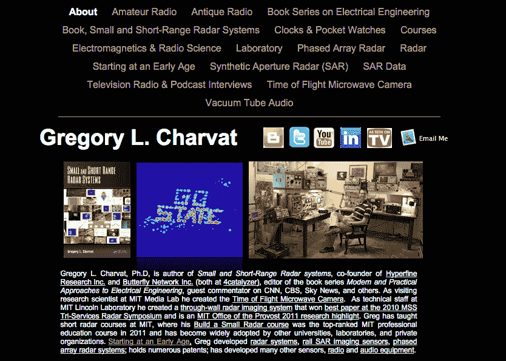

# 如何成为初创公司的硬件工程师

> 原文：<https://hackaday.com/2015/12/07/how-to-be-the-hardware-engineer-at-a-startup/>

对于那些喜欢焊料烟雾的味道而不是代码行的人来说，你可能是一名硬件工程师。你应该考虑的是如何在一家初创公司找到工作，如何快速工作，成为一名团队成员，保持开放的心态，并有条理。加入创业公司将是你职业生涯中最大的挑战。你能做到的！在创业公司做硬件工程师，改变世界。

## 建立你的技能并展示它们

作为一名硬件工程师，你的工作是应用已知的物理知识制造一台解决问题的机器。尽快开始制作东西。如果你是高中生或更小的学生，今天就开始做东西吧。

  My friends in high school would make ad-hock computer networks using these really ancient ethernet cards that had BNC connections on them, we would run everything out of MS dos, way before there were such things as LAN parties.  Was very luck to have parents that encouraged electronics, at around age 7 i am taking apart television sets.  Built this radio telescope receiving system in high school as part of science fair, taking the opportunity offered me by our incredible and extremely kind high school astronomy teacher Ardis Herrold.  Had the opportunity to partake in a team effort to build a solar powered vehicle in 8th grade, thanks to our amazing shop teacher Kerry Pytel

作为 Hackaday 的读者，我们有许多兴趣和众多的项目可以参与。练习你的焦点，选择一个并完成它。让你自己养成完成你开始的事情的习惯。

在初创公司，你需要能够将想法转化为可行的解决方案。拥有一个已完成项目的文件夹表明你是问题的解决者。

建立你的网站和在线足迹。我发现在我的[个人网站](http://glcharvat.com/Dr._Gregory_L._Charvat_Projects/About.html)上展示已完成的项目是创造机会的宝贵资源。利用你的网站记录并展示你的作品集。组织内容，使其简单且易于浏览。很多时候，当你在做其他项目，需要回顾你过去是如何做的时候，这将会派上用场。但远不止于此。这就给了别人一个机会，让别人看到你热爱的东西，给了别人一个接触你的途径。

个人网站的其他示例；[托尼·金](http://web.stanford.edu/~tonyekim/)，[詹妮弗·艾斯特拉达](https://jennestrada.com/)，[马特·比恩](http://mattbeane.com/)。同样，教师网站也可以作为很好的例子，包括 Ron Walsworth 教授的这个。

Showcase your work on your website, this will generate opportunity and collaborations.

为了保持对谁在看你的眼睛添加一个跟踪器，如谷歌分析。这将有助于你注意到你的作品何时出现在网站上。当你的工作被报道时，花点时间参与对话。成为硬件社区的一员将有助于增加向您开放的机会。

尽你所能发表一切。我们的一些项目属于 Hackaday，在 [IEEE](https://www.ieee.org/index.html) ， [Nature](http://www.nature.com/index.html) ，或者 [QST 杂志](http://www.arrl.org/qst)。一定要发表——不管网站或出版物的声望如何——这样其他人就可以从你的工作中受益，你也可以加入到技术发展的对话中来。创业公司喜欢雇佣那些在他们的领域很活跃的人。

你去哪所学校并不重要。如果你有一个在线分享/出版的作品组合，你会创造机会。

## 如何在创业公司找到工作

随着你的技能得到很好的展示，你现在有了解决问题、提出解决方案、提供展示在你自己网站上的例子的可信度。这将使你能够在机会出现时抓住它。我职业生涯中的三个例子:

1.  大约四年前，我被邀请去见乔纳森·罗斯伯格。他想开一家新公司。我提出了一个分三步走的计划，用机械扫描仪、开关阵列元件和最终的全数字阵列，以渐进的方式开发原型。我当场得到了这份工作来实现它。我建议的前进道路有很大的分量，因为我已经建立了许多扫描传感器，基于阵列的传感器，所有这些都在我的网站上有很好的记录。从那时起，[蝴蝶网](http://www.technologyreview.com/news/532166/with-100-million-entrepreneur-sees-path-to-disrupt-medical-imaging/)筹集了 1 亿美元，并将于今年一月在达沃斯举行的[世界经济论坛上亮相。](http://widgets.weforum.org/techpioneers-2015b/)
2.  多年来，我偶尔会和我的一位研究人员朋友讨论 RF 电路和模拟设计问题。我会发送具体的设计实例，作为我从网站上临时搭建的收音机的链接。这种关系让我成为了创建超精细研究公司的一员。
3.  我收到了一封来自麻省理工学院教授 David Mindell 的电子邮件，他有深海探险的经验，想用微波设备尝试一些非常规的东西。多亏了我的网站，大卫找到了我。我们在我的船上开了个会，提出了一些想法，制定了一个计划。通过电子邮件，我们很快设计了一个原型，制造了它，并在我的车库里开始运行，最终建立了[人类学家](http://site.humatics.com/about-us/)。

#### 小贴士:

*   通过你所做的工作、你的同事以及参加专业组织来拓展你的人际网络。
*   总是回复教职员工。
*   使用 LinkedIn 来检查那些联系你的人的可信度。有时可能是你的技术社区之外的知名人士。其他时候，可能是一些不可信的人，在决定花时间调查之前应该做更多的研究。
*   在提出解决方案时，我不会过分担心知识产权。换句话说:如果知识产权问题让你保持沉默，你可能会失去机会。
*   玩得开心！思考解决问题以及如何解决问题是一件非常有趣的事情。
*   在你的一生中会有很多问题需要解决，不要担心你错过了一个特定技术的机会，还会有更多的问题出现。

## 学会走得快

一旦你成为创业公司的一员，成为第一名，成为这种类型的第一个产品就是最重要的。你在赛跑，因此你必须学会比以前更快地工作的技巧。以下是我用来快速执行的一些方法:

*   会议是为了决策。尝试一下，而不是连续几个小时的辩论或哲学思考。在资源和时间有限的情况下，优先考虑回报最高的最容易实现的目标。
*   永远不要把工作放在桌子上。如果你需要再花一两个小时来完成工作，那就在回家之前完成。
*   制定一个计划。和你的团队一起制定工作计划，然后看看你必须完成的日期。
*   想想可以同时做些什么。许多任务可以从信封背面的计算或以前做过的人的经验开始。大多数时候，你所需要的只是一个“球场”规格来推动工作，随着时间的推移，硬性规格将会趋同。
*   求行动。

## 成为一名团队成员

在创业公司工作不全是娱乐和游戏。我们最糟糕的守护进程喜欢在这种高压环境中出现。无论发生什么事情，都要保持团队精神的一些建议:

*   一旦你的工作完成了，寻找还没有完成的最高优先级的任务，如果它与你的技能足够匹配，就接受它。
*   我们都知道史蒂夫·乔布斯、埃隆·马斯克和其他人。不幸的是，你不是这两种人，所以你不能像史蒂夫·乔布斯那样对待你的同事。尽可能的好，尽可能的善良。如果你搞砸了并且不友好，那么你需要能够迅速道歉。努力提高你的软技能。
*   你之所以有一个团队，是因为你没有所有的答案。虚心听取同事的意见，不要自以为无所不知。向以前做过的人学习比重新发明轮子要快得多。
*   为了让团队继续前进，总是优先完成对其他团队成员或分包商来说是障碍的任务。成功的最快途径在于保持整个组织及其分包商的执行力。你是一个，他们是许多。

## 与多学科团队合作

在多学科团队中工作。你可能会发现自己与一个多元化的团队一起工作，在这个团队中，你必须依靠彼此在特定领域的专业知识。这是一个每天学习新事物的好机会，但是你可能是唯一一个知道你所知道的东西的人。不要期望被指导。在翻译、理解、向不熟悉你专业的人解释自己时会出现错误。在多学科团队中工作时，要坚持下去，要有耐心。

任何团队都会有差距。必须有人来填补空缺，通常这个人就是你！不要担心，你会对拿起一本教科书或阅读一些 IEEE 期刊所能学到的东西感到惊讶。你需要弄清楚需要做些什么来推动这个项目，直到有经验的老手被雇佣为止。一旦你雇佣了一个专家来填补空缺，然后迅速交出控制权。帮助专家命中回合运行。

例如，我最出名的是开发短程雷达设备，但在我的第一次创业中，我帮助开发了医疗超声成像技术。

## 对你的技术保持开放的心态

作为一种策略，你要不断检查你对产品的假设。当市场现实与你的产品不符时，那就是改变的时候了。在这种情况下，你必须成为一名团队成员，敞开心扉，展开富有成效的讨论，找到可量化的市场数据来指导决策，并与决策保持一致。这一时刻发生在我参与的三家创业公司中的两家。

## 有条理

首先要组织好自己。关键是挑简单的，分量轻的，坚持下去。我更喜欢 GTD。

从预期结果开始制定团队计划。从一些高层次的目标开始向后工作，例如消费电子展的展览、投资者演示等。与团队一起挑选谁拥有任务，并让那个人选择他/她的交付日期。

为了项目协调和跟踪进度，我更喜欢使用福特汽车公司首席执行官艾伦·穆拉利开发的流程再造图。就是这个家伙在没有政府救助的情况下把福特从悬崖边拉了回来。

让团队每周开会一次，讨论当时最大的问题。

每个人都应该写一份每日电子邮件更新，并在团队成员中传阅。是的，这是乏味的，但它确实导致会议明显减少，因为你可以了解每个人前一天都做了什么。它还自然地同步位于远程站点的团队成员，这在初创公司中越来越常见。

注意不要陷入过于复杂的团队组织方法，这可能会浪费大量时间。很多用来组织软件团队的方法并不适用于硬件团队。选择适合你的。

如果你是有组织的，那么与异地员工和承包商合作应该很容易。关键是建立一个工作计划，明确交付和日期。异地人员可以阅读您的日常电子邮件，并在每周的会议上进行同步，因此协作将会发生。使用可靠的屏幕共享和会议服务包。

使用类似 dropbox 的文件共享工具。我知道很多人喜欢 git，但是我发现对于多学科的硬件团队来说，git 并没有被所有人接受。

## 恭喜你，你改变了世界

在创业公司试试运气。打开你的思维，成长，同时以前所未有的速度工作。在一家初创公司做硬件工程师。冒险是奖励。但是如果你有一个真正好的想法，有一个有才华的团队支持，你的工作可以改变世界。

## **了解更多信息**

*   获得帮助，[麻省理工学院创业指导服务](http://vms.mit.edu)。
*   来自已故的 David Staelin 教授的知识金块。
*   [‘从捡垃圾到启动’](http://www.glcharvat.com/website%20pdfs/GL_Charvat_SHPE_talk_3_9_13.pdf)
*   催化剂公司正在招人。
*   和许多其他人…

**作者简介:** Gregory L. Charvat，博士，是 [Humatics](http://site.humatics.com/) 的首席技术官，[小型和短程雷达系统的作者，](http://www.amazon.com/Short-Range-Practical-Approaches-Electrical-Engineering/dp/143986599X)Hyperfine Research Inc .和 Butterfly Network Inc .(都在 4catalyzer)的联合创始人，电气工程的现代和实用方法系列图书的编辑，CNN、CBS、Sky News 等的客座评论员。作为麻省理工学院媒体实验室的访问科学家，他发明了飞行时间微波照相机。作为麻省理工学院林肯实验室的技术人员，他创建了一个穿墙雷达成像系统，该系统在 2010 年 MSS 三军雷达研讨会上获得了最佳论文，并且是麻省理工学院 Provost 办公室 2011 年的研究亮点。Greg 曾在麻省理工学院教授短期雷达课程，他的*构建小型雷达*课程是 2011 年排名第一的麻省理工学院专业教育课程，并被其他大学、实验室和私人组织广泛采用。