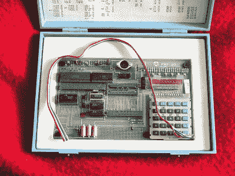
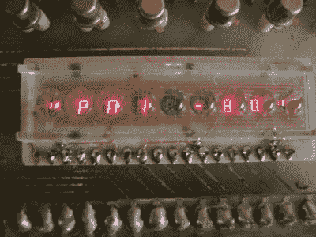
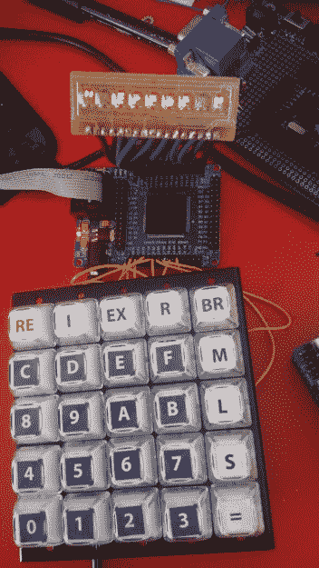
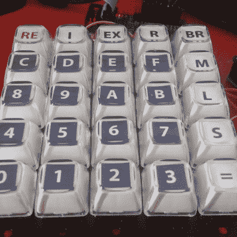
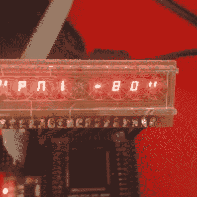

# 芯片上的逆向计算

> 原文：<https://hackaday.com/2015/12/03/retrocomputing-on-a-chip/>

新的电子元件使我们能够更有效地改造旧的线路。特别是，可获得的和便宜的 FPGA 套件提供了将许多旧计算机的布线放在一起作为“片上”解决方案的可能性。

当我设法得到一个旧的气泡 LED 显示屏和一个漂亮的机械矩阵键盘时，我决定建造一个旧单板计算机的复制品。合乎逻辑的选择似乎是建造 KIM-1 或 Heathkit ET-3400。KIM-1 的复制品已经存在，即使是 Arduino，所以我的任务将减少到连接键盘和显示器。但后来我告诉自己，我会利用我的气泡显示器有 9 个位置这一事实作为借口，来建造传说中的捷克斯洛伐克单板计算机 PMI-80，它使用了相同的显示器。我的复制品是一个 FPGA，或者说是这台计算机的 FPGA 仿真器。

## PMI-80

原装 PMI-80【来源: [DLW 博客](http://daluth.sweb.cz/pmi80.php)

Hackaday 的读者中大概没有多少人会知道这台电脑，它是前捷克斯洛伐克 80 年代制造的。Hackaday 编辑(Brian Benchoff)可能是唯一一个读到这篇文章的人。但是如果你有自己的孩子，我们也很乐意在下面的评论中听到。对于那些还不熟悉的人，让我们先介绍一下。

PMI-80 是基于英特尔 8080 处理器的单板学校计算机。由于它是在 80 年代所谓的铁幕背后创建的，所以它使用捷克斯洛伐克的 Tesla 芯片而不是最初的 Intel 芯片，尽管它们在功能上是相同的，包括编号(Intel 8080A 的名称是 MHB8080A，PIO 8255A 作为 MHB8255A 出售等等。)

底座由标准的“神圣三位一体”接线(8080 a–8224–8228)组成。在 RESIN 8224 电路的输入端是一个电容器和二极管，在通电后提供复位。晶体有 10 MHz，所以计算机运行的频率是 10/9 = 1.111 MHz。INTA 输入电路 8228 连接到+12V，这确保了在中断请求的情况下，指令 RST 7 被执行(即跳转到地址$0038)。

存储器由 1K PROM (8608，1kx8)和 1 kB RAM (2x 2114)芯片组成。PROM 的地址为$ 0000-$ 03FF，RAM 的地址为$ 1c 00-$ 1 fff。甚至可以在主板上增加额外的 2708 内存(0400-07FF 美元)。

VAD30 显示器【图片来源:[nostalcomp . cz](http://www.nostalcomp.cz/pmi_zavady.php)

计算机还包括一个 VQD30 显示器，由前德国(德意志民主共和国)制造。这相当于显示器 NSA1198 或 cqyp 95–9 七段共阴极显示器的功能。输入数据由 3×9 矩阵键盘提供。这两种外设都由基于 PIO 8255 的电路驱动。端口 A 出口(PA0-PA6)通过驱动晶体管控制单个段(阳极)。端口 C 的最低四位由电路 MH1082(相当于 74145)解码为代码 1-from-9，用于选择位置，同时激活键盘的列。键盘线路连接到 PC4-PC6 位。

程序以非常简单的方式存储在磁带上，这也是通过 PIO 8255 控制的。每个条目都有一个起始位(1)，然后是实际值和一个停止位(0)。在记录期间，一个程序在 PA6 端口上产生一个 0.2ms 的载波频率周期，并用引脚 PA7 选通它。在读取期间，信息在位 PC7 处可用。

PIO 8255 作为外围设备连接到地址$F8-$FB。计算机板允许插入另一个 PIO 电路，然后连接到地址$F4-$F7，完全可用于应用。

## 操作

键盘由排列成 5×5 矩阵的 25 个键组成。然而，在里面，它的线路是不同的。两个键(RE 和 I)直接通向处理器的输入端(RESET，分别为 INT)。其余的键(0-9、A-F、EX、R、BR、M、L、S 和=)已经连接到已经提到的 3×9 矩阵中，如此处所示。

开机后，显示屏显示“PMI-80 ”,计算机等待任何按键。之后，它进入主屏幕模式，由“？”标识在显示屏的左侧。然后计算机等待监视器命令。

### 监控命令

**M**–更改/查看存储器内容。按下 M 后，字符 M 出现在左边，计算机等待地址输入。按=激活数据输入。每按一次=地址指针增加 1。按=和 0-F 以外的键完成数据输入。

**R**–查看和更改寄存器的内容。按下 R 后，字符“R”出现在左边，计算机等待对应于寄存器对(AF = A，B = BC，D = DE，HL 9 = 8 = SP)的击键。同样，可以修改数据并使用=移动到下一对。

**Ex**–运行程序。计算机等待一个地址，按=进入程序。可以通过跳转到地址 0 或地址 8(对应于跳转到监视器)来终止程序。

**BR**–与 G 相同，但有一个断点。首先你需要输入一个地址，在这个地址上程序应该停止，然后输入下一个开始地址。

**L** ，**S**–加载并保存数据(此处未实现)

**I**–中断。导致中断并跳转到地址$0038。只有说明:JMP 1 美元 6 美分。在这个地址(在 RAM 中)，您必须首先创建一个到您的处理程序例程的跳转。
重新复位。在复位期间，RAM 不会清零，因此它可以用作程序中断并返回到监视器。

带有注释的监视器列表可以从 Git 存储库获得[。](https://raw.githubusercontent.com/maly/fpmi/master/docs/pmi80.asm)

## FPGA 中的 PMI-80

我选择了一个便宜的 FPGA 开发套件，EP2C5/EP2C6 迷你板，这是格兰特·塞尔在他的 Multicomp 中使用的[(感谢灵感！).它有一个我用 VHDL 编程的 Altera Cyclone II 芯片。](http://searle.hostei.com/grant/Multicomp/index.html)

我连接了一个键盘，是 5×5 的矩阵，不是原来的 3×9；FPGA 内部正在处理重新编码为适合 PMI 的形式。

显示器通过电阻直接连接到 FPGA，所有逻辑和重新映射到适合仿真的形式都在 FPGA 内部完成。

一个用于磁带录音机的接口不见了，我还没有实现它。你可以在 [my Github repo](https://github.com/maly/fpmi) 看到我当前的实现。

我使用了 8080 的免费 VHDL 实现，名为 [Light8080](http://opencores.org/project,light8080) 。它不是“T-perfect ”,但这并不是必需的。我还用过 pia8255 元件。

主代码在文件 [rmi.vhd](https://github.com/maly/fpmi/blob/master/FPGA/rmi.vhd) 中，这里存放了每个组件的所有“胶合逻辑”:8080、8255、RAM、ROM、键盘和 LED。

该档案还包括测试组件，我使用时，工作的仿真，例如，一个简单的显示显示十六进制数字。让模拟正常工作有些不稳定。8080 处理器的最初实现使用稍微不标准的定时，因此在总线上出现奇怪的状态，例如，RAM 在处理器设法读取它之前停止给出信息，等等。一些事情帮助了我:

*   用简单的代码测试 ROM
*   频率约为 1 Hz 的时钟发生器
*   十六进制显示(组件自动刷新显示内容，我把数据直接从数据或地址总线输入)
*   Altera 探针–连接到电路的虚拟逻辑探针，它通过 JTAG 接口将数据传输到 Quartus IDE。

    

构建硬件和编写仿真器是一个周末的工作，它仍然是一个“版本 0.1”。在未来，我希望扩展该系统以模拟其他单板计算机(KIM，ET，也许是 COSMAC ELF)并模拟磁带，也许是作为 RS-232 接口。看一下快速视频演示。查看下面的参考资料，如果您对更多的芯片上逆向计算项目感兴趣，请留下您的评论。

 [https://www.youtube.com/embed/tHp572p013c?version=3&rel=1&showsearch=0&showinfo=1&iv_load_policy=1&fs=1&hl=en-US&autohide=2&wmode=transparent](https://www.youtube.com/embed/tHp572p013c?version=3&rel=1&showsearch=0&showinfo=1&iv_load_policy=1&fs=1&hl=en-US&autohide=2&wmode=transparent)

## 资源

源代码:[https://github.com/maly/fpmi](https://github.com/maly/fpmi)

斯洛伐克语的 PMI-80 描述:

[http://www.nostalcomp.cz/pdfka/pmi80_popis.pdf](http://www.nostalcomp.cz/pdfka/pmi80_popis.pdf)

[Click to access pmi80_doplnky.pdf](http://www.nostalcomp.cz/pdfka/pmi80_doplnky.pdf)

[点击进入 pmi_prirucka1.pdf](http://www.nostalcomp.cz/pdfka/pmi_prirucka1.pdf)

[http://www.nostalcomp.cz/pdfka/pmi_prirucka2.pdf](http://www.nostalcomp.cz/pdfka/pmi_prirucka2.pdf)