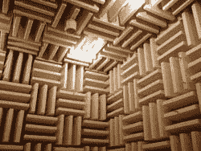

# 机场地面艺术(声学)令人困惑

> 原文：<https://hackaday.com/2015/12/05/airport-land-art-is-acoustic-baffling/>

根据史密森尼杂志上的一篇文章，这些几何排列的山丘不是外星人的 T2 着陆标志，而是阿姆斯特丹史基浦机场跑道后面的隔音材料。

Photo by Alexis Glass, via Wikipedia

这 80 英亩的山丘和山谷被称为“土地艺术公园”，据说可以减少附近 50%的噪音。它们的工作原理是向随机方向发送反射，否则反射会从地面上跳过，就像录音室中的反回声挡板一样。对于当地居民来说，这是一个不错的选择，它们还包括慢跑道。

人们之前已经制作了[土地艺术](https://en.wikipedia.org/wiki/Land_art)——我们特别喜欢大盐湖的[螺旋码头——但据我们所知，这是第一个也是功能性的土地艺术“作品”。](https://en.wikipedia.org/wiki/Spiral_Jetty)

当然，情人眼里出西施。不幸的是，正如史密森尼指出的，没有人看到它。因为 Buitenschot 的目的是分散飞机尾部发出的起飞噪音，所以飞机总是远离噪音；乘客从空中看不到它。