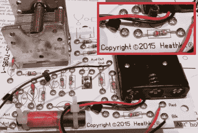

# 希斯基特的凯旋归来？

> 原文：<https://hackaday.com/2015/12/17/heathkits-triumphant-return/>

希斯基特(Heathkit)起死回生，它是高质量 DIY 电子套件的传奇供应商，激励了一代爱好者，开启了许多工程师的职业生涯。我们认为。至少从[Spritle]的这个构建日志来看是这样的，他是重新启动的公司的第一个产品的早期采用者。但如果[斯普里特尔]的经历有任何启示的话，希斯基特要重现辉煌还有很长的路要走。

No solder? That’s just screwy.

目前 Heathkit 唯一的完整套件产品 Explorer AM radio kit——他们确实为早期的 Heathkit 产品提供了一些升级和维修板——与经典的 Heathkit 体验相去甚远，至少对我们这些当年实际组装过该公司无数产品之一的人来说是如此。与过去最明显的不同是:探索者套件不需要焊接。PCB 上钻有超大孔，用于安装机器螺钉和螺母，元件引线只需缠绕在螺钉上并拧紧即可。这或许是一种简便的方法，对于电子新手来说也是可行的，但对于精密的元件引线来说就不太合适了。事实上，[Spritle]报告说，几个过度扭转的螺钉几乎掐断了元件引线，以至于没有足够的引线来进行连接。想象一下破坏一个组件却无法完成构建的沮丧心情。

Nice retro look, but is it retro quality?

[Spritle]还报告了这个工具包的手册中一些令人不安的错误。希斯基特以其组装说明的质量而闻名，他们的手册是你项目中的“至圣所”。在你阅读手册之前，不要碰其他任何东西，手册非常详细地指导你完成组装过程。但是这本手册遗漏了安装一个电阻器的说明，并且把另一个电阻器的颜色代码弄错了。在一个经典的希斯基特项目中留下一些零件，这表明你做了一些非常错误的事情；一个不像[Spritle]那样善于观察的构建者可能会很困惑地试图追踪那个错误。期待一个电子新手，这似乎是这个套件的目标市场，抓住一个颜色代码错误是很难接受的。是的，对初露头角的电子爱好者来说，关注细节是一项重要的技能，但为什么要在击球手知道如何握拍之前就投出曲球呢？

就我个人而言，我不记得以前的 Heathkit 目录中有任何非焊料套件；事实上，我记得说明书上有大量的焊接课程，以防你的烙铁操作技能没有达到标准。我的第一个工具包是一个 SW-717 短波接收器，是我的邻居推荐的，他是一个试图让 11 岁的我成为业余无线电爱好者的业余爱好者。在我们拆开零件信封之前，他花了几个小时训练我焊接技能，这很有成效，无论是对那个构建还是从长远来看，我至今仍为之自豪的生活技能。

回顾我的第一次构建，似乎最有价值的部分是导师。知道有人指导我并回答我的问题对我有极大的帮助。今天，我很想和我的孩子们站在这种指导关系的另一边，而过去的希思基特将是一个很好的方式。我会花很多钱和我的孩子一起开发一个新的希斯基特项目。但是无焊料套件呢？有什么意义？

我并不是说无焊料体验作为更复杂套件的“入门药物”没有用武之地。但是选择这个套件作为第一次提供是令人费解的；这就引出了一个问题，希斯基特认为该公司将何去何从。价格点也令人困惑——150 美元一台电池供电的 AM 收音机，没有扬声器。是的，它看起来很好，但是我不愿意为此支付额外的费用。

希斯基特将何去何从，谁也说不准。我们自己的【Brian Benchoff】一直在密切关注[再次开启，再次关闭希斯基特重启](http://hackaday.com/2015/10/08/heathkit-live-die-repeat/)，以及早先[宣布希斯基特回归](http://hackaday.com/2014/12/22/the-heathkit-mystery/)，其中包括 reddit AMA 和一个奇怪的 geocache 推广。我们真的希望希斯基特卷土重来，但现在，我们所能做的就是观察和等待。和孩子们一起练习焊接。