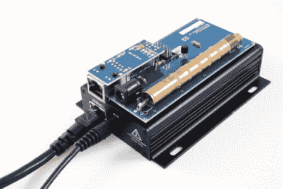
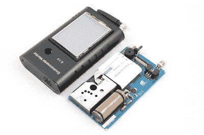
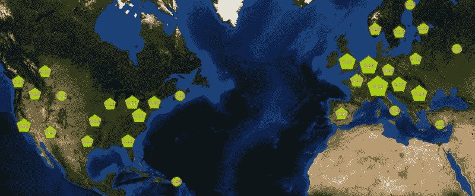

# 全球分布的传感器网络监测空气质量和辐射

> 原文：<https://hackaday.com/2015/12/07/globally-distributed-sensor-net-monitors-air-quality-and-radiation/>

Radu Motisan 一直在建立一个全球环境监测网络，该网络首先监测辐射水平，此后增加了测量空气质量的能力。他认为，人们需要更多地意识到他们周围的环境，就像社会已经意识到个人健康和健康问题一样。没有简单可靠的方法来测量环境，我们无法做到这一点。

他在 [2015 年黑客日超级大会](http://hackaday.io/superconference)上发表演讲时详细讨论了这个项目。观看下面视频中的谈话，然后在休息后加入我们，了解收集和公开呈现数据的硬件和基础设施的更多细节。

 [https://www.youtube.com/embed/nssmiXufFXg?version=3&rel=1&showsearch=0&showinfo=1&iv_load_policy=1&fs=1&hl=en-US&autohide=2&wmode=transparent](https://www.youtube.com/embed/nssmiXufFXg?version=3&rel=1&showsearch=0&showinfo=1&iv_load_policy=1&fs=1&hl=en-US&autohide=2&wmode=transparent)

### 从 uRADMonitor 开始

uRADMonitor PCB shown on top of its metal case

uRADMonitor 是 Radu 用来开发网络的原始硬件。对用户来说，这些都是简单的设备，只需要插入以太网和电源就可以工作。然后，他们在网络上列举，并开始打电话回家与背景辐射测量。

有了每个节点的已知位置，这些数据就可以随着时间的推移绘制成图表，并在网站上提供。Radu 做了很多工作来增加野外节点的数量，概念和执行都得到了认可，并在 2014 年 Hackaday 奖的半决赛中获得了一席之地。

### 成长以衡量更多

Environmental Monitor PCB next to its enclosure

随着成熟的数据网络和许多节点已经投入使用，Radu 开始寻找改进硬件的方法。他的目标是利用具有更好的节点的数据网络，这些节点是便携式的，具有位置感知能力，并且具有更多数量的传感器。便携性是通过添加可充电电池和 WiFi 来取代硬连线以太网连接来实现的。前一版本硬件的辐射传感器加入了空气颗粒传感器以及 CO2 和 VOC 传感器。新型号还包括一个小触摸屏，它提供了一个新的系统设备上的用户界面。该作品被认为是 2015 年黑客日奖(Hackaday Prize)的入围作品[和最佳产品(Best Product)的入围作品](https://hackaday.io/list/7999-2015-hackaday-prize-finalists)。

### 有趣的数据

Each pentagon represents several sensors deployed in that geographic area

Radu 分享了几个关于他的硬件收集的数据的非常有趣的故事。微粒、二氧化碳和挥发性有机化合物传感器的加入立即取得了成功。即使在他相对较小的 30 万人口的城市，硬件也记录了与交通模式加剧相关的明显污染变化。

在辐射方面，他注意到位于美国的一个节点上有一个尖峰信号。他首先想到的是可能出现了故障。但是当询问节点的所有者时，他发现情况并非如此。业主的女儿一直在进行使用贫化铀的学校实验，由于这些样本的接近，敏感设备记录了较高的背景辐射水平。同样，Radu 也注意到，在设备上飞机后立即打开设备会记录到高层大气中更多宇宙射线的辐射峰值。

也许最有趣的是他对自己制作并绑在车外的传感器的回忆。在他的国家周围开车时，他发现了几个大的辐射峰值。该数据已从报告网络中删除。他相信他可能已经在他的国家发现了富含铀的地区。这一数据可能与国家的自然资源有关，这也是它被保留下来的原因。除此之外，所有正在报告的数据都是可用的，并且可以在他的网站上查看[。](http://www.uradmonitor.com/)