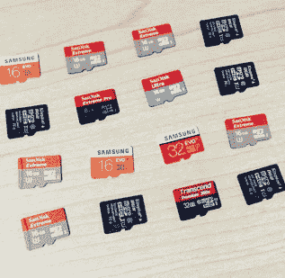

# 在 Pi 中使用哪种 SD 卡？

> 原文：<https://hackaday.com/2015/12/10/which-sd-card-to-use-in-a-pi/>

SD 卡的性能有惊人的差异。它们并不都是平等的，无论哪种型号，这些差异都会影响您的 Raspberry Pi 的运行。[Jeff Geerling]想知道不同的卡会如何影响系统性能。他对从廉价的无名牌到知名品牌的卡片进行了一系列测试。没有名字的卡片表现很差，但即使是名牌之间也有相当大的差异。

Raspberry Pi Spy 的[Matt]也测试了 SD 卡，发现了类似的差异。两者都测试了 microSD 卡。[Jeff]的测试只针对 Pi，而[Matt]的测试针对 Windows 7、Ubuntu 和一个 Pi。

博客中关于衡量什么的讨论和实际结果一样有趣。这导致确定哪些软件工具用于测量。例如，一个进行大量小型数据库读写的系统可能在一个 SD 卡上运行得更好，而一个存储和流式传输视频的系统可能在另一个卡上运行得更好。另一个有趣的结果是 Pi 的数据总线极大地限制了访问速度。[Jeff]使用带有 USB 加密狗的 Mac 运行相同的测试时，测得的速度要高得多。这些卡的能力远远超过 Pi 所能提供的。

[马特]还检查了 SD 卡的容量。有很多假冒产品标着比他们实际支持的更高的容量。即使拿到名牌也无济于事，因为有些是假冒的。所以要小心:如果价格好得不像真的，它很可能是真的。