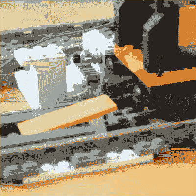

# 自动分离乐高火车

> 原文：<https://hackaday.com/2015/12/13/decoupling-lego-trains-automatically/>

乐高火车套装是在大约 50 年前推出的，从那时起，有一件事是不变的:用磁铁连接的火车。虽然这是一种极其简单的连接机车和车辆的方法，但有一个很大的缺点。制造解耦器——将一辆车与另一辆车分开的装置——很困难。

现在，通过齿条、齿轮和楔子的巧妙组合，[火车可以自行拆卸](https://www.youtube.com/watch?v=tUPxj0smong)。他们甚至可以用 Arduino 来做。

 这种解耦器的工作原理是有效地将汽车相互楔开。用一台旧的乐高技术设备的马达、几个齿轮、轴和一个架子，可以建造一个装置，安装在一条轨道的铁轨之间，这条轨道伸入机车车辆的底盘。

因为这种机车车辆是随机车一起移动的，所以要把火车分成两半，所需要做的就是让机车向前移动。是的，这确实意味着与最弱磁体的连接脱离——不一定是你想要解耦的连接。然而，只有一辆车和一个火车头，只有一个连接断开。很简单。

这个乐高解耦器可以进一步改进，增加一个 Arduino、几个超声波传感器和一个红外探测器，为乐高列车布局制作一个全自动解耦侧线。你可以在下面看到，这一切都是通过一个全状态机来实现的，这个状态机可以永远切换机车后面的车辆。

乐高玩具的一大用处。

 [https://www.youtube.com/embed/tUPxj0smong?version=3&rel=1&showsearch=0&showinfo=1&iv_load_policy=1&fs=1&hl=en-US&autohide=2&wmode=transparent](https://www.youtube.com/embed/tUPxj0smong?version=3&rel=1&showsearch=0&showinfo=1&iv_load_policy=1&fs=1&hl=en-US&autohide=2&wmode=transparent)

