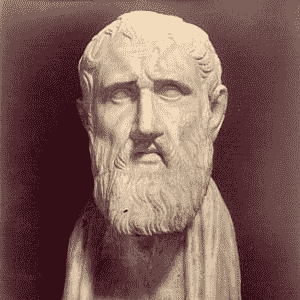
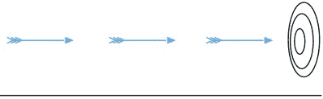
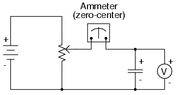
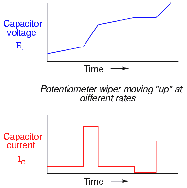

# 微积分没有你想象的那么难

> 原文：<https://hackaday.com/2015/12/15/calculus-is-not-as-hard-as-you-think/>

> "一切都应该尽可能简单，但不能更简单。"
> 
> 阿尔伯特·爱因斯坦

我们的旅程从一个我们称之为[无名氏]的虚构人物开始。他代表了世界各地城镇中的普通职业工人。几乎每天，[约翰]都会被闹钟叫醒，然后开车去上班。他乘电梯到办公室，然后登录他的电脑。他做这些事情的时候，一点都不知道它们是如何工作的。虽然[John]可能有兴趣了解他日常使用的机器和设备的内部工作原理，但他没有时间和精力投资于此。对他来说，汽车、电梯、电脑和闹钟是完全不同的复杂机器，几乎没有任何相似之处。没有多年的研究，根本不可能理解它们是如何工作的。

Hackaday 的普通读者可能会与我们的[无名氏]有所不同。他们会知道驱动电梯的电动机与他汽车里的交流发电机非常相似。他们会知道控制驱动电梯的电动机的 PLC 与他登录的计算机非常相似。他们应该知道，在基本层面上，PLC、闹钟和计算机都是基于相对简单的晶体管理论。对[John Doe]和普通人来说是一个巨大的复杂的混乱，对黑客来说不过是简单的机械和电气原理的使用。复杂之处在于如何应用这些原则。从复杂的想法中抽象出基本原则，让我们能够简化和理解它们，以此向上面引用的爱因斯坦的即兴建议致敬。

Zeno of Elea 490 – 430BC

你们中的许多人看待微积分就像[无名氏]看待机器一样。你看到的是同样庞大复杂的混乱局面，需要花费大量的时间和精力去理解。但是如果我告诉你微积分有一个共同点，就像许多不同的机器一样。有一些基本原则是任何人都可以理解的，一旦你理解了，它将开启一种看待世界及其运作方式的新方式。

普通的微积分课本有一千页长。世界上的约翰将会看到一千个难学的东西。然而，黑客会看到两个基本原则和这些原则的 998 个例子。在这一系列文章中，我将向你展示这两个原则——导数和积分——是什么。基于德克萨斯大学奥斯汀分校的[迈克尔·斯塔伯德]教授为教学公司所做的工作，我们将使用任何人都能理解的日常例子。微积分揭示了我们这个世界的一种特殊的美——当你能够动态地而不是静态地看待它时，这种美就会产生。我希望给你这个观点。

在我们开始之前，了解一点微积分的历史是有好处的，它的根源在于对变化和运动的仔细分析。

## 芝诺悖论

[埃利亚的芝诺](https://en.wikipedia.org/wiki/Zeno_of_Elea#Zeno.27s_paradoxes)是公元前四世纪的哲学家。他提出了几个微妙但深刻的悖论，其中两个最终导致了微积分。人类的聪明才智需要 2000 多年才能解决这些悖论。你可以想象，这并不容易。这些困难主要围绕着无限的概念。你如何从数学的角度处理无穷大？艾萨克·牛顿爵士和[戈特弗里德·莱布尼茨](https://en.wikipedia.org/wiki/Gottfried_Wilhelm_Leibniz)在 17 世纪中期独立发明了微积分，最终解决了悖论。让我们仔细看看他们，看看大惊小怪是怎么回事。

### 箭头

 考虑箭从空中飞过。我们可以合理而有把握地说，箭在弦上。现在考虑任意时刻的箭头。箭头不再移动。它是静止的。但是我们知道箭在运动，怎么可能是静止的！这就是悖论。这可能看起来很傻，但从数学的角度来看，这是一个非常具有挑战性的概念。

我们稍后会发现，我们真正处理的是瞬时变化率的概念，我们将用微积分的两个原则之一——导数的概念来详细阐述。它将允许我们计算箭头在某一瞬间的速度——这是人类花了 2000 多年才实现的不朽壮举。

### 二分法

让我们再次考虑同样的箭头。这一次让我们假设箭头是冲着我们来的。芝诺说我们不必移动，因为它永远也打不到我们。想象一下，当箭在飞行时，它必须经过弓和目标之间距离的一半。一旦它到达中途点，它必须再次这样做——移动它和目标之间距离的一半。想象一下我们一直这样做。箭头在原点和目标之间不断移动。这样做，箭就永远射不到我们了！在现实生活中，箭最终会射中目标，这就给我们留下了一个悖论。

和第一个悖论一样，我们将看到如何用微积分的两个原则之一——积分来解决这个问题。积分允许我们将无穷大的概念作为一个数学函数来处理。对于科学家和工程师来说，这是一个非常强大的工具。

## 微积分的两个原则

微积分的两个主要思想将通过用它们来解决芝诺悖论来展示。

*   **导数**–导数是一种允许我们计算“箭头”悖论中箭头速度的技术。我们将通过逐渐变小的时间量来查看箭头的位置，从而当测量之间的时间无限小时，将知道精确的速度。

*   **积分**–积分是一种技术，它将允许我们计算二分悖论中箭头的位置。我们将通过逐渐减少的时间量来观察箭头的速度，这样，当测量之间的时间无限小时，精确的位置将是已知的。

不难注意到导数和积分之间的一些相似之处。这两个值都是通过以越来越精细的时间间隔检查箭头来计算的。我们将在后面了解到，积分和导数实际上是同一个陶瓷电容器的两面。

## 我为什么要学微积分？

我们都熟悉欧姆定律，它用一个简单的等式把电流、电压和电阻联系起来。然而，让我们考虑电容器的“欧姆定律”。流经电容器的电流取决于电容器两端的电压和**时间**。时间是这里的关键变量，在任何动态事件中都必须考虑到。微积分让我们理解和衡量事物如何随时间变化。对于电容，通过电容的电流等于电容乘以每秒伏特数，即 i = C(dv/dt ),其中:

*   i =电流(瞬时)
*   C =电容，单位为法拉
*   dv =电压变化
*   dt =时间变化

 在这个电路中，没有电流流过电容器。电压表将读取电池电压，电流表将读取零安培。只要电位计不动，电表上的电压就稳定。我们的等式表示 i = C(0/dt) = 0 安培。但是当我们调整电位计时会发生什么呢？我们的等式表明，电容器中会产生电流。该电流将取决于电压变化的速率，而电压变化的速率与我们移动电位计的速度有关。

这些图表显示了电容两端的电压、通过电容的电流和我们转动电位计的速度之间的偶然关系。它从电位计缓慢转动开始。速度的增加导致更快的电压变化，进而导致电流的急剧增加。在所有点上，通过电容器的电流与电容器两端电压的变化率成正比。

微积分，或者更具体地说是导数，使我们能够量化这种变化率，这样我们就可以知道在任何给定时刻流过电容器的电流的准确值。同样，我们可以知道芝诺之箭的瞬时速度。在你的黑客武器库中，这是一个非常强大的工具。

在下一篇文章中，我们将深入讨论如何使用芝诺“箭”悖论的现代但简单的表示和一些基本代数来计算导数。下一篇文章将使用二分法悖论对积分做同样的处理。然后，我们将通过展示这两者之间的关系来把事情联系起来，这就是所谓的微积分基本定理。