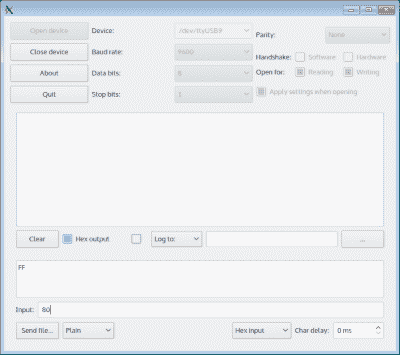
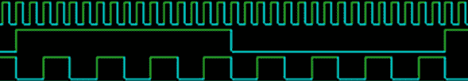

# 获取 FPGA 的脉冲(宽度调制)

> 原文：<https://hackaday.com/2015/12/16/taking-the-pulse-width-modulation-of-an-fpga/>

我认为人们使用 FPGAs 有四种不同的方式:

1.  将 FPGA 用作 CPU，这允许您添加预定义的 I/O 块
2.  从预定义的 I/O 模块为外部 CPU 构建定制外设
3.  从头开始构建定制逻辑电路
4.  不需要 FPGA 但有助于您学习的项目

我敢打赌，FPGA 的大部分用途属于第一类和第二类。一些 FPGAs 甚至已经内置了 CPU。即使没有板载 CPU，通常也可以在芯片中放一个 CPU“核心”(想想可重用库)。无论哪种方式，您都可以添加其他内核来创建 UARTs、USB、以太网、PWM 或您碰巧需要的任何其他 I/O。你要么把它们连接到芯片上的 CPU，要么连接到外部 CPU。使用今天的工具，你经常从列表中选择你想要的，然后你的整个项目就变成了软件开发工作。

第三种风格是做完整的逻辑设计。您可能会使用一些内核，但您根本不需要 CPU。您可以配置 FPGA 来精确执行您需要的逻辑功能。当然，如果您正在创建一个定制的 CPU，您将在开发的不同阶段将所有这些风格混合在一起。其他开发人员可能会构建包含 FPGA 上的 CPU、一些定制内核和一些成熟的逻辑开发的系统，因此界限可能会变得模糊。

第四种风格我就不理会了。在 FPGA 中实现交通灯状态机或 LED 闪光器是很好的实践。不过，实际上，您也可以使用 Arduino 或其他微控制器来实现。

## 为什么要用 FPGAs？

对于前两种风格，使用 FPGA 的原因很明显:这些开发人员只想混合搭配预构建的内核。就像用乐高积木搭建东西一样，它可能不会产生最佳的结构，但是你可以不费吹灰之力就完成很多事情。缺点主要是成本和功耗，具体取决于设备。

您使用 FPGA 进行“纯”逻辑设计的原因与您首先使用分立逻辑进行开发的原因相同。FPGAs 可以实现非常高速的逻辑。在 CPU 必须执行一堆指令来做事情的情况下，FPGA 只是有专用逻辑来做你需要的任何事情，通常在一个时钟周期内。

此外，FPGAs 上的大多数操作是并行运行的。假设您构建了一个 PWM 模块，并将其放在 FPGA 上(我们将在下面做一些事情)。如果您决定需要两个 PWM 模块，它们仍将以相同的速度运行。如果您需要 20 个 PWM 模块，它们也将以与单个模块相同的速率运行。

FPGA 的高速并行运行能力使其成为并行处理和高速信号处理的绝佳选择。设计师有时使用 FPGAs 还有其他一些次要原因，比如抗辐射器件的可用性，但速度和并行性通常是驱动因素。

## 一个项目

今年早些时候，我向你展示了如何用廉价的 Lattice iCEStick 和开源工具构建[一个简单的项目。(冰棍出现在右边。)从那以后，我就想回来做一些更实际的事情。这一次，我将从 GitHub 获取一个 UART 内核，并使用它通过 iCEStick 上的 USB 端口与 PC 对话。然后，我将从头构建一个自定义 PWM 模块，并创建一个 PC 驱动的 PWM 外设。在这个过程中，您将看到一些 Verilog 的细微差别，如参数，并获得更多使用现有内核和测试平台的实践经验。稍后，我们将通过创建 PWM 模块的更多实例来快速添加多个 PWM 输出。](http://hackaday.com/2015/08/19/learning-verilog-on-a-25-fpga-part-i/)

## UART 通信

虽然我喜欢从零开始构建一切，但我也知道我可以抓住一些常见的构建模块来使事情变得更容易。有时我会重用自己的代码，也有其他地方可以查看，包括:

*   FPGA 供应商的网站
*   [OpenCores](http://opencores.org)
*   [GitHub](http://github.com)
*   整个互联网

在这种情况下，我知道 iCEStick 的 USB 端口可以作为 PC 上的串行端口，快速搜索发现了这个 GitHub 库。UART 是驻留在 OpenCores 上的开源 UART 的一个薄薄的包装器[。](http://opencores.org/project,osdvu)

我有自己的 UART 代码，所以如果不是因为 iCEStick 专用的包装器，我可能会使用它。然而，下载 UART 并不困难。有一个问题:这个项目包括底层的开源 UART 作为子项目。如果您从 GitHub 下载 ZIP 文件，该子项目将是一个空文件夹，您需要单独填写。如果克隆项目，需要这样初始化子项目:`git submodule update --init`

该项目包括一个简单的测试驱动程序，它可以回显字符。在开始添加东西之前，确保借用的代码能够工作总是一个好主意，所以第一个任务是将测试项目下载到 iCEStick 并让它工作。事实上，对于这个简单的项目，我将从测试代码开始，作为最终设计的框架。

如果你需要冰风暴(冰棍的开源工具)的复习，你可以看看我之前的帖子。这个存储库有一个 Makefile 文件，可以让您简单地运行 make 来构建项目。如果您在命令行中键入`make flash`，makefile 将根据需要构建项目，并将其编程到 FPGA 中。确保 FPGA 插入 USB 端口。

[](https://hackaday.com/wp-content/uploads/2015/12/cutecom.png)Linux 下 FPGA 会枚举为串口— /dev/ttyUSBx。要与 FPGA 对话，您需要将一个终端程序连接到该端口。对于这一步，任何终端程序都可以(例如，minicom、picocom 或 putty)。然而，当 PWM 模块就位时，您将希望终端能够轻松处理十六进制代码而不是 ASCII 字符。有很多选择，但是我推荐 Cutecom，应该在你的软件仓库里(或者从[它的主页](http://cutecom.sourceforge.net/)下载)。

一旦你把端口打开到 9600 波特，你应该能够输入字符并看到它们出来。`uart_demo.v`文件使用 UART 内核的实例产生回应:

```

always @(posedge iCE_CLK) begin
    if (received) begin
        tx_byte &lt;= rx_byte;
        transmit &lt;= 1;
    end else begin
        transmit &lt;= 0;
    end

```

为了好玩，让我们把小写字母转换成大写字母:

```

always @(posedge iCE_CLK) begin
    if (received) begin
        if (rx_byte &gt;= 8'h61 &amp;&amp; rx_byte &lt;= 8'h7a)
            tx_byte &lt;= rx_byte &amp; 8'hDF;
        else begin
            tx_byte &lt;= rx_byte;
            transmit &lt;= 1;
        end 
    else begin // else goes with if (received)
            transmit &lt;= 0; 
    end

```

你可以用很多方式来写，但我想表达清楚。在英文中，`tx_byte`赋值的右边写着:如果`rx_byte`在 61 hex 和 7a hex 之间，包括 61 hex 和 7a hex，使用`rx_byte`和 0xDF 的 and，否则直接使用`rx_byte`。更改代码并再次刷新设备，验证小写字母是否转换为大写字母。

## 关于 PWM

随着 UART 的工作，我们可以进入项目的核心:脉宽调制(PWM)发生器。产生 PWM 有多种方法。想象你站在一个黑暗的房间里的电灯开关旁边。当然，如果你打开开关，房间就会亮起来。如果你开灯 1 秒，然后关灯 59 秒，房间里的总光量将是开关打开时光量的 1/60。现在想象你可以非常快速地开关电灯。所以在 60 毫秒中，你打开灯一毫秒。你的眼睛会平均光线，看起来光线很暗。

如果你希望灯光亮度是全开时的 50%会怎样？你有几个选择。你可以把灯打开 30 秒，然后关掉 30 秒。这被称为“等面积 PWM”然而，您也可以打开灯 1 ms，然后关闭 1 ms，产生“比例 PWM”。哪种方式最好？那取决于你想做什么。例如，1 毫秒的脉冲可能会使任何闪烁的光不那么明显。然而，使用比例 PWM 意味着脉冲频率会根据占空比而变化，这可能会导致电机在某些速度下发出嗡嗡声。

下图显示了两个 50%的 PWM 信号。顶部轨迹是时钟，中间轨迹使用等面积语义，底部轨迹是比例 PWM 发生器。虽然信号看起来不同，但底部的两条轨迹一半时间处于开启状态，一半时间处于关闭状态。



我决定创建一个模块，可以做任何一种类型的 PWM。当你使用内核时，你可以选择你想让它使用的方法。

## 创建 PWM 模块

只需驱动一个具有所需分辨率位数的计数器，就可以轻松产生 PWM 输出。对于等面积 PWM，当计数器为零时，可以从输出开启开始。当计数器达到所需的占空比时，关闭输出。例如，对于 8 位计数器，大约 50%的占空比将是 127 的计数。计数 0 到 127 时输出为高，计数 128 到 255 时输出为低。您可以通过提前将计数重置为零来减少步数。例如，如果您将计数器重置为 200，那么 50%将是 100，这很方便，如果不是必要的话。

比例 PWM 有点棘手，但仍然很简单。坚持 8 位分辨率，PWM 发生器可以使用带进位输出的 8 位计数器。在每个时钟周期，增加占空比值。就是这样。输出是计数器的进位输出。假设占空比为 0x80。最初，计数器为零。在第一个时钟周期，计数器将为 0x80，由于进位输出位为零，输出将为低电平。下一次加法导致计数器值为 0x00，但发生进位，因此输出变为高电平。你可以看到这将重复，因为下一个周期将是 0x80。50%的占空比就是这样产生的。

如果您使用占空比为 1 的计数器，您将会看到高输出之间有很大的差距。如果您在每个时钟周期将 0xFF 加到计数器，您将获得几乎恒定的高输出。

我决定创建一个块来做这两种风格。Verilog 界面如下所示:

```

module pwmblock #(parameter CNT_WIDTH=8, DIV_WIDTH=8)
    (input clk, input reset, input [CNT_WIDTH-1:0] increment, 
     input [CNT_WIDTH-1:0] endval, input [CNT_WIDTH-1:0] match,
     input [DIV_WIDTH-1:0] scale, output reg epwm, output ppwm);

```

我会在明天的帖子中详细讨论参数。参数包括标准时钟(`clk`)和`reset`输入。其余的输入是:

*   `increment`–每个时钟周期加到计数器上的量(1 表示相等的面积；比例占空比)
*   `endval`–导致复位的计数器值
*   `match`–导致输出切换的计数器值(相等面积的占空比)
*   `scale`–时钟的预分频计数器(设置为零表示无预分频)

输出为等面积输出的 epwm 和比例输出的 ppwm。当然，每个实例只能使用一个。

## PWM 快捷键

为比例或等面积模式设置 PWM 模块只需要设置正确的参数并拾取正确的输出。然而，为了使它更容易，我创建了两个包装器，它们只公开每种模式所需的参数:

```

// Handy wrapper for equal area
module epwmblock #(parameter CNT_WIDTH=8, DIV_WIDTH=8)
  (input clk, input reset, input [CNT_WIDTH-1:0] endval,
  input [CNT_WIDTH-1:0] match, input [DIV_WIDTH-1:0] scale, output pwm);
  pwmblock #(.CNT_WIDTH(CNT_WIDTH), .DIV_WIDTH(DIV_WIDTH)) 
  pwmb(clk, reset, 1, endval, match, scale, pwm,);
endmodule

```

```

// Handy wrapper for proportional
module ppwmblock #(parameter CNT_WIDTH=8, DIV_WIDTH=8)
  (input clk, input reset, input [CNT_WIDTH-1:0] duty, input [DIV_WIDTH-1:0] scale, 
  output pwm);
  pwmblock #(.CNT_WIDTH(CNT_WIDTH), .DIV_WIDTH(DIV_WIDTH)) 
  pwmb(clk, reset, duty, 0, 0, scale,,pwm);
endmodule

```

除非你需要特殊的东西，否则你可能会使用包装纸。

## 测试平台和模拟

虽然尝试将代码加载到 FPGA 中进行测试很有诱惑力，但除非第一次就成功了(是的，没错！)在模拟中开发系统要高效得多。[我用 EDAPlayground](http://hackaday.com/2015/07/21/learn-fpgas-in-your-browser/) 来测试 PWM 代码。为了测试它，我需要一个测试平台，它只是一个简单的驱动程序，使用这个模块并生成一些结果，您可以将这些结果与您期望的进行比较。

你可以在 EDAPlayground 网站上找到测试平台和代码[，也可以在那里运行它。下面是测试平台的样子:](http://www.edaplayground.com/x/E8s)

```

`default_nettype none
module test;
reg clk=0, reset=1;
wire ep, pp, ep0, pp2, ep1;
always #1 clk=~clk;
// 10/256 
epwmblock dut0(clk, reset, 8'hff, 8'h10, 8'h0, ep0);  
// 10/1024
epwmblock #(.CNT_WIDTH(10)) dut1(clk, reset, 10'h3ff, 10'h10, 8'h0, ep);
// 255/256
ppwmblock dut2(clk, reset, 8'hFF, 8'h0, pp);  
// 128/256 with prescale=1
ppwmblock dut3(clk, reset, 8'h80, 8'h1, pp2);  
// 16/32
epwmblock dut4(clk, reset, 8'h1f, 8'h10, 8'h0, ep1);
initial
begin
  $dumpfile(&quot;dump.vcd&quot;);
  $dumpvars(3);
#5 reset=0;
#4096 
  $finish;
end
endmodule

```

测试平台不难理解。它生成一个时钟，只需连接几个测试设备，记录几千个时钟周期的结果。这是模拟的一部分:


您可以将左侧的信号名称与测试平台代码进行匹配，以查看每条走线的 PWM 占空比。

## 下次

这个例子几乎太简单了，但也很难消化。下一次，我们将在真正的硅片上集成 PWM 和 UART，添加一些通道，使协议更加复杂。在这个过程中，您将看到 Verilog 是如何处理数组和参数的。如果你想重温一下如何使用 EDAPlayground 做模拟，看看我上次谈到冰棍时的[视频，包括下面的视频。](https://www.youtube.com/playlist?list=PL_tws4AXg7asC75dRvL_4vRWbz1F5focG)

 [https://www.youtube.com/embed/Oq8Z0eK0Fmg?version=3&rel=1&showsearch=0&showinfo=1&iv_load_policy=1&fs=1&hl=en-US&autohide=2&wmode=transparent](https://www.youtube.com/embed/Oq8Z0eK0Fmg?version=3&rel=1&showsearch=0&showinfo=1&iv_load_policy=1&fs=1&hl=en-US&autohide=2&wmode=transparent)

