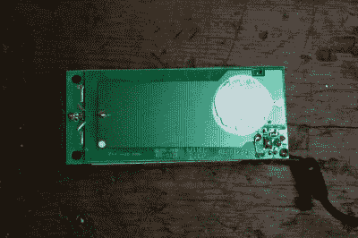

# Sparkfun 拆电源

> 原文：<https://hackaday.com/2015/12/17/sparkfun-tears-apart-power-supplies/>

我们喜欢好的拆卸，上周在 Sparkfun 举行的“Enginursday”满足了我们观看 AC-DC 开关电源内部的愿望，并伴有知识丰富的评论。[MTaylor]向我们介绍了基本电路是如何工作的，然后指出了在他拆开的几个电源中，为什么要进行各种其他的精心制作，以及有时如何偷工减料。

 在对比中让我们印象深刻的是，一些电源是非常简约的设计，而另一些则有明显是事后添加的“功能”。例如，Li Shin 电源(大约在页面中间)有一个额外的电路板粘在真实电路板的底部，作为电磁屏蔽。

[MTaylor]没有像我们一样宣称这是一次危险的黑客攻击，而是宣称这是一个“好消息！”因为这意味着他们可能已经进行了排放测试，失败了，然后加上这一点使其通过。这当然与其他可能从未考虑过排放测试的制造商形成对比。叹气。

如果你有兴趣看到更多的电源模块的内部信息，Sparkfun 论坛读者[sgrace]将这份关于各种电源的现场指南传递给了你，这也值得一看。如果你有兴趣为自己打造终极台式电源，那么看看[【The Big One】](https://hackaday.io/project/4154-bench-power-supply)的这个 Hackaday.io 项目就知道了。