# 从未有过的星球大战汽车:欧比-肖恩的定制 Z 翼

> 原文：<https://hackaday.com/2015/12/14/star-wars-car-that-never-was-obi-shawns-custom-z-wing/>

星球大战从来没有汽车。当然，有陆地飞车和飞车，但这两者都表明很久以前就没有轮子了。所以那些想驾驶星球大战飞船的人只能靠他们自己的想象力去创造一个。这正是[欧比-肖恩]，又名[肖恩·克罗斯比]，建造他的 Z 翼。

 [https://www.youtube.com/embed/onZQ0AxmDr4?version=3&rel=1&showsearch=0&showinfo=1&iv_load_policy=1&fs=1&hl=en-US&autohide=2&wmode=transparent](https://www.youtube.com/embed/onZQ0AxmDr4?version=3&rel=1&showsearch=0&showinfo=1&iv_load_policy=1&fs=1&hl=en-US&autohide=2&wmode=transparent)

Z-Wing 是一辆改装的日产 350Z，是他在 Craigslist 上买的。彻底拥有它是很重要的，因为他会把它切碎，像挑剔的怨恨一样吐出来。但这也给他留下了一些额外的现金用于改装。

这不仅仅是油漆工作；车的两侧有几组爆炸装置，R2D2 坐在后备箱里，车内看起来和感觉上都像驾驶舱。我们真的很喜欢外部组件，它们是对普通商品的巧妙重用。例如，轮毂盖是比萨饼锅，冲击波是棒球棒。行李箱盖上的“绿色物品”(感谢我们的 Brian Benchoff 让我们意识到这个词)由各种各样的物品组成，比如看起来很有趣的便携式扬声器，甚至是星际迷航的电脑鼠标。

 [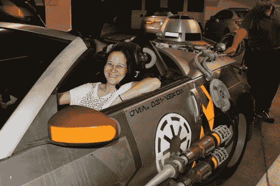](https://hackaday.com/2015/12/14/star-wars-car-that-never-was-obi-shawns-custom-z-wing/img_1847/) Jasmine trying it on for size [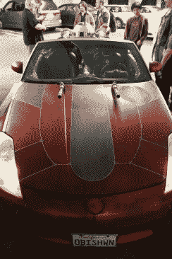](https://hackaday.com/2015/12/14/star-wars-car-that-never-was-obi-shawns-custom-z-wing/img_1818/)  [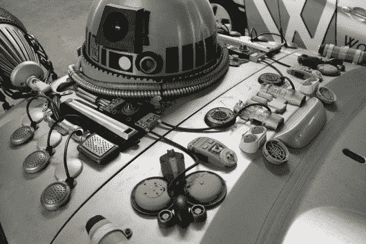](https://hackaday.com/2015/12/14/star-wars-car-that-never-was-obi-shawns-custom-z-wing/img_1829/)  [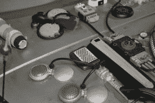](https://hackaday.com/2015/12/14/star-wars-car-that-never-was-obi-shawns-custom-z-wing/img_1835/)  [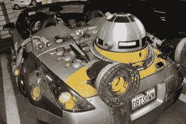](https://hackaday.com/2015/12/14/star-wars-car-that-never-was-obi-shawns-custom-z-wing/img_1837/) R2 spins [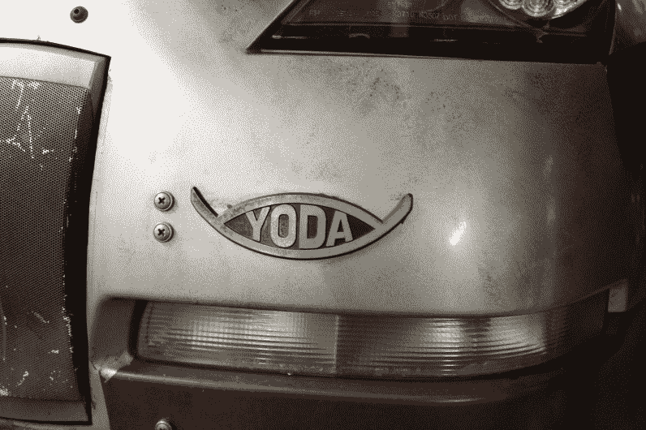](https://hackaday.com/2015/12/14/star-wars-car-that-never-was-obi-shawns-custom-z-wing/img_1855/) Great bumper decor

内部装饰有一个全息投影道具(目前波巴·费特在快速拨号上)，手套箱上方有一个放置光剑和平板电脑的地方。Z-Wing 的移位器是一个游戏操纵杆，就在它上面是一个非常有趣的定制作品。这是一个 24V 的人造地平线。这是一种普通的飞行仪器，可以让飞行员知道飞机相对于地球的方位。欧比-肖恩把它改装成了带重物的。所以急转弯、停车或加速都会影响它的方向。

方向盘是另一个有趣的定制。顶部已经被切掉，并在两端添加了拇指按钮。这看起来和感觉非常像科幻控制轭。现在这些按钮只是为了展示，但他的计划是将它们连接到侧面爆炸装置的闪光灯上。

 [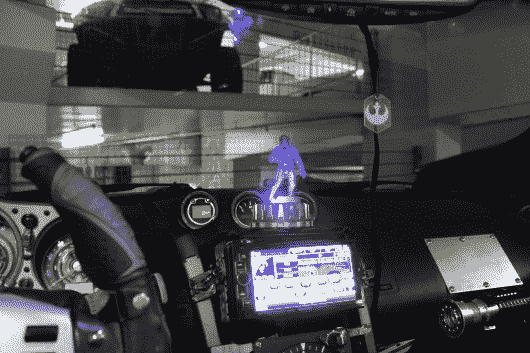](https://hackaday.com/2015/12/14/star-wars-car-that-never-was-obi-shawns-custom-z-wing/img_1854/) Hologram for receiving dashboard communications [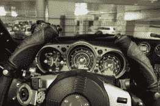](https://hackaday.com/2015/12/14/star-wars-car-that-never-was-obi-shawns-custom-z-wing/img_1853/) Customized indicators and steering wheel [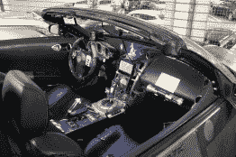](https://hackaday.com/2015/12/14/star-wars-car-that-never-was-obi-shawns-custom-z-wing/img_1809/) The Interior Modifications [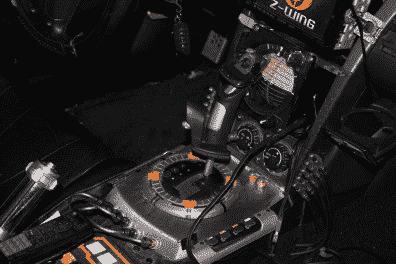](https://hackaday.com/2015/12/14/star-wars-car-that-never-was-obi-shawns-custom-z-wing/img_1813/) Joystick shifter [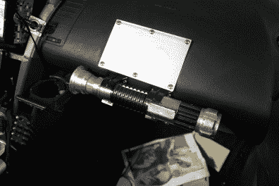](https://hackaday.com/2015/12/14/star-wars-car-that-never-was-obi-shawns-custom-z-wing/img_1823/) Light Saber and mounting for a tablet above glove box

Z-Wing 的最新成员是背面的一对马达。考虑到原始资料，这些真的很好地结合在一起。圆锥体是一个花盆，红色的分隔圆柱体是幻灯机上的旋转木马，防爆挡板是光圈控制装置。这种装配是早期科幻电影的标志，也是对欧比-肖恩在建造过程中所用的深思熟虑的致敬。

露营在行李箱盖上是 R2D2 圆顶的忠实再现。它自由旋转，被偷过几次。通常把它找回来只需要在附近走一圈，直到那个带着它到处走的傻瓜被发现。

 [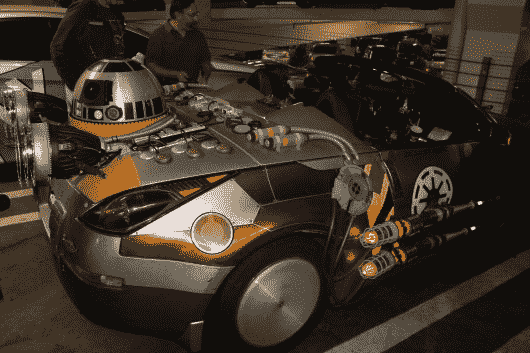](https://hackaday.com/2015/12/14/star-wars-car-that-never-was-obi-shawns-custom-z-wing/img_1805/) Size view of blasters [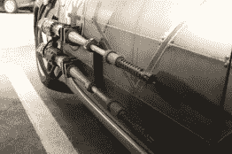](https://hackaday.com/2015/12/14/star-wars-car-that-never-was-obi-shawns-custom-z-wing/img_1822/) Blasters are baseball bats [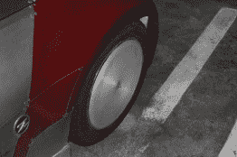](https://hackaday.com/2015/12/14/star-wars-car-that-never-was-obi-shawns-custom-z-wing/img_1845/) PIzza pan for a hub cap [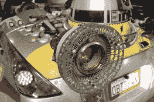](https://hackaday.com/2015/12/14/star-wars-car-that-never-was-obi-shawns-custom-z-wing/img_1860/) Engines are newest addition [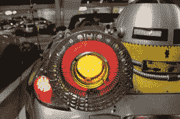](https://hackaday.com/2015/12/14/star-wars-car-that-never-was-obi-shawns-custom-z-wing/img_1831/)  [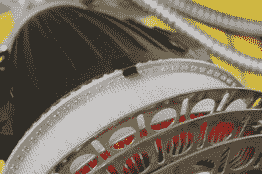](https://hackaday.com/2015/12/14/star-wars-car-that-never-was-obi-shawns-custom-z-wing/img_1834/) Slide projector carousel

欧比肖恩已经做了很长时间了。事实上，这是他的第二次建造，第一次使用本田德尔索尔。当里程爬得太高时，不得不退休。他花很多时间去参加像儿童医院这样的慈善活动。这是与[第 501st】、](http://www.501st.com/)[反抗军团](http://www.rebellegion.com/)、 [R2 建设者俱乐部](http://astromech.net/)联合进行的。像这样的展品坐在他的车库里会被浪费掉，我们很高兴他花时间通过炫耀它来照亮人们的生活，并让他们坐在驾驶座上(就像 Hackaday 的 Jasmine Brackett 在上面做的那样)。

但即使在比赛间隙，你也可以看到它在洛杉矶地区行驶。我们在帕萨迪纳的一次聚会上碰到了欧比肖恩。他用这辆车作为他的日常司机，当我们发现这一点时，有一大群人离开了酒吧，游行到停车场参观他的作品。