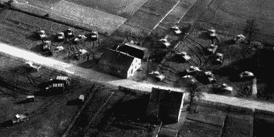

# 橡胶坦克和音速卡车:二战的幽灵军队

> 原文：<https://hackaday.com/2015/12/16/rubber-tanks-and-sonic-trucks-the-ghost-army-of-world-war-ii/>

温斯顿·丘吉尔曾告诉约瑟夫·斯大林“在战争时期，真理是如此珍贵，她应该永远有一个谎言的保镖陪伴着”。在第二次世界大战期间，这些保镖的力量，以军事欺骗的形式，变得非常明显。德国军队是有史以来技术最先进的军队。德国人率先在战场上使用喷气式飞机。他们创造了恩尼格玛机，这被证明是一个极难破解的系统。盟军怎么可能骗过他们？答案是科技和一些不可思议的天才士兵的结合。

这些人是第 23 总部特种部队，更好地被称为幽灵军队。这支部队是第一支专门用来欺骗敌人的部队。通过多次手术，他们做到了。这 1100 名士兵分散了德军的注意力和炮火，而不是他们所扮演的成千上万的盟军。

### 幽灵军队由 4 个不同的团体组成:

*   第 406 特种工程战斗连由 166 名“正规”士兵组成——这些人负责安全、建设和拆除工作。

*   第 603 伪装工程师是最大的群体，为 379 人。顾名思义，603 师是为了工程伪装而创建的。

*   3132 信号服务公司由 145 人组成，负责装载 500 瓦大喇叭的半履带车，15 英里外都能听到。

*   信号连的前身是第 244 信号连，该信号连的 296 人专门处理欺骗无线电通信。德国人严重依赖捕获和解码的无线电信息来决定盟军的下一步行动。

### 视觉欺骗

第 603 伪装工程师在战争中花费了大量精力来隐藏人员和装备。除了疲劳裤，伪装还有很多。部队制服上使用的那些看起来随机的颜色斑点实际上并不那么随机。它们由艺术家精心制作，以适应冲突地区的地形。但是迷彩不仅仅创造了图案。他们设计了在自然环境中隐藏设备的方法。如果地形多岩石，就用岩石来隐藏混凝土碉堡。许多 603 军的士兵都是从纽约的学校招募来的艺术家。他们一有空闲时间就会画画。这将使幽灵军队的非秘密日常活动成为战争中记录最完整的活动之一。

作为幽灵军队的一部分，603 部队被赋予了一项艰巨的任务。从地面或空中创造坦克、士兵、卡车和炮兵的幻觉。问题是“假”坦克、卡车和火炮仍在设计和制造中！在等待道具的时候，这个团队用手头的帆布、金属和木头制作了大炮。这个小组知道拥有真正的假人只是成功的一半。几辆坦克在战场上是骗不了任何人的。坦克需要看起来像是经过伪装的。从总部帐篷到睡袋到洗衣房，士兵们需要所有的服饰。

当 603 号装扮布景时，主要道具仍在设计中。陆军尝试了几种不同的类型，最终选择了由罗德岛 Woonsocket 的美国橡胶公司的 Fred Patton 设计的充气设计。橡胶在第二次世界大战中是一个巨大的产业。美国橡胶公司已经在生产能力建设拦河坝气球。大部分工作是由妇女完成的。

弗雷德·巴顿已经因设计太平洋战区战斗机飞行员使用的紧急救生筏而声名鹊起。他为幽灵军队创造的坦克需要轻便，快速部署，最重要的是看起来像真的一样。最终的设计是一个充气橡胶管的桁架状骨架，上面覆盖着一层涂有颜色的橡胶防水布。这些坦克重达 93 磅，由四个人轻松举起。卡车、火炮、甚至飞机都是用同样的方法制造的。美国橡胶公司、固特异公司和其他几家公司制造了数百个假人。它们以最快的速度被运送到 603 部队。

### 声波欺骗

3132 信号服务公司选择的武器是一台 M3A1 半履带车，装有 500 瓦的扬声器。这些经过特殊改装的车辆在设计时就考虑到了隐身性。扬声器可以藏在床底下，让这辆车看起来像欧洲剧院里成千上万辆半履带车中的任何一辆。当展开的时候，整个系统用手摇曲柄系统启动。士兵们很快给这个曲柄起了个绰号叫“咖啡研磨机”。声音回放是个问题。如果受到撞击，或者有炮弹落在附近，记录就会跳过。那时还没有磁带。解决方案是(当时)最先进的有线回放单元。这些播放器使用 0.0006 英寸的钢丝作为记录介质。要达到任何一种保真度都需要高速，所以电线以每秒 5 英尺的速度移动。卷轴有 2 英里长，可以播放 30 分钟。每个半履带车配有两个播放器，允许操作员在一台机器播放时切换另一台机器的卷轴。正如人们可能想象的那样，一根那么细、移动那么快的电线可能——而且确实会断裂。现场解决方法是在铁丝上打一个结，然后在下面放一根火柴。

在建造半履带车的时候，贝尔实验室被请来制作录音。一整个移动工作室与 16 英寸转录光盘录音机被送到诺克斯堡。他们记录了坦克、卡车和工人的工作。必须克服许多技术问题，才能获得在战场上经得起考验的记录。只要开一辆卡车经过麦克风，就会产生多普勒效应，录音会立刻被识别为假的。解决这个问题的方法很巧妙:把麦克风放在一个圆圈的中心，让卡车绕着它行驶。卡车与麦克风的距离总是相等的，所以不会有多普勒效应。

为了创造幽灵军队使用的电线录音，几个记录被混合在一起。如果欺骗包括渡河，男人组装浮桥的声音将与坦克、卡车和其他设备混合在一起。这是多声道录音的早期例子。

声音传播的方式因风、温度和其他天气条件而异。幽灵军队必须处理这件事。每次任务都部署了一个安装在吉普车上的气象站。天气数据与贝尔实验室制作的射表书进行了对比。就像炮手使用的表格一样，这些数字帮助幽灵军队确定正确的播放方向和音量。

### 无线电迷惑

信号公司特辑是一群精心挑选的无线电操作员。他们的工作是发送精心编排的无线电信号来误导敌人。这不仅仅是发送信号的问题。他们必须模仿他们正在模仿的师的装备和人员。

任何听过业余无线电爱好者用莫尔斯电码交流的人都会告诉你，没有两个业余爱好者是一样的。有些是缓慢而沉重的，而另一些是快速的断奏节奏。每个无线电操作员都有自己的风格，就像每个人都有自己的指纹一样。在战争期间，这个术语叫做“拳头”。德国无线电监测部队了解每个单位的实力，如果突然有新的操作员出现，他们会得到提示。信号公司特种兵必须学习和模仿真正的无线电操作员的拳头，为他们正在模仿的战斗群服务。

传输功率是另一个问题。特别信号公司有强大的发射机。如果德国人看到他们的接收信号强度指标(RSSI)随着幽灵军队的广播而上升，他们会很快明白过来。虽然该公司没有发射机功率计，但他们有铅笔。在发射天线附近拿一支铅笔会导致火花从天线跳到铅笔上。更大的能量会产生更长的火花。该团队简单地设置他们的发射机功率水平，以匹配原始设备的火花长度。

### 战时行动

第 23 总部特种部队在法国、德国、卢森堡和其他欧洲国家工作了一年多。他们会制造骗局——有时一次好几个，把同盟团体放在他们根本不存在的地方。缴获的德国情报一再证明这些欺骗是成功的。这些人也是战争中最勇敢的人。想想看——站在一个被设计用来欺骗敌人的充气坦克包围的战区。如果德国人进攻了，第 23 步兵团仅有的真正武器就是几挺车载机枪和他们的随身武器。军方当然考虑过这种可能性。23 军的大部分装备，尤其是音速半履带车，都装有炸药。如果敌人看起来要超过他们，这些人就拉一个杠杆。在炸弹爆炸之前，他们有 15 秒钟的时间，在秘密设备落入德国人手中之前将其炸毁。谢天谢地，从来不需要收费。

### Viesen 行动

在幽灵军队的所有行动中，最让他们记忆深刻的一次是他们最后的欺骗。掠夺行动是 1945 年 3 月 23 日横渡莱茵河的代号。在掠夺前的将近一个星期，第 23 步兵团执行了“维尔森行动”,试图让德国人相信渡河将发生在实际位置以南 10 英里的地方。一千一百人冒充第九军的两个师——一支三万人的部队。一个配有充气 L-5 观察飞机的整个机场就这样建成了。一架真正的 L-5 飞机降落在那里，这非常真实，让飞行员懊恼不已。充气枪竖立起来，并不断监测。任何泄漏都会导致桶下垂，这肯定会给德国人通风报信。第 23 届的欺骗无线电操作员与他们真正的同行协调。随着真正的师从广播中消失，第 23 师开始了。转移是无缝的。德国人不知道他们被骗了。

就像所有 23 军的行动一样，直到实际攻击那天，他们才知道他们的计划是否可行。成功意味着很少或没有防御。失败将意味着进攻师的重大伤亡。在掠夺的情况下，事情进行得很完美。盟军越过里斯镇，发现只有几个组织混乱的德国守军。缴获的德军地图显示了第 9 集团军群在第 23 集团军群的确切位置。第九集团军司令威廉·辛普森将军写了一封信赞扬第 23 集团军的努力。对于幽灵军队的人来说，战争最艰难的部分已经结束了。

### 战后

许多 23 世纪的人继续过着成功的生活，成为艺术家、插图画家、设计师和工程师。最著名的成员是服装设计师比尔·布拉斯。尽管他们中的许多人没能活到分享他们的故事。对德国人不利的欺骗被认为是冷战的重要工具。40 年来，幽灵军队的行动大部分都是保密的。

### 来源

关于幽灵军队的媒体文章和书籍不计其数。其中比较著名的是里克·拜尔和伊丽莎白·赛勒斯的《第二次世界大战的幽灵军队:一个绝密单位如何用充气坦克、音响效果和其他大胆的骗局欺骗敌人》。这本书和拜尔长达一小时的 PBS 纪录片主要取材于 10 年来对第 23 届男子的采访。这本书非常值得一读，强烈推荐。