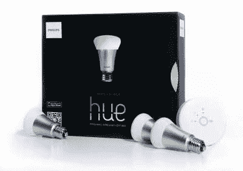

# 飞利浦说:没有适合你的物联网！

> 原文：<https://hackaday.com/2015/12/15/philips-says-no-internet-of-things-for-you/>

每个人都试图忽略的物联网(IoT)宣传角落里的 900 磅大猩猩是互操作性。在互联网的互联网(IoI)中，一切都基于几个被广泛接受的标准:IP 和 HTML。差异在于细节，标准之争已经成为过去。网站在很大程度上是可互操作的。在物联网的狂野西部精神中并非如此。

飞利浦生产了一系列支持 ZigBee 技术的 RGB 灯泡，在发烧友群体中掀起了一阵风暴。最初，飞利浦对其他设备非常友好——它制造了一个 ZigBee-WiFi 桥，让你可以从你的手机控制所有基于 ZigBee 的灯，不管它们是什么制造商。直到现在。

飞利浦刚刚推出了“色调之友”认证流程，并推出了固件更新，其中他们的色调桥停止与未经认证的设备互操作。你可以在这里阅读飞利浦的故事版本。

### 飞利浦锁定第三方 ZigBee 硬件

The hub shown on the right is what’s being locked down.

简而言之就是，让 ZigBee 标准见鬼去吧，你未来的非飞利浦灯将不被允许与飞利浦桥相关联。你的 GE 和 Osram 灯泡不是 Hue 的朋友。在你的照明组合中 DIY RGB 条？不是顺化的朋友。其实你知道“色相之友”是谁也不会惊讶:飞利浦的其他产品，还有苹果。就是这样。如果你习惯运行混合照明系统，那些日子已经过去了。如果你不在好友名单上，你就是色相的敌人。

他们声称，第三方产品可能会在飞利浦网络上显示错误行为，这增加了他们的客户响应热线，使人们认为飞利浦应该负责。当然，他们可以简单地告诉人们禁用“其他”设备，然后看看它是如何工作的，把责任推到它该在的地方。或者他们可以开辟一个“开发者模式”，让用户清楚地知道他们在做一些“创新”的事情。但是这些策略都没有阻止消费者购买其他公司的灯泡，这些灯泡的价格只有飞利浦 Hue 系列的 30-50%。

虽然飞利浦很小心地不这样说，但色相之友计划看起来真的像是试图将他们的竞争对手拒之门外；飞利浦在 RGB LED 领域取得了早期领先，并占据了很大的市场份额。正如他们在自己的新闻稿中所说，“今天，这些第三方灯泡只占连接到我们桥梁的总产品的极小一部分，因此受影响的用户比例也是极小的。”他们希望保持这种方式，即使他们伤害的人可能是他们最直言不讳和最忠诚的客户。

### 谁拥有物联网？

[tech dirt 对这种情况的反应](https://www.techdirt.com/articles/20151214/07452133070/lightbulb-drm-philips-locks-purchasers-out-third-party-bulbs-with-firmware-update.shtml)确实令人愤怒，在 Slashdot 的评论中出现了[可以预见的长篇大论。一月份还在](http://slashdot.org/story/15/12/14/2254205/lightbulb-drm-philips-locks-purchasers-out-of-3rd-party-bulbs-with-new-firmware#comments)[庆祝买得起足够多的彩灯](http://zatznotfunny.com/2015-01/philips-hue-and-zigbee/)来安抚他儿子的[现在已经不那么开心了](http://zatznotfunny.com/2015-12/philips-hue-excludes-3rd-party-bulbs/)。

当我们手动打开电灯开关，对色相消费者的第一世界问题一笑置之的时候，我们必须问问自己，我们是不是下一个。今天他们来找我们的 RGB 灯泡，但明天可能是我们的联网烤面包机。令人不寒而栗的想法！

撇开 Snark 不谈，物联网将软件世界的两个最可悲的现实带入了你的家用电器:[有代码的地方就有漏洞](http://hackaday.com/2015/10/02/a-white-hat-virus-for-the-internet-of-things/)，当你不能自己控制代码时，你就没有真正的控制权。你可能拥有灯泡，但你只是授权运行它的固件。制造商可以改变游戏规则，或者完全退出生产线，你就孤立无援了。你能做什么？拿出你的 JTAG 调试器。

当然，建议每个人都需要成为嵌入式设备固件黑客以保持冰箱运转是疯狂的。正如我们之前所写的，[我们需要想出一些解决方案](http://hackaday.com/2015/10/08/get-your-internet-out-of-my-things/),将更多的控制权放在设备的表面所有者手中，同时将坏人挡在外面。例如，我们建议按下恢复固件按钮。当飞利浦推出非消费者友好的升级时，你可以用指尖投票——但那样你也会错过漏洞修复。也许最好是放弃一个[学会爱上 Windows 10](http://www.theregister.co.uk/2015/10/30/windows_10_updates/) 。

没有简单的解决方案，也没有完美的软件。这个行业还很年轻，我们将会看到许多公司像对待任何新技术一样划定自己的地盘。在我们看来，物联网设备留给消费者的选择和控制甚至比过去更少，因为它们是由 T2 认为不可见的固件驱动的。只是个灯泡，对吧？

你怎么想呢?有什么想法可以让电源回到设备的“主人”手中，而不会让每个人的冰箱变成僵尸网络？请在评论中告诉我们。

感谢[djxfade]的提示！

编辑:在我们刊登这篇文章后不久，[飞利浦放弃了](http://www.developers.meethue.com/documentation/friends-hue-update):

> “我们低估了这对目前在飞利浦色调系统中使用其他品牌未经认证的灯的少数客户的影响。我们决定继续支持希望将这些未经认证的产品集成到飞利浦 Hue 系统中的客户。”