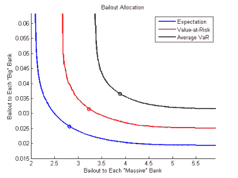

# 一个巨大的骗局

> 原文：<https://hackaday.com/2015/12/17/a-scam-of-galactic-proportions/>

在 Hackaday，我们看到许多寻求资金的技术骗局。一些在 Kickstarter 上，另一些是寻找投资者的公司。与许多媒体不同，我们都持怀疑态度，而且经验丰富，足以闻到蛇油的味道。当你读到一种看起来好得令人难以置信的激光刀片时，你知道我们会支持你。

背景:[Zachary Feinstein]是圣路易斯华盛顿大学的教授，研究金融工程，尤其是银行业的系统性金融风险。所以，他正是你想找来写一篇关于《星球大战》中死星毁灭的财务影响的论文的人。等等，什么？

这篇论文的中心论点是，由于帝国有如此多的钱用于建造死星，叛军摧毁它无异于经济自杀。为了量化这些，范斯坦运行了金融危机模型。这个想法是，叛军赢了，但他们继承了一个如此机能失调的经济，他们不摧毁死星会更好。

我们并不是说其余的媒体容易受骗，而是说他们(T2)没有把他们最好的经济学家放在关于资助死星的文章上。但是在 Hackaday，我们是。我们称之为骗局。所以，让我们看看这篇论文中哪些是正确的，哪些甚至比丘巴卡的地狱咆哮更没有意义。剧透:我们会被数字所包围，因为它很有趣，但整个事情因为经济学 101 式的原因而没有意义。

### 数字

[范斯坦]基本上没有任何数字。更具体地说，他得到了一个:建造第一颗死星(DS1)所需钢材量的估算。他从美国政府的专家那里得到了这个数据。

 白宫开辟了一个通用的在线请愿网站，可以预见的是，互联网上有近 40000 个签名响应，要在 2016 年前建造一颗死星。在一次精彩的公关行动中，白宫让管理和预算办公室科学与空间部门的负责人保罗·肖克劳斯写了一份厚颜无耻的回应给 T4。(保罗)做了我们任何人都会做的事情——他在搜索引擎中键入“死星成本”，然后报告了他的发现:852 万亿美元。足够胜任政府工作了，对吧？

但是白宫从这个网站得到的数据承认，在白宫收集了大量的公众调查后，这个网站承认计算错误了 100 倍！我们看到的更像是 810 亿美元。但是我们在狡辩。当所有的数字都是从上到下编出来的时候，一百的因数是什么？

无论如何，绝对值并不像死星成本与帝国银河生产总值的比率(GGP)那么重要。[范斯坦]通过曼哈顿计划的成本与当时美国 GDP 的比率(约为 0.21%)来估算这一数字。

我们认为这可能是低估了。美国[每年在国防*上花费约 4%的 GDP*过去四年](http://data.worldbank.org/indicator/MS.MIL.XPND.GD.ZS)，那时我们甚至没有面临与叛军联盟热战的生存危机。相比之下，在二战期间，美国每年花费约 50%的 GDP 用于战争。

曼哈顿计划在很大程度上也是一个研究项目，至少与建造一个小行星大小的空间站相比是如此。我们会很高兴地说，帝国在死星相关的研发上花费了 0.2%。但是我们必须计算出 GGP 的 5%或 10%来作为死星的核心和明显雄心勃勃的项目。(我们确实喜欢[范斯坦]承认他们可以在第二颗死星上重复使用大量研发支出——它看起来一模一样！)

所以这些数字到处都是，但如果有什么不同的话，[范斯坦]肯定低估了死星对帝国的重要性。

### 银行业:后果

那么当帝国崩溃时会发生什么？欠了钱的银行破产了，不能再贷款给正常的穷人了，经济停滞了。防止这种情况需要向银行提供(临时)流动性——救助它们——以防止更大的系统范围的伤害。

(范斯坦)是金融危机建模方面的专家，所以我们不会深入讨论这些问题，除非指出他的模型严重错误，至少是因为从 GGP 角度来看，死星的成本被轻而易举地低估了 10 倍。无论如何，他预测银河经济混乱。

 但是经济混乱，经济混乱。雷曼兄弟的前银行家费恩斯坦不是叛逆者。他将 10% [的风险价值](https://en.wikipedia.org/wiki/Value_at_risk)设定为 GGP 的 1%。也就是说，他说，反叛者正试图彻底限制银行违约风险，以至于 1%的 GGP 损失只会发生在最糟糕的 10%的情景中。而要做到这一点，反对派将不得不为一次性救助银行制定高达 GGP 20%的预算。

Rebel? Or Financial Engineer?

韩"永远不要告诉我概率"索罗会嘲笑这种近乎保险推销员式的对风险的厌恶！一个走私者和叛逆者会对不太可能发生的 1%的 GGP 银行违约大惊小怪吗？没有先生。韩宁愿看到损失 5%或更多。考虑到概率曲线下的区域逐渐变小，韩的救市方案很可能比范斯坦的方案便宜得多。勇敢是要付出代价的！

### 这一切都没有实际意义:沉没成本

但所有这些都是疯狂的言论，我们不仅仅是指因为所有这些星球大战的东西都是编造的。不，我们的意思是叛军不应该因为经济原因攻击死星的论点有一个根本性的缺陷，这是经济学 101: [沉没成本](https://en.wikipedia.org/wiki/Sunk_costs)。

 要想知道为什么，想象一下，叛军派出他们的绝地武士，用老式的方法除掉帕尔帕庭和维德，通过暗杀。没有死星被摧毁，没有附带损害，但帝国干净利落地投降了，反抗军取得了胜利。万岁，经济崩溃避免了？没那么快！

叛军肯定不会资助死星的进一步工作——这不是他们的风格。那么他们打算用它做什么呢？翻新和建造公寓？在那个街区？浪费在死星上的钱已经浪费了，而且不会被撤销。我们的猜测？无论如何，叛军将不得不摧毁它，因为你不希望一颗没有动力的死星脱离轨道，撞向恩多的森林卫星。

但是，即使你对死星毫无用处，但仅仅因为它昂贵而不去摧毁它，对年轻的绝地来说是一个错误。正如我的一位睿智的绿色教授曾经说过的，“你的选择必须基于与决策相关的标准！”

### 结论

这太荒谬了。希望你玩得开心。并了解了沉没成本。