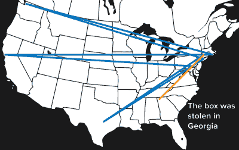
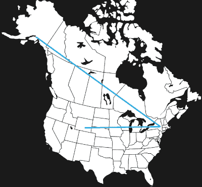

# 这个项目将再次被盗

> 原文：<https://hackaday.com/2016/01/03/this-project-will-be-stolen-again/>

[旅行黑客盒子](https://hackaday.io/project/7373-travelling-hacker-box)是 hackaday.io 社区的物理实现。虽然 hackaday.io 上发生的大多数事情都发生在网上，但有时这些活动会泄露到现实世界中。其中一个活动是一个盒子，里面装满了随机的电子产品，分发给 hackaday.io 社区的不同成员。

 这是一个伟大的理论构想。实际上，人们都是混蛋。第一个旅行黑客盒子被 hackaday.io 社区的一个成员偷走了。在经过费城、旧金山、波士顿、西雅图、纽约、波士顿和德克萨斯州中部 14，167 英里的旅行后，第一个旅行黑客盒子在佐治亚州边界遭遇了命运，距离亚特兰大两小时车程。谁负责？我们不会谈论他。他知道自己是谁，做了什么。

即使几百美元的电子产品丢失了，也不是所有的都丢失了。一个新的旅行黑客盒子已经在美国上路了。它正在慢慢地被好东西填满，并且已经访问了怀俄明州和纽约州北部，目前正在阿拉斯加州安克雷奇附近。最新的更新显示，这个盒子装满了好东西，包括一个旧摄像机的迷你 CRT 组件，步进电机驱动器和其他奇怪的电子设备。

The travels of the current Travelling Hacker Box

旅行黑客盒子的当前计划与旧盒子相同:在里程表上增加 25，000 英里，同时利用美国邮政统一费率盒子的经济性。从那里，它将去更远的地方，第二次环绕地球，在欧洲、非洲、亚洲、印度、澳大利亚和南美洲停留。如果你是雷神公司的分包商，隶属于纽约空军国民警卫队，或者能够在南极洲接收邮件，欢迎你给我发电子邮件。

感觉你准备好为旅行黑客盒子增加几百英里了吗？上榜没有固定的过程；目的地是根据与当前节点的距离、可信度以及与下一个节点的距离(如果有计划)来选择的。想要上榜，最好的方法是点击[旅行黑客盒子项目](https://hackaday.io/project/7373-travelling-hacker-box)上的“请求加入这个项目”链接。然后，在黑客盒子聊天室闲逛，你可能有机会收到一个随机电子产品的神奇盒子。