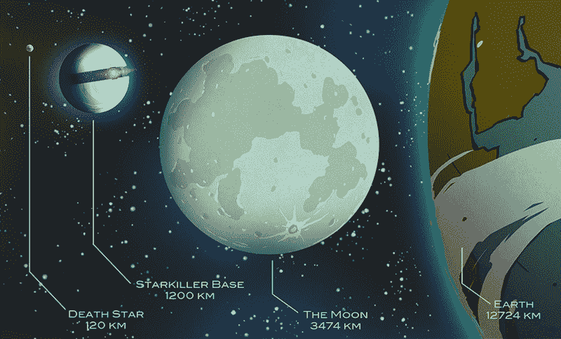

# 弑星者基地的科学不合理性

> 原文：<https://hackaday.com/2015/12/22/the-scientific-implausibility-of-starkiller-base/>

这篇帖子包含《星球大战:原力觉醒》的剧透。如果你没看过电影，这些剧透不会影响你；他们相当于说，“在新的希望中，有一个月球大小的战斗站，有一个超级激光器”和“有人在星球大战电影中用光剑截掉了一只手”

* * *

自恩多战役以来,《星球大战》宇宙中发生了很多事情。帝国已成废墟，雅文 5 号和恩多的森林卫星都有新的行星环系统。叛乱已经让位给一个新的银河共和国，但在银河系的未知领域有一个邪恶的幽灵正在隐现:第一秩序，一个邪恶的力量，已经建立了一个星球大小的超级武器，能够摧毁整个星系的整个行星系统。弑星者从收集整个太阳中获取能量，从一个太阳系移动到另一个太阳系来喂养这个巨大的恐怖武器。

我们已经花了将近 40 年来讨论死星、光剑、作为时间单位的秒差距和超光速推进器的合理性。是时候把争论虚构宇宙飞船的神圣传统传给下一代了。弑星者基地是一个很酷的想法，但它背后的科学依据站得住脚吗？不。这完全不可信。这是一个伟大的故事，但它完全不可信。

### 对于冲锋队来说你是不是有点矮了？

在*原力觉醒*中，我们看到了死星和弑星者基地之间的直观对比。死星的直径是已知的(120 千米)，有了这个我们可以很好的猜测弑星者基地的直径。从*《原力觉醒》*中看到的，我要说弑星者基地大约是死星的十倍大，或者直径大约 1200 公里。

对于一颗行星来说，1200 公里实际上相当小，但是是不是太小了？如果我们要像国际天文学联合会(IAU)那样定义一颗行星，我们只有几件事要考虑。根据 IAU，如果一个天体围绕太阳运行(无效资格，这是在一个很远很远的星系中)，如果该天体已经清除了其轨道上的碎片(例如像一颗恒星)，如果该行星体已经达到[流体静力平衡](https://en.wikipedia.org/wiki/Hydrostatic_equilibrium#Planetary_geology)，那么该天体就是一颗行星；基本上不管是不是球体。

如果我们将“弑星者基地”与太阳系中的天体进行比较，我们会发现一些类似的天体。弑星者基地比小行星带最大的天体[谷神星](https://en.wikipedia.org/wiki/Ceres_(dwarf_planet))还要大一点。谷神星足够大，可以把自己拉成一个球体，所以我们只能想象第一级掏空的行星会是什么样子。

虽然弑星者基地的物理尺寸说得通，但重力说不通。厚厚的大气层并不存在。能吸倒一个明星却不能。不过，这只是一部电影，通过定义弑星者基地的维度，我们可以进行更有趣的计算。

### 压力下的凯洛·伦

弑星者毕竟是一颗行星，随之而来的是行星大小的天体。这意味着地质学、水文学，可能还有构造运动，是的，还有大气。尽管弑星者基地星球的大部分表面被单独留下来建造一个毁灭星球的超级武器，但弑星者基地确实有一个非常独特的特征:沿着星球赤道有一个巨大的裂缝，比任何可能的自然地质现象都要大。

Starkiller Base, as seen in a *The Force Awakens* poster

如果我们假设将成为弑星者基地的行星相当像地球，具有相似的重力和大气，但直径只有地球的十分之一，我们就可以深入了解这个基地的内部实际情况。给定“海平面”(或者弑星者地表场景发生的任何高度)上 1 atm 的大气压力，并且假设武器峡谷的深度大约是行星半径的五分之一(一个很好的猜测)，我们可以计算武器峡谷底部的大气压力。

对一条深约 240 公里、温度为 0 摄氏度、类似地球的大气压力和重力位于弑星者表面的武器战壕进行数学计算，我们发现武器战壕底部的压力是惊人的:数千个大气压。这是气压公式指数性质的产物，除了力场和重力板，别无选择。

客观地说，太平洋底部——马里亚纳海沟的挑战者深渊——的压力约为 1000 个大气压。第一批冲锋队不会真的在离行星核心这么远的地方呼吸空气，他们会是在空气中游泳的 T2。

在这样的温度和压力下，水变成了地球上不常见的冰相—[第七阶段冰](https://en.wikipedia.org/wiki/Ice#Phases)。空气也会变成液体:这些压力高于氮和氧的液体-蒸汽转变线。即使一阶能够将弑星者武器沟底部的大气保持在温和的 0 摄氏度，这个星球大小的巨型武器的内部仍然无法居住。

### 弑星者和 E=mc

弑星者就像电视上说的那样:它吸收恒星来运行一个单一的、巨大的、摧毁系统的巨型武器。宇宙和扩展宇宙中的一切都是守恒的，我们只剩下一个问题，*恒星到底去了哪里*？

首先，我们可以假设被弑星者吸住的恒星直接转化为能量；如果不是这样，弑星者也会获得它杀死的恒星的质量和引力。一颗质量相当于恒星的被占领行星存在明显的问题，无论如何，我们在屏幕上看不到弑星者基地的重力变化。

如果用于驱动弑星者的恒星通过质能等效或 E=mc 直接转化为能量，我们可以很好地了解这种武器的功率输出。此外，我们可以计算如果将质量转化为能量的过程不是 100%有效会发生什么。

同样，我们只能对弑星者实际上是如何工作的做出一些假设，但我们从*中知道，原力唤醒*弑星者从一颗恒星旅行到另一颗恒星，完全消耗它，并将能量转化为集中的能量束，摧毁整个星球。主序星的大小可以通过它的颜色来估算，比太阳大的恒星颜色更蓝，小一些的恒星颜色偏红。从原力唤醒的*，*中，我们可以做出一个有根据的猜测，最后一幕中的恒星比我们的太阳小，可能是一颗 K 型恒星，质量约为太阳的 0.15 倍。

将质量直接转化为能量会产生一个惊人的数字:大约 1.5 x 10 ^(31) 焦耳的能量。这种能量足以将几颗行星从银河地图上抹去。这几乎相当于我们的太阳在一千年中释放的所有能量。这是一个令人难以置信的能量，但如果你需要炸毁银河系中的行星，它会做到这一点。

弑星者基地必须将恒星的所有能量储存在某种巨大的行星大小的电池中。来自恒星的大部分能量将进入这个能量束，但不是全部；毕竟没有什么是百分百高效的。假设“弑星者基地”将恒星质量转化为系统杀伤光束的效率为 99.999%，这仍然意味着 1.5 x 10 ^(27) 焦耳的能量作为废热散发。这相当于 350 万亿吨 TNT 炸药，或 30 万亿个小男孩大小的核弹。这只是弑星者基地的余热，并不是能量束本身的输出。无论如何，弑星者基地有一个令人难以置信的冷却系统。

但是这些废热到底发生了什么呢？因为*原力苏醒*时没有任何辐射器从大气层中伸出来，所以所有这些能量都必须进入*大气层*。当所有这些能量被排放到大气中时会发生什么，这是一个简单的一年级物理或化学问题。

在每一本物理和化学教科书中，能量的多少和温度上升的关系都被给出为*Q = c[p]mδT*，其中 Q 是能量的多少，c [p] 是大气的比热，m 是大气的质量，δT 是温度的变化。我们可以假设弑星者大气层的比热值为 1.0 kJ/kg，而大气层的质量约为地球的 1/10(5×10^(18)千克)，我们会得出一个令人震惊的数字。弑星者的恒星质量转化为能量的废热足以将一阶超级武器的大气层温度提高到近 3 亿度。这就是把物质转化为能量的问题:你获得了大量的能量。如果弑星者的质量到能量转换过程只是一丁点的低效，它足以蒸发表面的一切。

### 有关系吗？

《原力觉醒》中的超级武器可信吗？不，但这真的不是重点。毕竟，这只是一部电影——而且是一部伟大的电影——星际飞船在太空中像在大气层中一样机动，光束神奇地停在半空中，能量场包围并穿透生物，将银河系结合在一起。这些东西不是真实的，把真实的数字放在后面完全没有意义。毕竟，这只是一部电影，但用数字来描述一个伟大的故事也同样有趣。