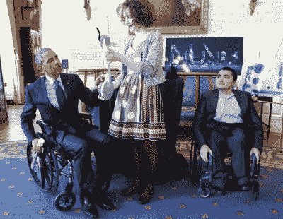

# 凯特·里德:行动中的创造过程

> 原文：<https://hackaday.com/2015/12/21/kate-reed-the-creative-process-in-action/>

凯特·里德是一位艺术家。凯特·里德还制造手动轮椅配件，可用于任何轮椅。等等，什么？这些东西不一定是单独的技能。我们生活在手工创作的时代，凯特是一个完美的例子，你需要体现所有的技能。她是一位艺术家，从开始到实施，她都遵循着一个创造性的想法。查看她在 [Hackaday 超级会议](http://hackaday.io/superconference)上关于创作过程的演讲，然后跳过休息时间，了解更多关于她一直在构建什么以及她如何构建她多样化技能的细节。

 [https://www.youtube.com/embed/b4nyfMvGVi8?version=3&rel=1&showsearch=0&showinfo=1&iv_load_policy=1&fs=1&hl=en-US&autohide=2&wmode=transparent](https://www.youtube.com/embed/b4nyfMvGVi8?version=3&rel=1&showsearch=0&showinfo=1&iv_load_policy=1&fs=1&hl=en-US&autohide=2&wmode=transparent)

凯特的成就是独立的。她和她的朋友 Nathaniel Tong 一起开发了一种手动轮椅附件。他们的发明通过增加一个杠杆来操纵椅子的划动，改善了坐轮椅的人的生活。这使用了强大的肌肉群，对用户的背部更容易，而且(这是我们以前从未想到的)与推动车轮相比，它有助于保持用户的手清洁，而车轮本身是接触地面的。该项目在 2015 年 Hackaday 奖中被认定为[最佳产品决赛选手](https://hackaday.io/list/7403-2015-best-product-finalists)。

Kate Reed demonstrates Hand Drive for President Obama

得知凯特是一名高中生，你应该感到惊讶。但是她的教育采取了一种与传统高中学习完全不同的方式。她参加了 NuVu 工作室，这是一所为马萨诸塞州剑桥的中学生和高中生开设的创新学校。重点是从头到尾研究创作过程。课程包括构思、开发和建造东西。对我们来说，这看起来像是一种技术，它彻底改变了学生走出学校没有经验的刻板印象，我们喜欢它！

我们喜欢凯特的评论“创造力需要实践”。目前设计的手动驱动是第六个原型。他们的每一次表演都越来越好，但是就在她向奥巴马总统演示的时候(在参议员和媒体对其进行了一整天的压力测试之后)，就连当前的表演也出现了问题。她逆来顺受，将失败视为未来进步的工具。我们需要一代又一代的人以这种创新精神来对待生活，我们感谢凯特通过她的开放设计和像这样的演讲来帮助传递这些经验。