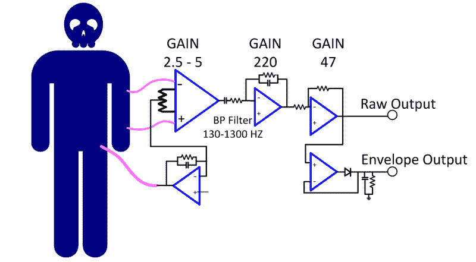
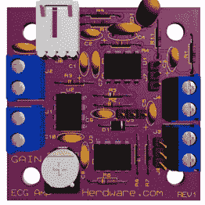
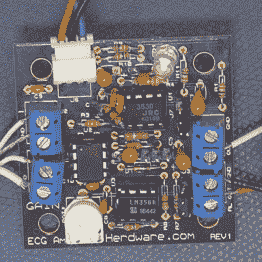

# 放大身体自身的电流

> 原文：<https://hackaday.com/2015/12/29/amplifying-the-bodys-own-electricity/>

测量身体的电信号是一个巧妙的技巧……如果你能让你的设备调到足以建立可靠的测量。这项技术被称为表面肌电描记术(SEMG ),尽管你可能会听到很多人称之为心电图。它们本质上是相同的技术。心电图仪器监测心脏的活动，而 SEMG 仪器监测用于控制其他肌肉的电信号。这两种类型的硬件相当于一个仪表型放大器和某种形式的 I/O 或显示器。

这个话题已经在我的口袋里放了好几个月了。早在五月份，我们黑客们就来到纽约市参加 Disrupt NY 黑客马拉松活动。我们提前一天左右到达，以便更好地浏览韩国烧烤店，并查看纽约提供的其他电子产品。周六，我们聚在一起，每个人都喊出了他或她喜欢的 t 恤尺寸，我们用栗色的 t 恤盖住了我们的黑色 Hackaday 标志 t 恤(当然是带有 Hackaday 标志的)，进行了一场 24 小时的硬件黑客热潮。

此幻灯片需要 JavaScript。

我们桌边有两个人都在用硬件测量身体肌肉以某种形式产生的电场。从皮肤测得的电信号很小，需要仔细考虑才能在有噪声的情况下测量信号。这是一个有趣的实验，让您使用仪表放大器和运算放大器从身体运动中获得有用的信号。

 [https://www.youtube.com/embed/dujCTCBkH8Y?version=3&rel=1&showsearch=0&showinfo=1&iv_load_policy=1&fs=1&hl=en-US&autohide=2&wmode=transparent](https://www.youtube.com/embed/dujCTCBkH8Y?version=3&rel=1&showsearch=0&showinfo=1&iv_load_policy=1&fs=1&hl=en-US&autohide=2&wmode=transparent)

在黑客马拉松上，Andrew Ippoliti 有一个小放大器和一个微控制器，正在玩控制一个小电机。他在晚上很早的时候就让模拟装置工作，这样他就有时间在夜里调整电机控制，直到凌晨 2 点左右头靠在桌子上睡着。

  Andrew Ippoliti  David Nghiem and Sophi Kravitz

大卫·恩格姆赢得了黑客马拉松上颁发的一个奖项，有人看到他带着半永久连接的 SEMG 模块走来走去，希望将来能被同化。大卫有一个优秀的 Hackaday.io 项目，描述了他的 SEMG 项目如何工作。

我在夏天拼凑了以下电路，看看我能在自己的实验室里做些什么。让我们来看看。

## 放大器板

在上面的框图中，有三个连接用于接收身体肌肉的微小电信号。两条引线直接连接到仪表放大器的输入端。大家应该还记得我之前的视频，[仪表放大器很特殊](http://hackaday.com/2015/03/16/instrumentation-amplifiers-and-how-to-measure-miniscule-change/)，因为它们具有高阻抗和低噪声特性。它通常不是信号链中增益最高的模块，其主要工作是从环境中提取信号，并对其进行初始放大和缓冲，以便后续级可以轻松地进一步放大干净的信号。仪表放大器还擅长剥离信号，无论是噪声还是失调(共模部分)，只放大差值(差分)。这正是这里正在发生的事情。

由于人体是 60 Hz 噪声的主要收集者(你可以触摸示波器探头的尖端以了解其数量)，因此抑制 60 Hz 共模至关重要。所示电路有一个反馈路径，试图通过反转部分信号、对其进行低通滤波并将其反馈至身体来抵消低频噪声的影响。

最后，我添加了一个跳线可选滤波器，它本质上是一个半波整流器(还记得关于在反馈环路中包括二极管以使其成为零正向电压二极管的帖子吗？)和带有放电电阻器的电容器。一个小的正脉冲会在电容上立即产生正电压，然后电阻会产生一个较慢的放电，使电路成为一个脉冲展宽器。

      

从这里开始，它是一个简单的 RC 高通滤波器，然后是一个低通滤波器和放大级，接着是另一个放大级，即标准运算放大器。

事实证明，通过挤压我的手，电路能够产生大约 5 伏的信号。只是为了帮助想象它真的在工作，而不只是显示噪声，我连接了一个 LM3914 条形图驱动器，并能够通过弯曲我的手臂肌肉来获得完整的显示。

## 安全

我将对电路做出的最大改变是增加 100k 电阻与引线串联，因为将任何不受电流限制的东西粘在皮肤上可能是危险的，特别是如果交流操作的设备存在浮地等问题。在这种情况下，我使用 9V 电池为电路供电，以消除拍摄视频时对额外组件的需求。

只需一把芯片，我们就能看到一点点皮肤下发生的事情。有时候这些简单的事情还是会让我惊讶。我希望你也有同样的感觉。我很想听听你自己的 SEMG 项目，以及你在未来的视频中使用这种技术的任何想法。请在下面的评论中告诉我。