# SRL Arduino 的 Federico Musto 向我们展示了新产品和新方向

> 原文：<https://hackaday.com/2016/01/04/new-products-and-new-directions-an-interview-with-federico-musto-of-arduino-srl/>

最近，我们与 Arduino SRL 公司的首席执行官[Federico Musto]坐在一起，聊了聊这家意大利 Arduino 公司的运营情况，他们即将推出的新产品和项目，以及他们在过去六个月左右的时间里都在做些什么。是时候了！

## 纸板

费德里科之前暗示过的我们会议的大新闻是 Uno WiFi 的发布。你在 Hackaday 上看到过多少基于插入了 ESP8266 WiFi 模块的 Arduino Uno 的项目？十亿美元。Uno 和 ESP8266 就像过去几年黑客时代精神的花生酱和果冻。

### Uno WiFi

[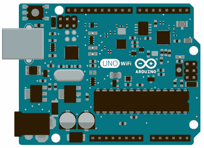](https://hackaday.com/wp-content/uploads/2015/12/arduino-uno-wifi.png) 那 Uno WiFi，就是 [Goober 葡萄](http://www.smuckers.com/products/peanut-butter/goober-pb-j/goober-grape-38)(不是代言，消费这玩意风险自担)。不那么诗意地说，Arduino 已经为您将 ESP8266 焊接到 Arduino Uno 上:没有必要摆弄模块和引脚接头。这不是一个突破性的创新，但这是我们喜欢看到的那种聪明的、社区主导的发展。你想要在你的 Arduino 上安装便宜又简单的 WiFi？你猜对了。

事实上，自从 Arduino Yun(T1)问世以来，许多黑客将其作为一种简单的方式，将他们的 Arduino 接入无线网络:物联网等等。当 ESP8266 亮相时，许多人认为云看起来死气沉沉:有了 ESP 芯片，你可以用一半的价格在你的 Arduino 上获得 WiFi。但是有些人需要额外的能力，或者宁愿用 Python 编程。例如，想想所有基于 Raspberry Pi 的简单物联网项目。

随着 Uno WiFi 的加入，简单的物联网设备和要求更高的应用程序都可以留在 Arduino 家族中。如果你想要联网但简单的东西，标准的 AVR ATmega328 处理器可以轻松处理，请使用 Uno WiFi。如果你真的需要 ATmega 之外的嵌入式 Linux 发行版的额外计算能力和灵活性，那就选择云吧。如果 ATmega 没有削减它，或者如果你需要更多的电源或微控制器方面的外围设备，新的田板与它的 ARM Cortex-M0+将符合要求。这实际上是一系列引人注目的产品，即使它们表面上很相似。

### 蒂安菜

[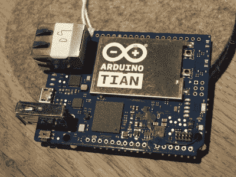](https://hackaday.com/wp-content/uploads/2015/12/dscf8150.jpg) 这就引出了田。在我们看来， [Arduino Tian](http://www.arduino.org/products/boards/4-arduino-boards/arduino-tian) 是一个整洁的新板。它有一个集成的 MIPS 处理器，板载 2.4 和 5GHz WiFi，并能够进行蓝牙和蓝牙 le。它的运行速度比 Yun 快一点，板载 4 GB 的 eMMC 内存，所以你不必像使用 Yun 或 fruit-pastry Linux 单板计算机那样使用外部 SD 卡。

我们无法确定天(或者云)是一个附加了 Linux 计算机的微控制器，还是一个带有处理 GPIO 的微控制器的 Linux 计算机。我们见过的大多数应用程序都符合前者。我们希望看到 Linux 方面有更多的发展，就像树莓派一样。在这种情况下，我们很高兴看到 Arduino SRL 继续致力于他们的 [Ciao](http://labs.arduino.org/Ciao) 库，以帮助简化微控制器和 Linux 机器之间的通信。

[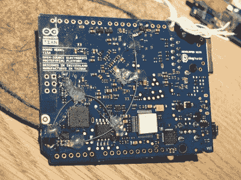](https://hackaday.com/wp-content/uploads/2015/12/dscf8151.jpg) 【费德里科】向 Tian 展示的一个很酷的技巧是能够从 Cortex M0+微控制器控制 Linux 计算机。正如你在这个原型中看到的，只需要几根绿线(和一些热熔胶)就可以让它工作。Tian 的生产版本应该内置了这一功能。

作为演示，我们通过 SSH 进入 Tian 的 Linux 端，并按下一个与+微控制器相连的按钮。

Linux 端优雅地关闭了，我们后来又重新启动了它。这是一个特别酷的技巧，因为 Linux 端有着快速的处理器和 WiFi，是一个耗电大户。另一方面，M0+及其相关电路的功耗非常低，在不处理数字时可以被调节到睡眠模式。虽然 Linux 端的启动时间意味着您不会每隔几分钟就打开或关闭它，但让组合系统长时间处于低功耗状态的能力大大增加了 Tian 有用的项目范围。可爱的黑客。

这款 Tian 到现在才上市一个月左右。你们有人试过吗？

### 其他电路板

[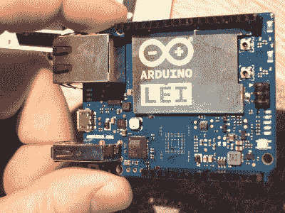【Federico】还向我们展示了 Lei，这是一款中国专用的 Arduino 板，结合了 Tian 的 Linux 端和来自 Yun 的 Atmel ATmega 部分，没有板载内存。这是两种板之间的一种更便宜的混合，费德里科说不值得为美国和世界其他地区获得 FCC 认证。“云”和“田”已经如此相似，我们认为他可能是对的。](https://hackaday.com/wp-content/uploads/2015/12/dscf8149.jpg)

云，天，甚至雷的最新版本的共同点是，微控制器的 USB 引脚已被打破头，以便它可以更容易地作为一个独立的 USB 设备使用。这使得即使是该系列中最便宜的主板也有三种方式连接到 USB——通过微控制器的设备模式，以及通过 Linux 端的主机模式和 USB OTG 模式。它还支持屏蔽，如下面的 GSM 屏蔽，通过 USB 连接到微控制器。(尽管在这张照片中没有填充标题。)

[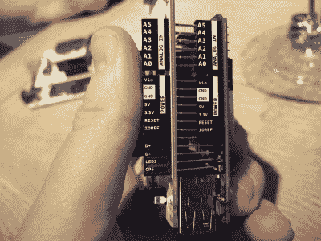](https://hackaday.com/wp-content/uploads/2015/12/dscf8145.jpg) 这张照片还展示了所有 Arduino SRL 主板的物理设计。所有的引出线都贴在母接头的侧面。尽管我们确信你是 Arduino 的铁杆粉丝，你可以在睡梦中分辨出你的 A0 和 A5，但我们认为不必再回到数据表前仔细检查是非常好的。

最后，[Federico]向我展示了他们在工业和[工业 101](http://labs.arduino.org/Arduino%20Industrial%20101) 演示板上的一些新进展。Industrial 本质上是与 Yun 相同的 Linux 端，只是在一个更小的独立包中。将它与工业 101 板及其 ATmega32u4 配对，基本上就是一个 Yun，但多了几个引脚。我们还不确定我们最近从许多公司看到的模块式封装是怎么回事——我们认为它们对于爱好者来说太烦躁了，对于生产数万个单元的公司来说又太容易 DIY 了。我们很可能错了。

 [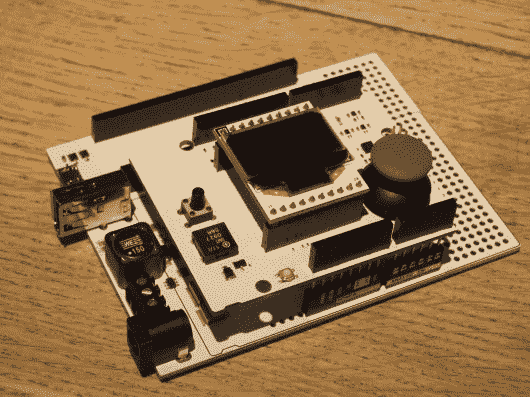](https://hackaday.com/2016/01/04/new-products-and-new-directions-an-interview-with-federico-musto-of-arduino-srl/dscf8143/)  [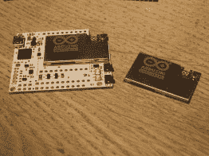](https://hackaday.com/2016/01/04/new-products-and-new-directions-an-interview-with-federico-musto-of-arduino-srl/dscf8140/)  [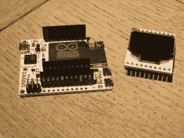](https://hackaday.com/2016/01/04/new-products-and-new-directions-an-interview-with-federico-musto-of-arduino-srl/dscf8141/) 

无论如何，工业 101 板有趣的部分是展示 Arduino SRL 设计的所有特殊护盾。例如，这里有一个有机发光二极管屏幕和操纵杆组合。

### 免费的东西

如果你对 Uno WiFi 感兴趣，你可能应该去看看将于 1 月 31 日举行的 [Arduino 圣诞挑战赛](http://www.arduino.org/arduino-xmas-2015)。如果你在 GitHub 上输入一个项目，并在 Arduino 上注册，你就有相当大的机会在一月份赢得一个免费的 Uno WiFi。(值得一提的是， [Arduino LLC 和微软](https://www.hackster.io/challenges/arduino-microsoft-maker)正在做类似的事情。我们不是在选边站，只是指出如何得到免费的板子。)

## IDE 开发

[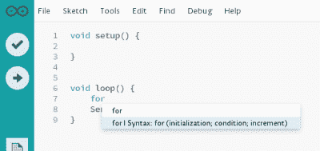](https://hackaday.com/wp-content/uploads/2015/12/dl38.png) 我们以前见过新的(ish) [Arduino Studio](http://labs.arduino.org/Arduino+Studio) 开发环境，但它只是现在才对我们有意义。当然，拥有一个比旧的基于 Java 的编辑器更好的编辑器是件好事。我们都抱怨缺乏代码完成等等。基于 Adobe 开源括号编辑器的新编辑器环境是一个巨大的进步。但是我们有一个更进一步的方向，我们希望看到 Arduino SRL 采取这一点，新的编辑器是用客户端 Javascript 编写的，这是一个很大的帮助。

Yun、Tian 和中国专用的 Lei 板都具有基于 OpenWRT 的 Linux 板载发行版以及 WiFi 连接。他们还设法让整个 GCC 编译链在 MIPS 内核上进行本地编译。在 Arduino 的 Linux 端安装并运行微控制器的交叉编译器应该不会有太多的工作。一旦发生这种情况，你就可以完全从云或天内部编译和刷新代码到微控制器上。添加一个漂亮的基于浏览器的图形编辑器，您就有了一个自包含开发环境的诀窍。

[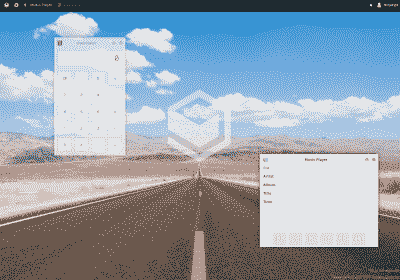](https://hackaday.com/wp-content/uploads/2015/12/os-js.png) 和【费德里科】展示了更多间接指向 Arduino 托管的 Arduino 开发未来的技巧:我们通过公共互联网连接到他们在西西里研发实验室的 Arduino 云，该云正在为 Arduino 品牌版本的 [OS.js](http://osjsv2.0o.no/) 提供服务，这是一个用 Javascript 编写的“操作系统”，运行在客户端的浏览器上。将 OS.js 之类的东西耦合到他们基于 Javascript 的工作室，在 Arduino 的 Linux 端运行交叉编译器会将最后的部分组合在一起，使您能够完全在云和天上编写、调试和刷新微控制器项目，而无需在笔记本电脑上安装除浏览器之外的任何东西。Arduino 可以成为自己独立的工具链。多棒啊。我们希望我们是对的。

## 基金会和商店

经过几个月的法律工作和寻找合作伙伴，Arduino SRL 公司最近宣布成立 Arduino 基金会。该基金会是一个非营利组织，旨在向学校和社区分发 Arduino 板和材料，这些学校和社区可能没有资源自己这样做，同时也简单地回馈 Arduino 社区。其实我们上面说的 Uno WiFi 圣诞挑战赛就是基金会赞助的。

[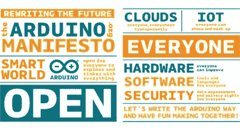](https://hackaday.com/wp-content/uploads/2015/12/manifestino.jpg) 我们希望看到基金会想出如何奖励编写流行的 Arduino 库的人。在我们看来，Arduino 的成功很大程度上要归功于热情而有才华的编码人员，他们编写了各种各样的库，支持人类已知的各种硬件外设。有一百万个项目仅仅使用达拉斯单线温度传感器或 RFM12B 无线电，每个项目都欠编写初始库的编码人员一大笔债。如果 Arduino 基金会能找到偿还部分债务的方法，那就太好了。通过与[费德里科]的交谈，回报社区是他们的主要目标之一。

Arduino SRL 还考虑了如何更好地与制造主板硬件的人——外面的屏蔽制造商——建立联系。[Federico]说他们将随时在柏林开设第一家实体 Arduino 商店。该计划是在商店中设立一个社区项目专区，为制造盾牌和其他附件的人提供一个展示和销售商品的地方。这也是 Arduino 公司与 Arduino 生态系统中从事最具创新性工作的人建立更紧密联系的一种聪明方式，因此我们认为这是一种全面的双赢。

## 合法的

最后，我们不能在不询问法律情况的情况下谈论 Arduino。虽然每个人的律师都很忙，但[Federico]告诉我，自从我们上次交谈以来，商标法庭案件没有太多消息。

在意大利，大概还有美国之外的世界其他地方，除了大喊大叫，一切都结束了。看起来法院很可能会判 Arduino SRL 胜诉，因为意大利和欧洲的商标法非常简单明了——最先申请的公司基本上就获得了商标。那就是阿尔杜伊诺·SRL。

只有在美国，情况更复杂，因为 Arduino LLC 首先提出申请，也因为 Arduino SRL 公司可能会证明他们在 Arduino LLC 成立之前就在生产印有 Arduino 名称的电路板。我们不是律师，但这个案子看起来很可能对我们有利。不过，美国的案子不太可能在 2016 年夏天之前结案，所以不要抱太大希望。

## 包裹

也许 2015 年将作为 Arduino 决斗之年而被人们记住，但我们希望这一年将作为一批新的和改进的 Arduino 硬件发布的一年而被人们记住。从 Arduino LLC，我们看到了与英特尔的进一步[合作。Arduino 一直忠于他们的 Linux 和 WiFi 根基，推出了 Tian、Industrial 和 Uno WiFi，并继续致力于他们的操作系统和微控制器接口。总的来说，对 Arduino 来说，这是很好的一年。](http://hackaday.com/2015/10/16/intel-and-arduino-introduce-curie-based-educational-board/)

我们已经暗示了一些我们希望明年在 Arduino 场景中看到的东西。2016 年你想看什么？