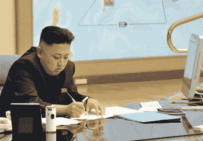

# 32C3:荣耀领袖操作系统内部

> 原文：<https://hackaday.com/2015/12/30/32c3-inside-glorious-leaders-operating-system/>

朝鲜是一个监视国家，由一个以侵犯人权而臭名昭著的极权政府和一支为精英服务的庞大军队支撑，而穷人则被留下来为残羹剩饭而战。巧合的是，这正是朝鲜对美国的评价。

这两个国家有一个显著的区别:朝鲜为其公民开发了自己的操作系统，名为[红星操作系统](https://en.wikipedia.org/wiki/Red_Star_OS)。这是一个基于 Linux 的操作系统，但它有一些有趣的功能，允许光荣领袖照顾他的公民。随着[【弗洛里安·格鲁诺】和【尼克劳斯·席斯】在本周](https://media.ccc.de/v/32c3-7174-lifting_the_fog_on_red_star_os#video)的混沌通信大会上的讲话，对红星操作系统开发的深入剖析直到现在才出现。

Kim Jong-Un with an iMac

当面对一个电力不足的国家开发的操作系统时，任何人都必须问的第一个问题是，“为什么？”这个问题只能用哲学来回答；已故的金正日强调了朝鲜开发“自己风格”的编程，而不是依赖西方操作系统的重要性。《红星》中的几乎所有东西都被修改了，有一个名为 Naenara 的定制浏览器、一个加密工具、一个 Open Office 的克隆、一个软件管理器和一个定制音乐创作工具。红星也必须有 OS X 的外观和感觉；那毕竟是光荣领袖用的。

红星比自定义浏览器和桌面主题更深入。操作系统中还有其他更微妙的组件。有一个程序通过对照数据库检查自定义文件的签名来验证系统的完整性。如果文件被篡改，系统会重新启动。由于这种篡改检查在启动时运行，红星几乎不可能修改文件进行研究。这是红星设计的一大特色——系统完整性至关重要。

还有一些定制的软件即使有 root 用户也能对用户隐藏文件，而“病毒扫描程序”则完全不是。这种病毒扫描程序检查文档中的模式，当通过谷歌翻译时，这些模式是奇怪的，怪异的，有点可以理解的。像“惩罚”、“饥饿”和“用拳头打击”这样的短语在所有文档中都可以检测到，并且根据开发人员的决定，这些文档可以被心血来潮地删除。

虽然在系统中扫描包含未经批准的言论的文档是非常可恶的，但还有一个功能会让任何隐私倡导者哭泣。包括 DOCX、JPG、PNG 和 AVI 文件在内的媒体文件会被每台打开这些文件的电脑添加水印。这使得任何人都可以追踪文件的来源，从而对言论自由产生明显的影响。

虽然大多数美国人认为朝鲜是一个技术落后和暴虐的政权，但红星操作系统对朝鲜有用的特性令人印象深刻。开发人员几乎接触了《红星》中的所有东西，里面的功能相当聪明，使他们的监视风格非常有用。他们这样做也没有任何明显的后门或其他间谍软件；他们把所有的监控都公开给所有人看，这也许是最好的方式。