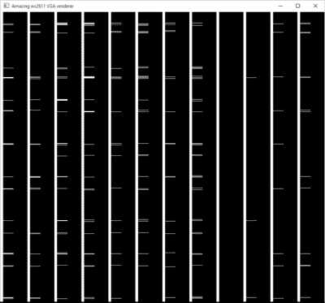

# 使用…VGA 驱动 WS2811 LEDs？

> 原文：<https://hackaday.com/2016/01/04/driving-ws2811-leds-with-vga/>

我们以为我们已经看到了一切。驱动 WS2811/2812“新像素”led 的所有方式。然后[史蒂夫·哈迪]想出了一个新点子:[黑掉一台电脑的 VGA 输出来驱动一串](https://stevehardyblog.wordpress.com/2016/01/02/ws2811-christmas-lighting-using-vga/)中的 500 个 WS2811s。这是一个很好的黑客。你可以看看休息下面的视频(值得忍受恐怖的风噪)。

【Steve】的重大发现是，他可以通过精心选择 VGA 的分辨率和时钟频率来发送新像素所需的数字数据，以匹配 WS2811 模块所需的时序。在 28MHz 时，分辨率为 840×1000，每 WS2811 位产生 70 个像素，即每行 12 位。这意味着每个 LED 的 RGB 三元组需要发送两条 VGA 线，因此有 1000 行。

在[Steve]开始编写自定义 OpenGL 着色器之前，还有一些更进一步的技巧，可以将常规图形转换为他的奇怪的黑白位模式来驱动 led，但你必须阅读[Steve]的博客才能了解所有这些。如果你在等待一份完整的代码报告，[Steve]说那份报告正在等待中。

我们只是兴奋地看到用于其他用途的显卡中蕴藏的计算能力。一旦你认为 VGA 输出是一个通用的高速(模拟！)输出，它开启了一大堆可能性，如果你能写出相应的视频软件的话。正如[史蒂夫]指出的，他现在只使用红色通道——他可以通过调整他的视频代码再增加 1000 个发光二极管。

 [https://www.youtube.com/embed/L6rrffBXQI8?version=3&rel=1&showsearch=0&showinfo=1&iv_load_policy=1&fs=1&hl=en-US&autohide=2&wmode=transparent](https://www.youtube.com/embed/L6rrffBXQI8?version=3&rel=1&showsearch=0&showinfo=1&iv_load_policy=1&fs=1&hl=en-US&autohide=2&wmode=transparent)

谢谢你的提示！