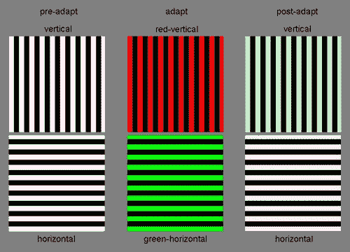
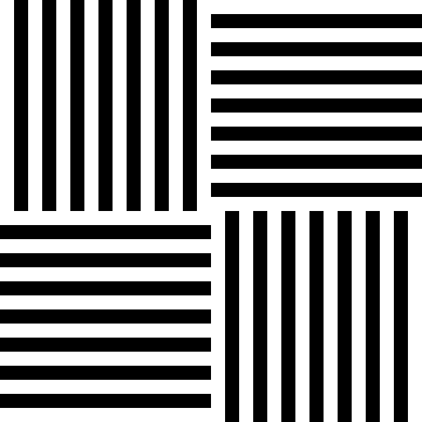

# 破解你的大脑:麦科洛效应

> 原文：<https://hackaday.com/2016/01/06/hack-your-brain-the-mccollough-effect/>

有一种令人着迷的大脑反应被称为麦科洛效应，就像通过你的眼球加载恶意代码一样。尽管这看起来和闻起来都像是一种光学错觉，但科学会提出不同的观点。Celeste McCollough 在 1965 年观察到的现象可以被描述为*偶然后效*，尽管我们称之为“McCollough 效应”,因为 McCollough 是第一个认识到这一现象的人。它是不能被忽视的东西…有时会影响你几个月的视力！

我并不是建议你亲身体验麦考洛效应。我们将会看到麦卡洛效应的现象，这是可以理解的，不需要让你自己受制于它。如果你一定要体验麦科洛效应，你必须自担风险(这里以视频的形式呈现)。但是在你冒险之前，请继续阅读，了解正在发生的事情。

McCollough 的文章*人类视觉系统中边缘探测器的颜色适应*是她在俄亥俄州奥柏林学院心理学系工作时写的。她参加了许多不同的色彩研究项目——最近是在俄亥俄州代顿市的代顿大学研究所。在 20 世纪 90 年代，她把自己的名字改成了塞莱斯特·麦科洛·霍华德博士，但我将在文章的其余部分省略霍华德，以保持该时期的具体参考文献易于理解。自 2003 年以来，她已经退休。

她论文中展示的效果包括水平和垂直条纹的图案。首先，受试者凝视黑白图案。然后是水平红黑条和一组垂直绿黑条的交替模式(称为适应)。这导致你大脑中的一部分被设定。这样做的结果是能够检测这些图案，并通过看到其互补色来指示检测到一个适应的图案。在只有黑色和白色的地方，大脑现在看到黑色和浅绿色，或者黑色和粉红色。

Image Credit: [Scholarpedia](http://www.scholarpedia.org/article/McCollough_effect)

此图像显示了水平和垂直条的集合，标记为“adapt”的中间列包含带有互补色(红色和绿色)的条的两种变体，这就是我上面描述的设置位的方式。一旦这个过程持续了几分钟(平均需要 2 到 4 分钟)，你就可以看到左边的一组图像，奇迹就要发生了。最终的效果是由最右边一列标有“后期调整”的颜色叠加来模拟的。

起初，这看起来像是普通的视觉后效或视错觉，这很公平，因为我们从小就一直参与这些有趣的视错觉。普通视错觉和麦考洛效应之间的区别比看上去要大得多。

## 彩色后像与偶然后效

我记得小时候在小学教室里做过光学实验，尽管直到多年以后我才以那种方式提到它们。当时，它们只是“巴德克里普太太向我展示的酷把戏！”我几乎可以肯定，除了对互补色的解释之外，我们没有对这些数据进行分析。最令人难忘的版本是美国国旗的彩色残像。

## 彩色后像—视网膜

如果你拿一个像餐桌一样的黑色表面，在上面放一个白色的圆圈，也许是一个茶碟，然后盯着茶碟看几分钟，你大概可以猜到当你抬头看白色墙壁时会看到什么。没错，一只长颈鹿在做引体向上。等等，那是两码事。白墙应该有一个黑色的圆圈，这就是通常所说的彩色残像。在浅色或深色背景上用各种颜色的形状也能达到同样的效果。我之前提到的美国国旗的例子背后也有类似的原理。盯着这面错色旗帜的中心 30 秒，然后盯着它旁边的白色区域。您应该看到适当的红色、白色和蓝色。

图片来源:[探索博物馆](https://www.exploratorium.edu/exhibits/bird_in_a_cage/bird_in_a_cage.html)

上面的实验就是彩色残像的一个例子。我们盯着旗帜后在白色空间看到的颜色是我们视网膜中的视杆细胞和视锥细胞因长时间暴露于同一颜色而疲劳的结果。这持续几秒到一分钟，因为在没有持续曝光的情况下，眼睛恢复得相当快。

## 偶然后效——视觉皮层

偶然后效的概念比彩色后像稍微复杂一些。虽然这个概念的名字相当简单:

*   ***后效* :** 不是后像，而是两种颜色中的一种。
*   ***偶然性* :** 看到的颜色取决于被观察线条的方向，线条的方向是由人类视觉系统的内置边缘检测决定的(因此有了麦科洛博士文章的标题)。

有相当多的证据表明，麦卡洛效应(ME)发生在大脑中，而不仅仅是视网膜中杆细胞和视锥细胞疲劳的结果。已经做了相当多的工作来确定 ME 在大脑中的位置，其中一些列在下面，可以在 McCollough 博士担任馆长的 [ME scholarpedia 页面](http://www.scholarpedia.org/article/McCollough_effect)上找到。

McCollough 效应被认为涉及视觉皮层早期阶段的单眼通路。这是基于多种理论，其中包括其他已发表作品提供的证据。其中一个更有趣的是，ME 可以由频率高达 50Hz 的图像生成，这对于有意识地感知颜色和方向关系来说太快了。在该频率下产生 ME 的能力与包括初级视觉皮层(V1)在内的早期皮层区域的特性一致。

当暴露于适应图像相同的时间长度时，ME 可以持续比彩色后像长得多的时间。在极端情况下，me 持续了 3.5 个月，然而，适度暴露于 ME 适应图像仅几分钟就可以具有持续 24 小时或更长时间的 ME。

## 方位识别 

持久的我在方向上有一些有趣的特性。ME 不仅将水平线表示为一种颜色，而将垂直线表示为另一种颜色，而且 ME 还限制了线条被识别为垂直线或水平线的角度。如果你要让自己适应“我”(同样，我不是建议你这样做…但如果你这样做，这可能会发生)，然后看右边的图像，你会看到左上角和右下角的象限是红色，右上角和左下角是绿色。根据我们目前对 ME 的了解，这是我们预期的结果。

然而，如果您要旋转图像(或您的头部，取决于您的硬件设置)，您会注意到，当线条旋转到 45°时，颜色覆盖不再可见。如果您继续将图像(或头部)旋转 90 °,您将看到颜色叠加返回，但是它们现在代表的是线条的当前方向，与我们开始旋转之前的颜色不同。

## 前进

这个主题包括来自学术界和私人研究者的学术出版物。如果你想了解大脑化学、脑电、初级感觉过程、联想学习、经典条件反射和感觉适应是感知可塑性的一部分，请从波士顿大学 (PDF)下载这篇文章。

麦卡洛效应有一些有趣的性质，但至今还没有被很好地理解。我当然对这个概念没有足够深刻的理解来提出一些深刻的最终想法之类的问题。我想到的是机器视觉。也许像我一样更多地了解我们的大脑如何解释现象可以帮助提高机器视觉中的颜色识别、边缘检测和定位。你怎么想呢?请在下面的评论中告诉我们。