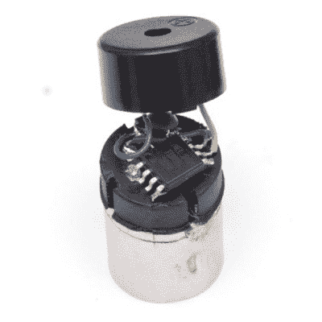

# 最小的 MIDI 合成器？

> 原文：<https://hackaday.com/2016/01/08/the-smallest-midi-synthesizer/>

该死。[Mixtela]刚刚完成了一项非常酷的黑客技术:在 attin y85 上运行一个完整的 MIDI 合成器，创造出他声称是[世界上最小的 MIDI 合成器](http://mitxela.com/projects/smallest_midi_synth)。就在左边，标准 MIDI 电缆插头旁边。整个东西非常小，可以放在 MIDI 插头里，可以用 MIDI 输出提供的电源驱动一个小型 pizeo 蜂鸣器。考虑到 ATTiny85 只有 8Kb 的内存和 512 字节的 RAM，这可不是一个小壮举(明白吗？).为了创造这种声音，[Mixtela]只需用 PWMed 方波驱动蜂鸣器，就能创造出每个复古游戏玩家都会认可的辉煌的早期 chiptunes 声音。

他甚至决定实现一些 MIDI 命令，而不仅仅是演奏音符，包括弯音，并且正在考虑为他的小奇迹添加复调的方法。当然，它不会赢得任何音质奖项，而且没有光隔离器，它也不符合 MIDI 规范。但它是有效的，请记住，MIDI 合成器曾经是又大又贵的设备，需要声音工程学位才能编程。现在，多亏了像[Mixtela]这样的黑客，你可以用只需要几美元的零件来建造你自己的。

 [https://www.youtube.com/embed/tnm6agF8oog?version=3&rel=1&showsearch=0&showinfo=1&iv_load_policy=1&fs=1&hl=en-US&autohide=2&wmode=transparent](https://www.youtube.com/embed/tnm6agF8oog?version=3&rel=1&showsearch=0&showinfo=1&iv_load_policy=1&fs=1&hl=en-US&autohide=2&wmode=transparent)

