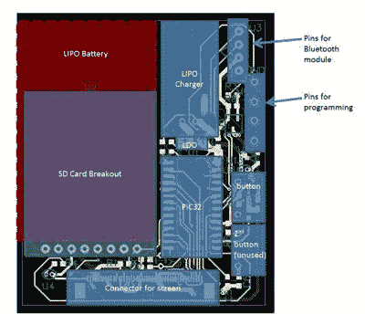

# 不到一个本杰明的 PIC32 智能手表

> 原文：<https://hackaday.com/2016/01/10/pic32-smart-watch-2/>

[Matthew Filipek]喜欢智能手表，但他想打造一款价格低于 100 美元的智能手表，[所以他做了](http://people.ece.cornell.edu/land/courses/ece4760/FinalProjects/f2015/mjf332/mjf332/mjf332/mjf332.htm)。这款手表有一个 1.7 英寸的液晶触摸屏，一个可充电的 LiPo 电池，一个 SD 卡和蓝牙。这只手表有点大，因为[马修]只有一个月的时间来完成这个项目，这促使他使用一些预制模块，这意味着他要一次就把定制的 PCB 做好。

这款手表有三个应用程序:一个设置应用程序、一个简单的游戏和一个素描程序(你可以在下面的视频中看到一个演示)。当然，电源管理是一个主要目标，虽然时钟频率足够高，使游戏可以玩。为了简化软件，[Matthew]使用了 proto threads——嵌入式系统的轻量级线程抽象。

在过去的中，我们已经看到了几款 [DIY 智能手表，包括](http://hackaday.com/2015/08/12/its-time-to-roll-your-own-smartwatch/)[一款 Hackaday 奖](http://hackaday.com/2015/08/12/hackaday-prize-entry-homebrew-smartwatches/)的参赛作品。很难推出与商业产品尺寸和风格一样小的手表。然而，有一个自制手表可以提高你的黑客信誉。

 [https://www.youtube.com/embed/Ax26oVOK_Ec?version=3&rel=1&showsearch=0&showinfo=1&iv_load_policy=1&fs=1&hl=en-US&autohide=2&wmode=transparent](https://www.youtube.com/embed/Ax26oVOK_Ec?version=3&rel=1&showsearch=0&showinfo=1&iv_load_policy=1&fs=1&hl=en-US&autohide=2&wmode=transparent)

感谢[Bruce Land]的提示。