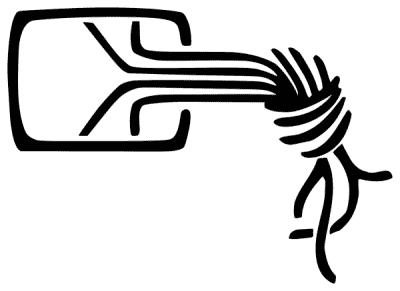
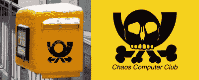
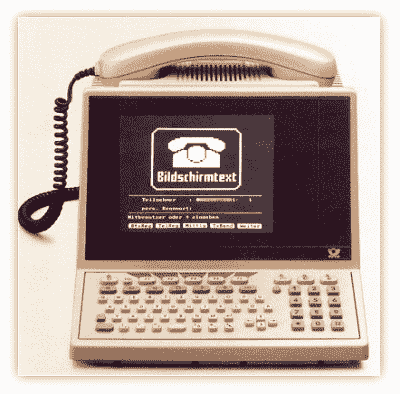
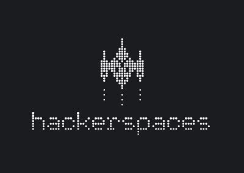

# 黑客与英雄:CCC 和黑客空间的崛起

> 原文：<https://hackaday.com/2016/01/12/hackers-and-heroes-rise-of-ccc-and-hackerspaces/>

从电话窃听的根源，到将黑客行为主要推向地下(或商业)的镇压和法律先例，美国的黑客文化在过去三十年里经历了很多。也许最突出的是 L0pht，这是一个可见的 20 世纪 90 年代美国黑客空间，从事公开披露，可以说是最后一个公开有影响力的美国黑客组织。

美国黑客事件的细节在我昨天的文章中有很好的报道。它以一种有点低沉的调子结束。L0pht 已经一去不复返了，据我所知，没有任何其他团体能像它一样拥有社会责任和公众知名度。这是一个耻辱，因为许多黑客相关的问题正在美国被决定，而且很大程度上没有我们的参与。

## 混沌电脑俱乐部

但是让我们远离美国，赶上德国。20 世纪 80 年代初，在德国和美国一样，有许多当地的计算机俱乐部，它们不过是在自助餐厅、科学博物馆或(像 CCC 那样)报社的每月一次的聚会。早期的计算机爱好者免费交换技术和软件。至少在美国，没有什么比确保一个会议场所更正式的安排了:我们都知道什么时候去，那么还需要做什么呢？

德国人的灵魂有点不同。向内窥视，你会发现“vereinsmentalitt”——一种“俱乐部心态”。在德国，几乎所有你能做的爱好或运动都有你能加入的相关俱乐部。冬季两项、养蜂、水彩画或黑客:当德国人做有趣的事情时，他们喜欢组织起来一起做有趣的事情。

Kabelsalat ist gesund! This CCC logo reminds you that it’s healthy to have a tangle of cables under your desk.

因此，CCC 在 1981 年开始作为一个非正式的本地黑客聚会，然后继续在汉堡举行定期会议。1984 年，他们举行了第一次混沌通信大会，这是一次在圣诞节后举行的年度会议，现在已经是第 32 年了。几年后，CCC 作为注册协会正式成立，但除了简单的“Vereinsmentalitä”之外，还有更多的工作要做。

翻译自[CCC 的网站](http://www.ccc.de/de/club):“为了排除法律上的误解，CCC 被注册为 e.V .以促进信息自由，以及至少在全球范围内不受阻碍地交流的人权。”我想提醒你注意这个可爱的短语:“排除法律误解。”你看，尽管 CCC 只是非正式地存在了大约五年，但他们已经完成了一些出色的黑客攻击，这些攻击可能会使人们陷入困难的法律处境——毫无疑问，几年后在美国也会如此。具有讽刺意味的是，通过公开合并和变得先发制人，而不是试图隐藏，CCC 为自己买了一些掩护。

如果你注意到 CCC 成为注册协会的原因和 Mudge 让 L0pht 进入政府视线的原因之间的相似性，你就已经简单地理解了这篇文章的主题。公开可见且负责任的黑客组织会回避潜在的指控，即他们是一个“团伙”或者他们在做一些见不得人的事情。有多少帮派有 501c3 身份？同时，如果报纸和国会议员有问题，他们可以很容易地找到他们。黑客成为社会成员。

CCC 做得非常出色，以至于该俱乐部的出版物不得不偶尔提醒人们记住将极客团结在一起的实际约束力:“spaam Gert”，与机器一起玩，或者快乐的黑客活动。

## BTX 黑客

虽然 CCC 可能像其他俱乐部一样起步，但一些早期高调的黑客帮助确定了俱乐部的方向，并有助于提升他们站在普通人一边的公众形象。这并不是说每个人的动机都是纯粹的，或者一切都是光明正大的。但是，就像后来在美国的 L0pht 一样，CCC 成为了新的网络世界中安全失败的公共信息来源。CCC 承诺披露这些失败，不管这样做可能会对声誉造成什么损害。如果受到损害的是黑客的宿敌德国央行的声誉，这也没什么。

Left: German Post logo. Right: CCC pirate flag. Get it?

“联邦测试”是德国黑客最喜欢的目标。政府电信和邮政垄断，就像美国的美国电话电报公司一样，很可能对服务收费过高，因为它可以这样做。正如上次提到的，邮报禁止进口外国调制解调器，要求德国人购买更贵的“官方”型号。电话，在当时也意味着数据，是昂贵的，甚至正常人也想要邮政的替代品。像 CCC 创始人瓦乌·荷兰德这样的理想主义黑客想要免费的替代品。

1984 年的目标是 [Bildschirmtext](https://en.wikipedia.org/wiki/Bildschirmtext) 。Bildshirmtext，或称 BTX，是一种先进的即时拨号服务，与 T4 早期在美国的服务非常相似。只有 BTX 由政府电话垄断经营，而且相对昂贵。

据说，CCC 创始人瓦乌·荷兰德和斯蒂芬·沃纳里发现了一个缓冲区溢出，会吐出未编码的数据，其中包括明文形式的密码。在去了联邦邮局后，被忽视了，他们策划了一次惊人的黑客攻击，然后去了 ZDF——第二个国家电视网——上了晚间新闻。霍兰德和韦纳里设法从一家汉堡银行获得了密码，并从该银行的账户中多次开设了一个付费的 BTX 网站，该网站归 CCC 所有。一夜之间赚了 136，000 德国马克后，他们去了出版社。(他们很自然地把钱还了回去。)

Wernéry and Holland and a whole bunch of monitors, prime-time on Channel One.

但是在全国晚间新闻上展示的一个重要系统的高调黑客攻击是一个游戏改变者。汉堡银行感谢他们让他们意识到潜在的问题。几天后，德国议会不得不做出回应，称他们已经修复了漏洞。但是秘密已经泄露，更重要的是公众正在重新考虑他们的数据安全。CCC 就像拨号罗宾汉一样。

通过直接面对媒体，中央竞争委员会在大多数时候都设法站在法律和公众舆论的正确一边。例如，当被问及警方是否知道他们在做什么时，霍兰德在一次采访中回答说，他亲自给巴伐利亚警方计算机犯罪部门的负责人送了一份 CCC 的时事通讯。媒体将 CCC 和一般的黑客描述为必要的公民社会对抗大企业的断言，即他们的数据将被保持安全。

通过具有公共影响的高调黑客活动，以及促进快乐黑客活动，CCC 扩大了成员数量，并在汉堡之外成立了卫星俱乐部。今天，在德国有 25 个地方 CCC 分会，拥有超过 5，500 名会员，CCC 无疑是德国乃至全世界最大的计算机俱乐部。因为他们公开探索影响每个人的技术，从 BTX 到电脑投票系统，媒体和社会，甚至有时政府，都会倾听。

## 黑客空间，把德国的一部分带到美国(和世界)

奇怪的是，所有这些关于 CCC 的讨论把我们带回了美国。不管你是否意识到，CCC 的 25 个本地人(以及独立但友好的柏林 [c-base](http://c-base.org/) 和维也纳 [Metalab](https://metalab.at/) 是我称之为美国新浪潮黑客空间的原型。

一群美国黑客，其中包括 Bre Pettis，Nick Farr 和 Mitch Altman，在 2007 年夏天去了欧洲的混沌通信营度假，然后参观了德国和奥地利的黑客空间，看看是什么让他们这么做的，他们想把这个想法带回美国。在 2007 年 12 月的第 24 届混沌通信大会上，CCC 在科隆和杜塞尔多夫分部的创始人延斯·欧利格和拉斯·魏勒讲述了他们运营黑客空间来帮助他们的美国朋友的新经历。

这次演讲的幻灯片，[黑客空间设计模式](http://events.ccc.de/congress/2007/Fahrplan/attachments/1003_Building%20a%20Hacker%20Space.pdf)将成为创建三个第一批新浪潮美国黑客空间的起点。2008 年 2 月，盈利性的[纽约电阻器](http://www.nycresistor.com/)开张了。到了三月， [HacDC](http://www.hacdc.org/) 作为一个非盈利组织成立，并对外营业。尽管他们已经在这里和那里会面了一段时间，Noisebridge 还是在 2008 年 10 月租下了它的第一个空间，并在六个月后注册成为一个非盈利组织。

几年之内，美国就有了 100 个黑客空间。今天，在美国 hackerspaces.org 上有 406 个注册活跃黑客空间，全球有 1200 多个。对于八年的工作来说还不错！如果你还没有去过你当地的黑客空间，这是你自己的功劳。

 由于个体成员的口味不同，每个 hackerspace 都略有不同。我不知道如何准确区分黑客空间和“创客空间”，但似乎有些团体更关注硬件项目，有些团体更关注计算机和信息自由。但我自己的经验是，也没有硬性的界限，一个空间的优势往往会随着时间的推移而改变。

这是一件好事，因为当人们从黑客活动中获得乐趣时，他们会创作出最好的作品，而不断提供交叉授粉的机会有助于保持新鲜。例如，在 HacDC 的早期，我们在高空气球上度过了一段美好的时光，因为它将我们的硬件人员与业余无线电爱好者甚至 web 开发人员联系起来，他们拼凑了一个不错的实时地图解决方案。但与此同时，HacDC 还推出了 Byzantium 项目，这是一种易于配置的自组织无线网状网络解决方案。

因此，尽管我很喜欢美国黑客空间在过去十年中如雨后春笋般涌现的方式，尽管我参观过的每个独立空间本身都很整洁有趣，但我不得不说，美国缺少了一些东西，那就是一个更大的组织和目标。如果美国 400 多个黑客空间的一些雄心被集中在一起，很难高估会有多少酷的东西被完成。

## 美国-CON！

那么下一步是什么，美国队？要在 400 多个黑客空间中达成共识将是非常困难的，但是想象一下，如果你能偶尔用一个声音说话，这将会有多大的好处？但是从哪里开始呢？人们怎么能试图组织这种混乱呢？

你想知道我认为德国人会怎么做吗？首先是年度会议，然后合并一个组织来处理协调:你会惊讶地发现一个大型的年度会议将会建立多少关注和团队合作。一年一度的活动给团体一个努力的最后期限，我不需要告诉你这有多重要。年度会议让人们聚在一起，玩得很开心，这绝对不应该被低估。

不知道你们都有什么共同点？你可以做得比从[黑客伦理](https://en.wikipedia.org/wiki/Hacker_Ethic)开始更糟，它非巧合地出现在麻省理工学院共享计算机资源的早期，但却是德国 CCC 的统一基础:

*   接触电脑——以及任何可能让你了解世界运作方式的东西——应该是无限制的、完全的。永远屈服于亲自动手的命令！
*   所有信息都应该是免费的
*   不信任权威——促进分权
*   黑客应该根据他们的黑客技术来评判，而不是像学位、年龄、种族、性别或职位这样的标准
*   你可以在电脑上创造艺术和美感
*   电脑可以让你的生活变得更好

至少考虑一下 CCC 的两个新增功能:

*   不要干涉别人的数据
*   使用开放数据，保护私有数据

(埃利奥特是 HacDC 的创始成员之一，至少在慕尼黑 CCC 缴纳会费，尽管他已经很久没有来过了。)