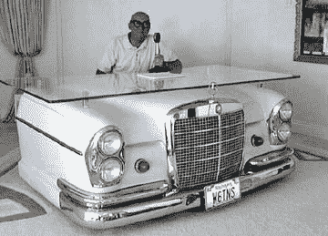
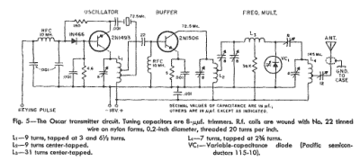
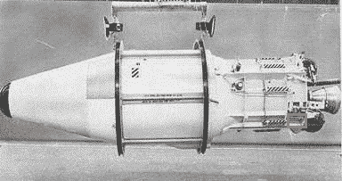

# 太空中的火腿:奥斯卡计划

> 原文：<https://hackaday.com/2016/01/14/hams-in-space-project-oscar/>

1961 年 12 月初，一枚美国空军火箭从加利福尼亚州范登堡空军基地起飞，携带一个特殊的有效载荷。主要有效载荷是一颗电晕监视卫星，但就在飞船尾部塞进了一个看起来像一块蛋糕的自制电子产品的小包装。包裹里是什么，它是如何跟随一项绝密军事任务的，这就是世界上第一颗业余无线电卫星奥斯卡 1 号的故事。

### 人造卫星危机

从很多方面来看，20 世纪 50 年代末是一个动荡的时代，但 1957 年苏联发射人造卫星真正将事情推向了高潮。在一天之内，人类已经转变为一个太空物种，这一事实任何人只要在日落时看着天空，看着那个抛光的球体绕着地球旋转，就可以看到。你也可以收听——人造卫星的 20 和 40 兆赫信标很容易在短波上接收到。全世界的业余无线电操作员都调到了人造卫星的信标上。事实上，第一次向公众转播人造卫星的信号是由哥伦比亚大学业余无线电俱乐部提供的；成员们录下了信号，并在大学的调频电台播放了磁带，击败了全国广播公司。

随之而来的“人造卫星危机”是许多变化的催化剂，这些变化导致了我们今天所知道的世界；毕竟，处理人造卫星的机构之一是高级研究计划局，或 ARPA，后来成为 DARPA，并导致了互联网。但是人造卫星也有立竿见影的效果，两者结合在一起，业余无线电卫星在短短几年内就成为现实。首先，人造卫星为苦苦挣扎的美国太空计划提供了焦点；受到一系列非常引人注目的公开失败的困扰，苏联的成功为美国人提供了动力，让他们开始在太空运载系统上取得成功。连续三周听着人造卫星轨道运行时简单的短波哔哔声，激发了一些火腿做一个大胆的梦——建造并发射他们自己的卫星。

### 奔驰男人的孩子

Don Stoner W6TNS, the Father of OSCAR. Source: [CB Gazette](http://www.cbgazette.com/Donaldstoner.html)

1959 年，也就是人造卫星发射后不到两年，奥斯卡计划(Project OSCAR)的第一缕曙光出现了，这是“轨道卫星携带业余无线电”的首字母缩写。称这个想法大胆是一种保守的说法。当时太空探索是超级大国的地盘；毕竟，还有谁有资源将包裹送入轨道？因此，当唐·斯托纳(Don Stoner)在那一年在《CQ》杂志上写了一篇文章，谴责哈姆在太空竞赛中被甩在后面，他们可以很容易地建造一颗卫星，只要有人手边有导弹发射它，这实际上引起了注意，在“人造卫星热”的气氛中，事情开始发生。

Dead simple: the OSCAR transmitter. Source: QST magazine, February 1962

加州的 Hams 开始头脑风暴业余无线电卫星会是什么样子。他们设定了一个远大的目标，那就是建造一个所有哈姆都能访问的轨道中继器，同时他们也认识到了循序渐进的必要性，因此开始设计一个简单的信标。由于仍然缺乏运载工具，他们坚持电子设计，并选定了一个简单的晶体管甚高频发射机。它将由电池供电，以避免太阳能的复杂性，通过单极天线传输简单的信标信号。传输将是经典的莫尔斯密码，代表笑声，“嗨”，由一个电子键盘发送，它将根据卫星的温度改变信号的速度。

### 社会工程运载火箭

Discoverer 1\. OSCARs 1 and 2 hitched a ride in the area highlighted in orange. Photo source: [Sven Grahn](http://www.svengrahn.pp.se/histind/Discoverer/Discoverer.htm)

关于哈姆夫妇如何设法说服空军让他们搭载一项任务，目前还没有太多细节。事实上，很多 OSCAR hams 白天在加州蓬勃发展的航空航天工业工作，这可能是一个因素，Stoner 自己提到了 1960 年准卫星建造者和 JPL 航天仪器部门负责人之间的一次会议，他自己也是一个 ham。看来，当你想把一个包裹送入轨道时，有关系是有好处的。

无论社会工程如何进行，最终结果都是同意搭载即将到来的空军发射。这颗卫星是发现者 36 号(T1)，这是一颗(T2)KH-3 Corona(T3)监视卫星，设计用于从轨道上拍摄照片，并将胶卷包裹放在降落伞上返回，降落伞会被飞机钩住。业余爱好者在有效载荷舱的尾部获得了一些空间，这些空间通常由压载物占据。这设定了卫星的物理参数，开始建造。

由于它的镁外壳和框架，楔形机身最终只有大约 10 磅重。建造者知道他们没有姿态控制或主动系统来管理热增益，所以他们决定采用被动热管理。车身镀了金，以尽可能多地反射入射的阳光。然后在外部添加吸收性油漆条来吸收一些热量，以防止内部冻结，内部空间用泡沫绝缘材料填充。

这颗卫星的建造总共花费了 63 美元，现在被称为奥斯卡 1 号，它在基本不存在预算的情况下进行了尽可能好的测试。构建团队必须证明他们的包不仅不会危及发现者 36 号的侦察任务，而且他们有很大的机会成功完成自己的任务。模拟卫星的飞机飞行在加利福尼亚周围进行，哈姆自愿监测信标。信号的地面监测程序已经到位。通过控制发射器功率来调整汞电池的能量预算，并分析航天器的热特性。

The spring that launched civilian spaceflight. Source: [National Air and Space Museum](http://airandspace.si.edu/collections/artifact.cfm?object=nasm_A19640011000)

最终，在 12 月 12 日，托尔助推器带着奥斯卡升空。一旦进入轨道，一个爆炸螺栓释放，一个在西尔斯花一美元买的弹簧将世界上第一颗非政府卫星从母船上弹出。它进入了自己的轨道，并立即开始向全世界发送友好的“嘀-嘀-嘀-嘀-嘀”问候。奥斯卡 1 号运行完美，在电池耗尽前传输了 20 天。共有来自 28 个国家的 570 个卫星报告听到了奥斯卡 1 号，它在 1962 年 1 月下旬重返地球之前完成了大约 280 次轨道飞行。

作为一个极简建筑，奥斯卡 1 是巨大的成功。除了实现将业余无线电放入太空的目标，并证明民间团体可以与军方和大型政府承包商合作，奥斯卡还产生了宝贵的数据，特别是关于热管理系统的数据。这被用来改善奥斯卡 2 号的热设计，实质上是第一颗卫星的克隆，最终是奥斯卡 3 号，第一个太空业余转发器。奥斯卡团队还发明了从更大的公共汽车上发射子卫星的概念，并证明了它的可行性。

奥斯卡项目最终演变成 AMSAT T1，这是一个志愿者组织，已经发射了一个业余无线电卫星舰队，今天仍在运行。一小群业余卫星现在环绕着地球运行，业余无线电已经牢牢地扎根于太空。这一切都是从一颗 63 美元的卫星开始的，这颗卫星是由一群黑客在地下室建造的，他们知道自己想要完成什么，并找到了成功的方法。

【主要图片来源:[国家航空航天博物馆](http://airandspace.si.edu/collections/artifact.cfm?object=nasm_A19640011000)