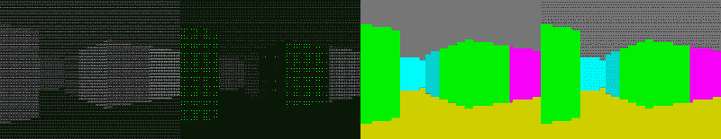

# 沃尔芬斯坦在 600 行代码中

> 原文：<https://hackaday.com/2016/01/15/wolfenstein-in-600-lines-of-code/>

更令人印象深刻的是，这个类似 Wolfenstein 的游戏有 600 行代码，还是它是在 AWK 编写的？

AWK 是一种主要用于文本处理的语言。但是如果你能写代码，世界会顺从你的意愿。[费多尔·卡鲁金]利用 Linux 终端的颜色选项来绘制他的游戏。3D 方面是通过光线投射产生的，光线投射从 3D 坐标产生 2D 图像。

试用游戏非常简单，安装 gawk，克隆 repo，然后玩:

* * *

```
sudo apt-get install gawk
git clone https://github.com/TheMozg/awk-raycaster.git
cd awk-raycaster/
gawk -f awkaster.awk

```

我们非常欣赏四种不同的显示模式，它们展示了用很少的资源做很多的事情。它们包括:黑白文本、彩色文本、彩色背景以及彩色文本和背景的组合。这是一种先进的纹理技术，每个 ansi 艺术家都熟悉这种技术。

[](https://hackaday.com/wp-content/uploads/2016/01/awk-wolfenstein-textures.png)

不要把自己局限于玩弄剧本而失去兴趣。把那东西打开。尝试基于这个框架制作一个旋转线框立方体！

[via [黑客新闻](https://news.ycombinator.com/item?id=10896901)