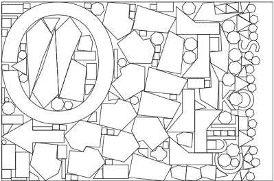

# 用遗传算法包装你的胶合板切口

> 原文：<https://hackaday.com/2016/01/22/pack-your-plywood-cuts-with-genetic-algortihms/>

阅读(或者写作！)如今，我们发现人们经常为我们解决问题，而我们甚至不知道自己遇到了这些问题。就拿【杰克乔】的 [SVGnest](https://github.com/Jack000/SVGnest) 来说吧。例如，如果你曾经使用过激光切割机，你可能会思考一两秒钟如何最好地将物品打包成一张纸，尽你最大的努力，然后继续前进。但是如果你有很多零件，并且它们的形状不规则，你想最小化材料成本，你会想出更好的东西。

SVGnest 在浏览器中运行，它将一堆 SVG 形状和一个边界框作为输入，然后尽可能地将它们打包。实际上，优化放置是一个计算量很大的提议，这是考虑到放置顺序是固定的，并且只允许每块旋转 90 度。

一旦你考虑了放置棋子的所有可能顺序，计算成本就会变得高得离谱，所以 SVGnest 作弊，使用了一种[遗传算法](http://www.ai-junkie.com/ga/intro/gat1.html)，这种算法本质上是交换一些棋子，然后测试很多很多次，以求改进。随机这样做是愚蠢的，所以例程首先打包最大的部分，然后在合适的地方回填小的部分，可能会移动大的部分来容纳。

这需要大量的计算工作，但最终结果是惊人的。SVGnest 打包的形状比我们希望的要好，还有一些商业嵌套软件。值得称赞。现在软件已经写好了，一旦你自己发现了这个问题，你就有办法找到解决方案。谢谢[杰克]！