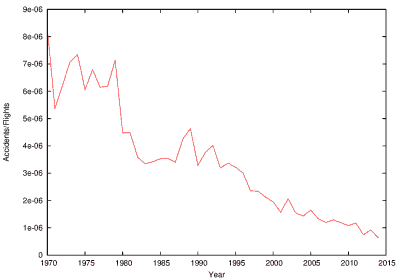
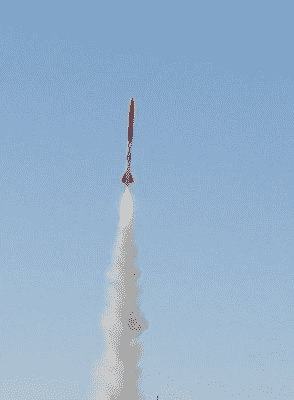

# 为什么没有飞机降落伞？等问题。

> 原文：<https://hackaday.com/2016/01/19/why-no-plane-parachutes-and-other-questions/>

本周，有人向我提出了一个问题。客机为什么没有应急降落伞？全机应急[降落伞可用于轻型飞机](https://www.inverse.com/article/7703-whole-plane-parachute-caught-on-video-during-safe-landing-in-arkansas)，在许多轻型飞机发动机故障和事故中发挥了巨大作用。

 [https://www.youtube.com/embed/FkBJefsx24s?version=3&rel=1&showsearch=0&showinfo=1&iv_load_policy=1&fs=1&hl=en-US&autohide=2&wmode=transparent](https://www.youtube.com/embed/FkBJefsx24s?version=3&rel=1&showsearch=0&showinfo=1&iv_load_policy=1&fs=1&hl=en-US&autohide=2&wmode=transparent)

但事实是，虽然降落伞对轻型飞机可能是有效的，但它们没有伸缩性。Quora 上有一系列很棒的[答案，这些答案计算了全尺寸客机所需的降落伞尺寸。我建议阅读完整的线程，但足以说，一个大概的估计将需要一百万平方英尺(92903 平方米)的材料。这显然不太可行，增加的重量和复杂性无疑会带来风险。](https://www.quora.com/Why-dont-airplanes-have-giant-parachutes-attached-to-them-to-save-the-plane-and-its-passengers-in-times-of-emergency)

Accidents/No. of flights by year. Data compiled from [1](http://aviation-safety.net/statistics/period/stats.php?cat=A1) and [2](http://data.worldbank.org/indicator/IS.AIR.DPRT/countries/1W?display=default).

然而，这些问题背后隐藏着一个更深层次的问题。一个飞行安全的问题，也许还有我们天生对飞行的恐惧。人们很容易担心客机的安全，尤其是考虑到过去几年里一系列引人注目的事故。然而，事实是航空旅行不仅非常安全，而且一年比一年安全。

右边的图是从几个公开的来源汇编的。它显示了每年的飞机事故数除以飞行次数。自 20 世纪 70 年代以来，事故率持续下降。有一篇由一位前波音员工撰写的关于此事的精彩文章,我也强烈建议你阅读。

航空飞行滋生恐惧的一个方面是伴随事故的信息缺乏。失踪飞机的未知命运让媒体得以炒作，随之而来的是我们对未知事物的天然恐惧。我们无法定位飞机似乎经常令人困惑，在这个世界上，我们觉得需要付出巨大努力来避免我们的位置每天每一秒都被 NSA 跟踪，[为什么我们不能定位像客机这样大的东西呢](http://aviation.stackexchange.com/questions/2198/why-dont-all-commercial-aircraft-transmit-gps-data-in-real-time)？

事实是，飞机在可能的情况下一直受到监视，而且信息是可以广泛获得的！飞机在 ADSB 上空传送他们的 GPS 坐标。流行的航班交通监控网站 FlightAware 24 将此作为其数据源之一。使用一个 [RTL SDR 加密狗](http://www.rtl-sdr.com/adsb-aircraft-radar-with-rtl-sdr/)，你也可以很容易地获取和解码 ADSB 信号。

然而，飞机使用 ADSB 与地面站通信。因此，它不适用于海洋。对此的一个解决方案是使用卫星上行链路，但这很昂贵，有人说效用有限。其他建议是在飞机穿越海洋时，在它们之间建立一种网状网络。毫无疑问，随着用户对机上 WiFi 需求的持续增长，这种跟踪解决方案将变得越来越普遍，Twitter 上也充斥着用户在 Twitter 上发布的他们在飞机上用餐的照片。

不管我们恐惧的根源是什么。空中旅行非常非常安全。但最近的另一个“假设”促使我考虑，如果安全不是我们最关心的问题，航空旅行会是什么样子。最近备受争议的亚马逊电视连续剧《高高城堡中的人》展示了一个世界，在这个世界中，盟军在第二次世界大战中失败，美洲由日本和纳粹联盟统治。有一个时刻，一架超音速飞机(上面的特写图片)从欧洲出发，只花了两个小时就抵达了旧金山。在这个世界上，也许更愿意拿人命冒险，更愿意在公民的意愿上妥协。超音速飞行还会普遍吗？

### 普通的超音速旅行

当然，我们过去有超音速客机。直到 2000 年，协和式飞机还被认为是世界上最安全的飞机之一。这是那一年唯一的一次坠机事件，9/11 之后空中交通的不景气，以及超音速商用飞机被禁止在陆地上飞行的事实，所有这些都使得协和式飞机变得不经济。商业航班于 2003 年停飞。

A hobbyist rocket, capable of supersonic speeds.

虽然超音速飞行目前对于商业飞行来说可能是不切实际的，但爱好者们一直试图参与到超音速行动中来。最快的遥控飞机还没有达到超音速，但是超音速火箭已经制造出来了。这份[说明书](http://www.instructables.com/id/Supersonic-Rocket-Mach-My-Day/?ALLSTEPS)描述了改装一枚价值 70 美元的火箭(包括价值 360 美元的部件)以达到超音速的过程。在一次试飞中[ 小发明家 ]达到了 801 英里每小时(1.07 马赫)的速度。

火箭没有发出可听见的音爆，当火箭达到超音速时，它已经在 450 米的高空，产生的声波向侧面辐射。

然而，超音速飞机确实会产生音爆。正是这种侵入性的声音，导致商业超音速飞行被禁止在陆地上空飞行，帮助决定了协和式飞机的命运。

音爆是由与多普勒效应相同的机制引起的。在多普勒效应中，一个向你移动的物体[似乎会产生](https://www.youtube.com/watch?v=imoxDcn2Sgo)更高频率的声音。因为声波的来源正在向你移动，它“赶上”波前，有效地压缩声波，并在运动方向上产生更高的频率。

在音爆中，波前被推得如此之近，以至于它们互相追赶。因此，多个波前相互重叠。所有的声音被压缩在一起，在一次大爆炸中到达你的耳朵。

 [https://www.youtube.com/embed/W2Hfukjqv7I?version=3&rel=1&showsearch=0&showinfo=1&iv_load_policy=1&fs=1&hl=en-US&autohide=2&wmode=transparent](https://www.youtube.com/embed/W2Hfukjqv7I?version=3&rel=1&showsearch=0&showinfo=1&iv_load_policy=1&fs=1&hl=en-US&autohide=2&wmode=transparent)

然而，美国国家航空航天局一直在制定计划“修复”超音速飞机的音爆问题。他们已经投资了 230 万美元用于预测和减少音爆效应的研究项目。

### 谁杀了电动飞机？

超音速飞机是一个令人印象深刻的技术飞跃，但现有的设计仍然由化石燃料驱动。在一个消费类汽车开始过渡到所有电气系统的世界里，这感觉有点过时了。制造小型电动飞机是可能的，但是由于美国联邦航空局的裁决而受阻，虽然有一些在 T2 已经上市。

现有的电动飞机都是非常传统的使用电动机(一般是无刷 DC 品种)来产生运动。但是在 YouTube 上花很多时间，你可能会遇到一种非常不同类型的“飞行器”，有许多视频声称创造了反重力 UFO。这些源于托马斯·汤森·布朗。20 世纪 60 年代，他发明了一些装置，他认为这些装置利用电场来改变重力。不幸的是，情况并非如此。

他实际建造的是一艘[电离层飞行器](https://en.wikipedia.org/wiki/Ionocraft)。

 [https://www.youtube.com/embed/01F8V5IhB5k?version=3&rel=1&showsearch=0&showinfo=1&iv_load_policy=1&fs=1&hl=en-US&autohide=2&wmode=transparent](https://www.youtube.com/embed/01F8V5IhB5k?version=3&rel=1&showsearch=0&showinfo=1&iv_load_policy=1&fs=1&hl=en-US&autohide=2&wmode=transparent)

基本的推进机制非常简单。把一个尖的电极放在一个光滑的电极旁边，然后在电极上施加几千伏的电压，这个简单的装置就会产生推力。它通过创建一个集中在尖端并向光滑表面扩散的电场来实现这一点。当磁场很强时，电子被从空气中的原子上拉下来，使其电离。这些带正电的原子飞向负极。这本身不会产生推力，但当离子移动时，它们会撞击空气中其他不带电的原子，产生所谓的“离子风”。

一种相关的技术已经被美国宇航局和 JAXA 成功地用于他们的太空探测器。然而，因为太空中没有空气可以电离，他们需要带着自己的气体一起电离。虽然离子推进器产生的力很小，但它们的效率极高，这在太空旅行中至关重要。

然而，除了奇怪的 YouTube 视频，他们发现在地球上的效用有限。这种情况有可能改变。虽然离子推进器通常产生的力很小，但最近的研究表明，它们的效率可能比喷气式发动机高一个数量级。有一些相当重大的挑战需要解决，比如产生所需升力所需的巨大电压(即使在小型升降机中也需要几十千伏的电压)，或者推进器的巨大物理尺寸。但是，如果太空和地面飞行的未来都寄托在曾经被认为是反重力曲柄的工作上，那就不好玩了？

无论未来发生什么，让我们希望飞机变得更快更有效率，随着它们不断增加的安全性继续前进。