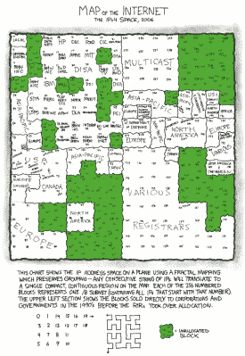

# shmoocon 2016:GPU 和 FPGAs 更好地检测恶意软件

> 原文：<https://hackaday.com/2016/01/17/shmoocon-2016-gpus-and-fpgas-to-better-detect-malware/>

检测恶意软件的一个大问题是，相同的恶意代码有如此多的不同形式。正是这种多态性问题促使里克·韦森开发了一种识别恶意软件的聚类技术*冰水*。

在 Shmoocon 2016 上展示的*冰水*项目是一种处理和过滤人们在互联网上发现的大量样本的新方法。每天处理 300，000 个新样本以确定其中是否有多态恶意软件是一项艰巨的任务。这里使用的方法是通过使用空间填充曲线从每个二进制样本创建指纹。多态性会改变每个样本中的许多位，但与人类指纹一样，模式仍然存在于这个二进制指纹中，表明该样本是先前已知对象的变体。

IPv4 addresses shown in a space-filling curve [by xkcd](https://xkcd.com/195/) CC-BY-NC

你在上面看到的图像是这些指纹的图示。图像实际上不是该技术的一部分，但通过将每个字节值转换成灰度，这是人类理解计算机在分析中使用什么的一种好方法。

一旦制作了指纹，就很容易对可能相同的样本进行比较和聚类。这种方法的昂贵部分是运行空间填充曲线。使用 CPU 运行这个需要很多时间。FPGAs 是个好主意，但是硬件相对昂贵。在其当前的实现中，GPU 是时间和费用的最佳平衡。

当你开始谈论互联网规模的问题时，这种费用衡量变得非常有趣；需要不断处理大量数据。目前的 GPU 方法可以在大约 33 毫秒内计算一个对象，每天可以处理几十万个样本。这比 CPU 方法大约好四个数量级。但目标是从 GPU 过渡到利用 FPGAs 中的并行处理。

Rick 对 Xenon Phi/Altera FPGA 的早期测试可以以每 586 秒一个对象的速度计算空间填充曲线。这意味着比 CPU 提高了 9 个数量级，但他仍然不满意。他的目标是将冰水冷却到每个物体 150 秒，这将允许在 4 小时内处理 1000 万个样本，功耗为 4000 瓦。

如何比较制造成本和功耗预算不同的硬件上的计算？Rick 计划用一种他称之为 InfoJoules 的测量方法来解决这个问题。这是计算决策相对于瓦秒的表达式。在一台消耗 1000 瓦的机器上，1 秒钟内计算出 1000 条新信息是 1 InfoJoule。这将使硬件的选择更容易一些，因为您可以权衡购买硬件的成本和每条新信息的运营成本。