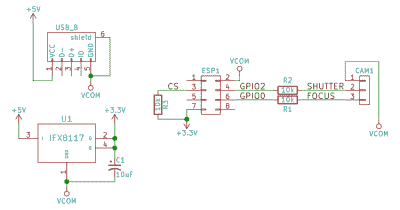

# 五块钱，三个部分:无线摄像头遥控器

> 原文：<https://hackaday.com/2016/01/24/five-bucks-three-parts-wifi-camera-remote/>

可笑的是，今天做一些在两三年前既昂贵又困难的事情是如此的便宜和容易。举个例子:Hackaday.io 用户[gamaral] [用三个部分为他的佳能 E3 相机](https://hackaday.io/project/9234-canon-dslr-wifimote)制作了一个 WiFi 遥控器:一个 ESP8266 模块、一个电压调节器和一个立体声插头，相机用它作为远程触发器。

并且[代码库几乎和](https://github.com/gamaral/canon-wifimote)一样小，尽管它也有一些不错的地方。控制很简单——只需拉下对焦或快门的插销。ESP 监听自定义端口，当它收到消息时，“按下”或“释放”引脚。这是如何使用 [ESP IOT SDK](http://espressif.com/new-sdk-release/) 的一个很好的简单例子。

时机都在客户端。例如，[gamaral]知道他会想试试按下聚焦按钮多长时间，所以他留有弹性。使用 [Netcat](http://nc110.sourceforge.net/) 使得客户端代码变得完全琐碎:`echo -n "SHUTTER HOLD" | nc -w 1 -q 1 roosevelt 9021`。砰。第一次成功了。查看下面的精彩视频，了解更多详情。

请留意[gamaral]的 Hackaday.io 页面，因为当 PCB 邮件到达时，他将制作另一个视频。

 [https://www.youtube.com/embed/ukUMP7jty64?version=3&rel=1&showsearch=0&showinfo=1&iv_load_policy=1&fs=1&hl=en-US&autohide=2&wmode=transparent](https://www.youtube.com/embed/ukUMP7jty64?version=3&rel=1&showsearch=0&showinfo=1&iv_load_policy=1&fs=1&hl=en-US&autohide=2&wmode=transparent)

