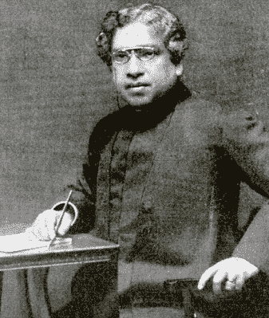
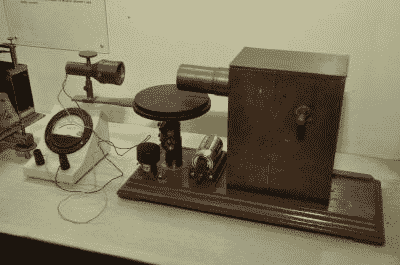
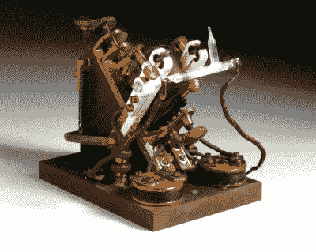
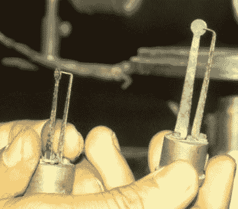

# 玻色与无线电的发明

> 原文：<https://hackaday.com/2016/01/19/j-c-bose-and-the-invention-of-radio/>

电力的早期似乎是一个残酷的时代。当学者们忙于揭开电磁学的神秘面纱时，一批批企业家正等着扑向纯科学和工程解决方案，以解决那些甚至还不存在、但无疑可以转化为利润丰厚的风险投资的问题。我们都听说过爱迪生、特斯拉和西屋电气之间的史诗般的斗争，即使有一个多世纪的后见之明，也很难说出谁对谁做了什么。但另一场冲突正在 19 世纪之交酝酿，这一次是在一位印度学者和一位意大利贵族之间，它将决定谁因奠定了 20 世纪的关键技术——无线电——的基础而获得荣誉。

### 任命和失望

Jagadish Chandra Bose

1885 年，27 岁的贾加迪什·钱德拉·博斯从英国回到他的祖国印度，他在英国剑桥大学学习自然科学。博斯原本被送到那里学习医学，但由于解剖室难闻的气味加重了他的健康状况，他退出了。相反，Bose 带着多个学科的学位和一封介绍信回来了，这促使印度总督要求在加尔各答的总统学院为他安排一个职位。一个人没有拒绝总督的请求，尽管学院管理层提出抗议，Bose 还是被任命为物理学教授。

可悲的是，政府找到了扳平比分的方法，主要是不为 Bose 提供任何实验室空间，但也只给他每月 100 卢比的工资，这是印度教授通常工资的一半，也只有英国人工资的三分之一。Bose 通过拒绝工资支票来抗议后者——三年后他的抗议奏效了，他追溯性地拿到了全额工资——并通过将洗手间旁边的小隔间改造成实验室来解决前者。但在那 24 平方英尺的空间里，配备着他自己设计并自费购买的仪器，Bose 将创造奇迹，并开始设计无线电的雏形。

大约在玻色加入总统学院的时候，海因里希·赫兹正在证实詹姆斯·克拉克·麦克斯韦在 19 世纪 60 年代提出的电磁波的存在。麦克斯韦在能够证明电、磁和光是同一现象之前就去世了，但是赫兹和他的火花隙发射器和接收器证明了这一点。受到这项工作的启发，并被“赫兹波”和可见光是一回事的想法所吸引，玻色开始探索这个新领域。

Bose’s microwave apparatus. Transmitter on right, galena detector in the horn on the left of the experiment stage. By [Biswarup Ganguly](https://commons.wikimedia.org/wiki/File%3AMicrowave_Apparatus_-_Jagadish_Chandra_Bose_Museum_-_Bose_Institute_-_Kolkata_2011-07-26_4051.JPG)

到 1895 年，在开始他的研究仅仅一年后，Bose 在加尔各答市政厅第一次公开演示了无线电波。所用仪器的细节尚不清楚，但在 75 英尺的距离，他远程按响了电铃，点燃了少量火药。受邀的客人对演示感到惊讶，演示显示 *Adrisya Alok，*或 Bose 在后来的一篇文章中总结的“不可见光”可以穿过墙壁、门，并以一种特别大胆的表演技巧，穿过孟加拉上尉总督的身体。

Bose 的无线演示之所以引人注目，有几个原因。首先，这件事发生在马可尼在英国第一次公开展示无线电报的两年前。马可尼对无线电商业化非常感兴趣，而博斯的兴趣纯粹是学术性的；事实上，Bose 断然拒绝为他的小工作室产生的几乎所有发明申请专利，原则是思想应该自由分享。

1895 年的演示也使用微波信号，而不是马可尼和其他人使用的低频和中频波。Bose 很早就认识到，更短的波长可以更容易地探索无线电波与光相似的属性，如反射、折射和偏振。为此，他发明了微波系统的几乎所有基本组件——波导、极化器、喇叭天线、电介质透镜、抛物面反射器和衰减器。他的火花隙发射器能够以 60GHz 的频率工作。

### 连贯的思想

Marconi Admiralty Pattern Coherer. Source: [The Science Museum (UK)](http://www.sciencemuseum.org.uk/online_science/explore_our_collections/objects/index/smxg-34916#na)

玻色在无线电方面的一些最重要的工作涉及到电磁波的探测。早期的无线先驱已经发现，电磁波可以被金属导体之间的管子中的细小金属颗粒整流；电能会使粒子聚集在一起，变得导电。由于这种聚集作用，这种设备被称为*相干器*，并在所有早期实用的无线接收器中被用作整流器，尽管人们对它的工作原理还不太了解。相干体[的实验一直持续到今天](http://hackaday.com/2015/11/22/the-first-radio-sets-a-spark-gap-and-a-coherer/)。

然而，早期的 coherers 有一个问题——信号过去后，文件仍然粘在一起。该设备需要通过一个微小的电磁敲击机制来重置，在检测到下一个信号之前，该机制会将锉屑震回到非导电状态。这对带宽有明显的影响，因此开始寻找更好的探测器。玻色在 1899 年发明的一项改进是铁-汞-铁凝聚器，在一个小金属杯中有一池汞。一层绝缘油覆盖在水银上，一个铁片穿过绝缘油，但不与液态水银接触。射频能量会分解绝缘油并导电，其优点是不需要解码器来重置系统。

两年后，Bose 改进的 coherer 设计奇迹般地出现在马可尼的跨大西洋无线接收器中。情况有些可疑——马可尼关于他如何想出这个设计的故事随着时间的推移而变化，有报道称 Bose 的电路设计在他展示他的工作时在伦敦一家酒店的房间里被偷了。无论如何，Bose 对将他的发明商业化不感兴趣，马可尼将继续为他自己申请专利。

### 半导体之父？

Early Bose galena point-contact detectors. Source: [National Radio Astronomy Observatory](//www.cv.nrao.edu/~demerson/bose/bose.html)

玻色也在半导体探测器方面做了早期工作。玻色在探索无线电波的光学特性时，发现方铅矿(一种富含硫化铅的铅矿)能够在存在无线电波的情况下选择性导电。他能够证明方铅矿晶体上的点接触起到了更好的凝聚作用，并以一个非典型的举动实际上为这项发明申请了专利。有趣的是，[专利](http://web.mit.edu/varun_ag/www/jcbosepatent.pdf)包括对物质的描述，这些物质显示出随着电压的增加，对电流的阻力减少或增加；Bose 选择将这些物质描述为“正”和“负”物质，这是半导体研究中常见的“P-N”命名法的早期例子。几十年后，晶体管的共同发明人威廉·布拉顿(William Brattain)承认，玻色在半导体领域领先了所有人，并将发明第一个半导体整流器归功于他。

几十年来，Bose 丰富的头脑一直在创造发明和创新。他最终将注意力转向了植物生理学，用他发明的一种敏感设备 [crescograph](https://en.wikipedia.org/wiki/Crescograph) 研究植物的应激反应，这种设备可以将植物尖端的运动放大 1 万倍。毫不奇怪，他还在微波对植物组织的影响方面做了重要的工作。Bose 还比较了金属疲劳和物理压力下植物组织的疲劳。博斯也被认为是孟加拉科幻小说之父。

尽管玻色在设计最终将世界连接在一起的无线系统方面取得了巨大成就，但他很少作为无线电领域的先驱被人们铭记。鉴于他在专利方面的立场，这并不奇怪——他的发明是他给世界的礼物，他似乎满足于让别人利用他的天才。