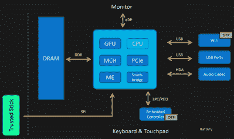

# 英特尔管理引擎的问题

> 原文：<https://hackaday.com/2016/01/22/the-trouble-with-intels-management-engine/>

英特尔公司内部有些东西已经腐烂了。在过去十年左右的时间里，英特尔在微控制器的安全性方面投入了巨大的努力。对于英特尔来说，这是唯一符合逻辑的做法；你真的真的想知道在一个设备上运行的固件是不是你想在一个设备上运行的固件。任何其他的东西，这个设备对戴着巴拉克拉法帽的黑客都是敞开的。

英特尔在加密签名固件方面的首次努力始于 21 世纪初，采用可信平台模块(TPM)的嵌入式安全子系统。这些小型加密芯片和 BIOS 一起构成了现代计算机的信任基础。如果 TPM 是安全的，那么计算机的其他部分也是安全的，或者理论上是这样。

然而，TPM 模型已经被证明容易受到攻击。英特尔的解决方案是增加另一层安全性:英特尔管理引擎(ME)。除了它的一些功能之外，人们对 ME 知之甚少。ME 可以完全访问计算机的所有内存、网络连接以及连接到计算机的每个外围设备。它在计算机休眠时运行，可以拦截 TCP/IP 流量。拥有了我，你就拥有了电脑。

现在在 ME 中没有已知的漏洞可以利用:我们都被锁定在 ME 之外。但这是通过模糊获得的安全。一旦 ME 倒下，所有带英特尔芯片的东西都会倒下。到目前为止，这是最可怕的安全威胁，而且由于我们自己对 ME 如何工作的无知，这种威胁变得更加严重。

### 英特尔管理引擎的开端

在她上个月 CCC 的演讲中，[Joanna Rutkowska]谈到了现代 x86 计算机中的信任链。信任对于安全来说是一种必要的邪恶，[乔安娜]将其与这个词的正常含义进行了对比，她使用了“值得信赖”这个词。如果您可以看到应用程序的源代码，就可以验证它是否值得信赖。但是由于应用程序运行在操作系统之上，所以您必须信任操作系统。即使操作系统已经过验证并且值得信任，它仍然必须信任 BIOS 和固件。当你继续这样挖掘，验证每一层时，你最终会发现系统中你无法验证但必须信任的部分，而这个信任的根源就是 me 试图扮演的角色。

【Joanna Rutkowska】的“信任棒”计划，将信任根卸载到一个小的 USB 设备

现代计算机上的这种信任根，很简单，是不可信的。今天的计算机没有可以追溯到第一台 x86 计算机的合适的 BIOS，而是具有 UEFI 和安全引导，这是一种旨在只允许签名软件在设备上运行的措施。制造商可以禁用安全引导，如果它是可选的，安全性就不安全，如果 UEFI 的特定实现存在漏洞，安全性就更不安全。

[Joanna]真正可信计算的计划是一个简单的 USB 拇指驱动器。这个 u 盘包含安全密钥，而不是保存数据。这个“信任棒”背后的想法是，信任的根源可以从这个棒上建立起来，这些密钥是你拥有和控制的东西，并且可以保守秘密。除此之外的一切都是可以证实的，因此不需要相信。这是一个有趣的想法，但现在它只是一个想法。这与目前英特尔以某种方式将信任植入芯片的情况形成了鲜明对比。

### 管理引擎*是什么*

管理引擎是什么和做什么的最佳描述不是来自英特尔。相反，我们依靠【Igor Skochinsky】[和他在《侦察 2014》上的一次演讲](https://www.youtube.com/watch?v=4kCICUPc9_8)。这是目前我们所掌握的关于 ME 的最佳信息。

英特尔 ME 具有一些特定的功能，虽然其中大多数可以被视为在企业环境中负责部署数千个工作站的 IT 人员的最佳工具，但也有一些工具可能会成为非常有趣的利用途径。这些功能包括主动管理技术，能够进行远程管理、配置和修复，以及充当 KVM。系统防御功能是英特尔机器上最低级的防火墙。IDE 重定向和局域网串行允许计算机通过远程驱动器引导或修复受感染的操作系统，并且身份保护具有用于双因素身份验证的嵌入式一次性密码。还有“防盗”功能，如果电脑未能在某个预定的时间间隔内登录到服务器，或者如果通过网络发送了“毒丸”,则该功能会禁用电脑。这种防盗功能可以杀死一台电脑，或者通知磁盘加密员擦除一个驱动器的加密密钥。

这些都是非常强大的功能，对于任何想要或需要完全拥有一台计算机的人来说都是非常有趣的，它们的广度使得攻击面相当大。然而，为英特尔 ME 寻找一个漏洞将是困难的。虽然 ME 的大部分固件也驻留在 BIOS 使用的闪存芯片中，但是固件不容易读取；一些常用功能位于片内 ROM 中，无法通过简单地从闪存芯片中转储数据来找到。

这意味着，如果你试图找出我，很多代码似乎是失踪的。雪上加霜的是，很多代码本身是用 LZMA 或霍夫曼编码压缩的。英特尔 ME 也有多个版本，都使用完全不同的指令集:ARC、ARCompact 和 SPARC V8。简而言之，这是逆向工程师最可怕的噩梦。

### 我的未来

This guy wants information on the Intel ME. Also, Hackaday has an istockphoto account.

如果可信的处理器直接连接到计算机的内存、网络和 BIOS，ME 可能会像一个长在类固醇上的 rootkit 一样落入坏人之手。因此，对 ME 的利用是所有戴着巴拉克拉法帽的黑客想要的，但迄今为止，他们似乎都一无所获。

我们所知道的最好的努力还是来自于伊戈尔·斯科钦斯基。在发现一家公司留在 FTP 服务器上的一些机密英特尔文档后，他能够查看一些不在片上 ROM 中并且没有被未知算法压缩的 me 代码。它使用 [JEFF 文件格式](http://www.unicode.org/L2/L2002/02042-jeff-spec.pdf)，这是一个来自已经解散的 J 协会的标准，基本上是不可谷歌的。(你可以把这归咎于杰夫。)但是，要破坏管理引擎，必须对这些代码进行逆向工程，并且弄清楚固件中使用的自定义压缩方案仍然是一个未解决的问题。

但未解决并不意味着人们不去解决它。[有破解 ME 的霍夫曼算法](http://io.smashthestack.org:84/me/)的努力。当然，破译我们拥有的代码将导致另一个路障:在不可访问的片上 ROM 中仍然有代码。除了工业间谍或打开芯片的盖子并查看硅片，任何人都无法读取 ROM 代码。虽然研究人员通过推断这些函数确实知道这些代码做了什么，但是没有办法阅读和审计它们。因此，ME 目前仍是一个黑匣子。

许多研究人员试图解开英特尔管理引擎的秘密，理由很充分:它是一个微控制器，可以直接访问计算机中的所有东西。在过去几年中，每台装有英特尔芯片的电脑都有一个，如果你正在寻找攻击的最佳媒介，你不会找到比 ME 更好的了。这是你的电脑中最可怕的东西，这种恐惧由于我们的无知而加剧:没有人知道 ME 实际上能做什么。如果不能审计运行在 ME 上的代码，没有人知道当它被打开时会发生什么。

第一个发现英特尔管理引擎漏洞的人将成为十年来最伟大的安全研究人员之一。在那之前，我们都被蒙在鼓里，不知道会有什么漏洞。