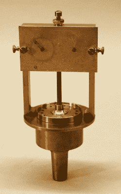
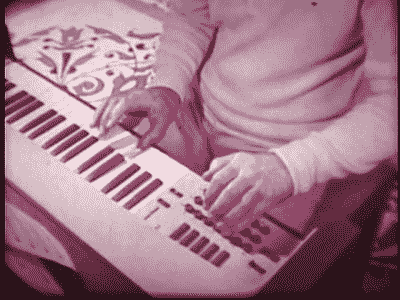
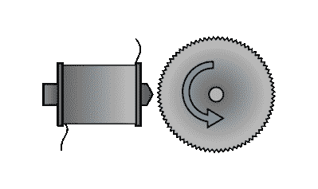

# 被海妖的歌声吸引

> 原文：<https://hackaday.com/2016/01/21/drawn-in-by-the-sirens-song/>

当我说“海妖”时，你会想到什么？救护车？空袭？叹气。我就怕你会这么说。我们有工作要做。

你看，大约 150 年前，海妖在物理和数学中扮演了重要的角色。在 20 世纪上半叶，这种精致的装置因其纯粹的噪音制造能力而变得平凡无奇。在两次世界大战期间，警报与空袭和防空洞联系在一起:与其浪漫的起源相去甚远。在这篇文章中，我们将海妖带回缪斯。我想让你从一个新的角度来看海妖:作为一个基本的科学实验，一种乐器，最后，作为一个伟大的 DIY 项目——这个*毕竟是* Hackaday。

## 歌唱缪斯，旋转磁盘，科学！

我们的故事始于古希腊。塞壬，冥界的缪斯，会坐在岩石峭壁上，用美丽的歌声引诱水手们沉船进入他们的岛屿。故事大概是这样的；我们不在那里。时间快进到近两千年前的 1819 年，在巴黎，查尔斯·卡尼亚德·德拉图尔将一个布满小孔的旋转圆盘改进成一个物理学和声学的基础实验。

Photo copyright Smithsonian Institution

在汽笛出现之前，人们知道声音是由空气中的压力波构成的，他们知道这些压力波的频率与音高有关，但他们只有相对不精确的方法来测量它。[警笛改变了这一切](http://americanhistory.si.edu/science/sirens.htm),因为音调很容易从穿孔圆盘的旋转速度中减去，穿孔圆盘可以减速到足以精确测量的速度。这导致了许多关于音高和声学理论的验证，甚至估计了一只蚊子拍打翅膀的速度~~(大约每秒 10，000 次)~~。最重要的是，海妖还能在水下工作，证明了音调与脉冲的频率有关，与它所通过的介质的密度无关，[，并给它起了一个富有诗意的名字](http://gallica.bnf.fr/ark:/12148/bpt6k65708448/f177.image.langEN)。

塞壬很快被制造出来测试约瑟夫·傅立叶刚刚形式化的数学思想，我们现在称之为[傅立叶分析](https://en.wikipedia.org/wiki/Fourier_analysis)。同样，音乐家们一直在通过组合管风琴中不同长度的管道来制作复杂的音调——“拉出止音”——但他们没有数据。警报器近乎正弦的输出，加上创建精确频率比的便利性，是傅立叶合成最重要的演示之一。

 [https://www.youtube.com/embed/hzoelA3Pm8E?version=3&rel=1&showsearch=0&showinfo=1&iv_load_policy=1&fs=1&hl=en-US&autohide=2&wmode=transparent](https://www.youtube.com/embed/hzoelA3Pm8E?version=3&rel=1&showsearch=0&showinfo=1&iv_load_policy=1&fs=1&hl=en-US&autohide=2&wmode=transparent)

即使在今天，警报器演示也是一种很好的实践方式，可以让大学生相信声波是周期性的压力变化，因为大转盘和空气压缩机很大，很响，而且可见。在这个例子中，一位物理学教授[变得轻摇，为他的班级演奏“欢乐世界”](https://www.youtube.com/watch?v=o0FWivA5d40)。

## 塞壬的孩子

这就把我们带到了音乐上:毕竟，海妖是以缪斯命名的，而不是物理学家。我不确定，但我猜我们没有看到基于塞壬原理的主流乐器的原因是这是一个严重的工程挑战。这并不是说人们没有尝试过。

作为固定比率变速箱的替代方案，现代高速步进电机或伺服电机应该能够相当容易地调整，这在当今是小菜一碟。毕竟，我们当中谁没有在某种数控机床上演奏过《帝国进行曲》？所以我们有点惊讶，我们的网络搜索只找到了几个例子，和一些细节。

也就是说，荷兰艺术家 Rene Bakker 似乎正在为一个完整的海妖管弦乐团工作，尽管我们所得到的只是一瞥。这个亥姆霍兹双警报器直接来自科学实验室。他的[伺服驱动警报器(YouTube 链接)](https://www.youtube.com/watch?v=x2g_IDH_zgQ)是这一系列中技术最高、最直白的音乐，尽管纯粹为了视觉冲击，我们喜欢这个版本的世纪之交[罗曼风琴](http://www.nime.org/proceedings/2014/nime2014_558.pdf):

 [https://www.youtube.com/embed/gSn4EUNXz4M?version=3&rel=1&showsearch=0&showinfo=1&iv_load_policy=1&fs=1&hl=en-US&autohide=2&wmode=transparent](https://www.youtube.com/embed/gSn4EUNXz4M?version=3&rel=1&showsearch=0&showinfo=1&iv_load_policy=1&fs=1&hl=en-US&autohide=2&wmode=transparent)

同样，CCRMA 的学生吉娜·科勒基亚、凯文·麦克罗伊和丹·萨默为一堂 DIY 乐器课制作了一个很酷的警报器。你可以阅读[的文档](https://ccrma.stanford.edu/wiki/The_Sound_of_Sirens)，查看他们的一个[海妖风琴原型](https://www.youtube.com/watch?v=bvfnVCZ2xmw)的视频或者他们在三个海妖风琴上的[表演](https://www.youtube.com/watch?v=lAqTPJSfitM)。

## 音轮:海妖的远亲

虽然通过将空气直接推入房间来制作音乐有些浪漫，但很难放大。从工程角度来说，如果你没有一台压缩机和一个惯性很大的转盘，事情会简单得多。事实证明，自 20 世纪 20 年代以来，艺术家和音乐家一直在制作光学音轮——相当于警报器的圆盘。合成器噪音制作人德里克·霍尔泽制作的这个非常详细的音频轮纪录片在一个网页中总结了大量的历史。我们将在下面的 DIY 部分回到一个简单的光学警报器，但同时，这里有一个德里克(混乱和可怕的)光学音乐疯狂的样本。

[https://player.vimeo.com/video/2361597](https://player.vimeo.com/video/2361597)

 与德里克在艺术光谱的另一边，但同样酷的是俗气的音乐奇迹，那就是[奥蒂根](https://www.youtube.com/watch?v=MY4hyWds6Qk)。Optigan 使用的光学音轮更像 LP 唱片，而不是简单的重复波形，尽管它也有这些。在乐器的左侧是一组按钮，用于播放预先录制的样本背景轨道，键盘上的每个键都以自己的音高在磁盘上播放单独的轨道。原则上，每个键也可以发出完全不同的声音，但它们从来没有那么疯狂。也就是说，很多音乐人都用 Optigans 录音，有一个粉丝正在[发布新盘](http://optigan.com/)。

顺便说一句，像这样对声音进行光学编码也是电影中声音轨道的工作方式:一条薄带沿着早期“说话”电影的侧面延伸，照射到光电池上的光强产生可变电压，然后放大以跟随电影。(如果你感兴趣，可以在自己的时间里查看维基百科上关于 [Phonofilm](https://en.wikipedia.org/wiki/Phonofilm) 和 [Photophone](https://en.wikipedia.org/wiki/RCA_Photophone) 的条目。)

### 磁性音轮和强大的 B3

 最后，几乎同样的原理被用在了哈蒙德·B3 的风琴上。每个轮子都是一个圆盘，类似于带有特殊切割的非啮合齿的齿轮。它们靠近一个磁性传感器，将小波浪齿的轮廓转换成正弦波。就像早期的声音傅立叶合成实验，或者在此之前的管风琴，不同轮子的输出可以组合在一起，产生丰富得多，有趣得多的音色。

即使声音产生方法在原理上很简单，但保持近 100 个旋转的音轮同步并平稳运行也不是一件容易的事。Hackaday 的 Kristina Panos 写了一篇关于哈蒙德风琴的精彩文章，其中包括一段视频，详细介绍了它们的制作方法。如果你是哈蒙德的粉丝，你应该去看看。如果你还不是哈蒙德的粉丝，那就去听听朗尼·史密斯博士:

 [https://www.youtube.com/embed/ZFTBPuuc8PU?version=3&rel=1&showsearch=0&showinfo=1&iv_load_policy=1&fs=1&hl=en-US&autohide=2&wmode=transparent](https://www.youtube.com/embed/ZFTBPuuc8PU?version=3&rel=1&showsearch=0&showinfo=1&iv_load_policy=1&fs=1&hl=en-US&autohide=2&wmode=transparent)

## DIY 项目:粉丝魔女

说到粉丝，如果你想打造自己的“音乐”警报器，我所知道的最容易实现的设计来自荷兰电子朋克 Gijs Gieskes，他的作品我们在 Hackaday 上已经介绍过了。我意识到的他的第一个项目是[迷你合成器风扇](http://gieskes.nl/instruments/?file=synth-fan)，它只不过是一个电脑风扇，它的叶片间歇性地阻挡照射在光电传感器上的光线。是的，这是一个简单的警报器，用光扮演空气的角色。

Gijs 还有一个更精致的版本，其中一个微控制器控制风扇速度，并结合了一个带有 MIDI 输出的小音序器。但这超出了我们的想象。即使就其本身而言，简单的 fan siren synth 也是相当可玩的。可以用手轻敲，也可以手动旋转。很有动手能力。如果你熟悉 Arduinos，你会知道从哪里开始。检查 Gijs 网站的(手绘)电路。

几年前我做了一个，这是我想出来的。从 AVR 运行的所有功能都由 AVR 控制，连接到 ADC 的四个滑动电位计用作输入。最后，最右边的一个控制风扇速度，另一个控制输出音量。LED 也由 PWM 信号驱动，并随着时间的推移变得更亮和更暗(平均而言)。一个电位计控制 LED PWM 频率(最左侧)，另一个电位计控制三角波的频率，该频率可修改占空比，使 LED 周期性变亮或变暗。将所有这三种音高结合在一起:风扇速度、PWM 速度和缓慢变化的占空比，会造成很大的混乱。

这个设备噪音很大，故障很多。我很久以前就丢失了代码，所以我不能发布它，但它会发出一些很棒的声音。在演示视频中，我首先运行风扇合成器部分，然后添加 LED PWM 及其调制。美好时光。

 [https://www.youtube.com/embed/17V9zvka47s?version=3&rel=1&showsearch=0&showinfo=1&iv_load_policy=1&fs=1&hl=en-US&autohide=2&wmode=transparent](https://www.youtube.com/embed/17V9zvka47s?version=3&rel=1&showsearch=0&showinfo=1&iv_load_policy=1&fs=1&hl=en-US&autohide=2&wmode=transparent)

像这样的设备的部分魅力在于它是多么简单，但也在于它很容易变得更复杂。加第二台风扇？控制风扇转速播放曲子？如果你有一个内置转速表的风扇(找四根线)，制作一个伺服控制回路应该是相当简单的。我在设备中内置了一个串口，所以我显然有宏伟的计划。

无论你做什么，不要抗拒塞壬的歌声！我希望我已经给你指出了足够的方向，至少有些东西会引起你的兴趣。如果你制作了任何可以旋转和制造音乐的东西，请在这里的评论中告诉我们，或者在提示栏中告诉我们。