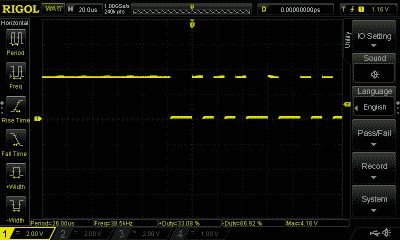
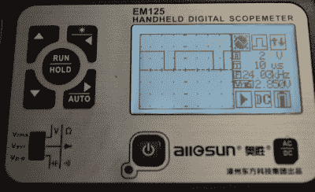
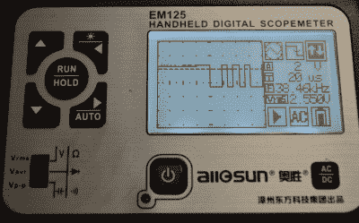

# 两个便携式示波器:枪战

> 原文：<https://hackaday.com/2016/01/28/a-tale-of-two-oscilloscopes-continued/>

上次我[向您介绍了两种相对便宜且有些便携的示波器](http://hackaday.com/2016/01/27/a-tale-of-two-sub-100-oscilloscopes/):em 125，它是数字电压表和示波器的结合体，以及 Wave Rambler，它是一种带有 USB 连接器的示波器探头。这两款设备的价格都在 100 美元左右，各有优缺点。

不过，这一次，我真的想看看一些真实世界的信号。为了简单起见，我随手拿了另一个类似示波器的东西:一个嵌入式美工工具。这本身就是一个有趣的板块。它是一个 LPC-Link 编程器，连接到具有几个高速 A/D 通道的 LPC ARM 板上。然而，我现在还没有使用这些功能。板上还有一个廉价的 ARM 处理器(LPC812 ),仅用于产生测试信号。这个想法是你可以在教室里使用 Labtool，不需要额外的设备。

Labtool 的演示 CPU 生成许多不同的信号，但测试示波器上只有一个通道，因此查看 I2C 数据等没有意义。所以我坚持使用两种不同的测试信号:一种可变脉宽调制信号和一种串行 UART 发射器。

## 基线信号

为了了解信号应该是什么样子，我用我目前最喜欢的台式示波器 Rigol DS1104Z 对它们进行了测量。如你所料，在这个示波器上捕捉信号很容易。这是 PWM。

在这种情况下，PWM 接近 99%(您可以在屏幕底部读出)。LPC812 相当快地将该输出从 0 循环到 100%,而我恰好在那个时候发现了它。UART 稍微更具挑战性，因为它发送的是一串数据，中间有很长的间隔。通过使用正常触发(而不是自动)显示漂亮和稳定: 

自然，单个事件触发器也可以工作。当然，Rigol 也可以解码 UART 字符串，这是其他示波器无法比拟的特性。当然，这也不是一个 100 美元的范围。作为参考，50 MHz 版本约 400 美元。此外，它有四个通道，因此每个通道的成本并不比我们看到的两个示波器高。

## 使用 Wave 漫步者

Wave Rambler 使用一些 Windows 软件，而我的主桌面根本不运行 Windows。然而，我确实有一台非常便宜的 Windows 平板电脑，它很耐用，有一个全尺寸的 USB 端口。当我第一次在平板电脑上运行该软件时，我很困惑文档中的截图看起来一点也不正确。原来平板电脑的默认设置是屏幕放大 125%。这导致 Owon 软件错误地计算了一些用户界面元素的位置，并且它们被绘制到屏幕之外。解决方案是在 Windows 控制面板中重置缩放级别。

将示波器探头连接到电路上并不难。有一个弹簧钩，就像你在普通的示波器探头上看到的那样，尽管在拉下它时没有可供手指抓住的裙边。考虑到这一点和探头本身的尺寸，使用它是相当困难的。如果你只是想探测，你可以去掉弹簧钩，就像普通的示波器探头一样。

该器件有两种接地方式。有一个通用的引线夹和一个小弹簧，可以让你接地到测试点。这在高频时很有用，可以避免地线中的电感。然而，在仪器的 25 MHz 速率下，您可能不会看到任何需要它的东西。

这个软件看起来属于一个更大的范围。例如，您可以看到，虽然 Wave Rambler 只有一个通道，但它提供了多个通道。有些特性你可能不会用到，比如通过/失败匹配。然而，这是一个真正的力量，以波漫步者。需要 FFT 吗？软件可以做到这一点。想要导出数据吗？很容易做到。

这个软件的界面有点不正规，但运行良好。您可以选择几种触发模式(边沿、脉冲宽度和斜率)。您可以像 Rigol 一样在显示屏上添加测量值。例如，这是 PWM 捕捉。

你可以在轨迹底部看到测量结果。主页图标是大多数菜单选项所在的位置，尽管按下一些屏幕上的元素会做一些明显的事情，如从交流到 DC 耦合的变化。屏幕顶部的大 A 是自动设置，对于像这样的小范围来说很方便。

 你可以用软件设置小轨迹球控制什么参数。老实说，我不觉得轨迹球很有用，所以试了几次后，我忽略了它，只使用软件设置。当然，您的里程可能会有所不同。

由于软件提供了多种触发模式，因此很容易捕捉 UART 数据，尽管软件不会为您解码:

总的来说，结果相当不错，如果你能习惯使用一个大的探头的话。我希望这个软件能在其他平台上运行，或者至少，有针对这个设备的 [Sigrok 支持](http://www.embeddedartists.com/products/app/labtool.php)(它还会负责数据解码)。

## 使用 EM125

EM125 当然很方便。有了支架、充电电池和普通的示波器探头，就没有很多奇怪的电线或尴尬的连接了。它也不需要笔记本电脑或平板电脑。取决于你想做什么，这可能是一件好事，也可能是一件坏事。

对便携性有好处。你可以把 EM125 扔在你的工具包里，你不需要太多其他的东西。它有一个漂亮的外壳，我把一根 USB 充电线和一套小工具放在里面。缺点是你不能做 Wave Rambler 在软件中做的所有花哨的事情，所以你会发现没有 FFT，没有捕捉到的图像或数据，除了基本的触发之外什么也没有。

这是 EM125 从电路板读取 PWM 输出的实际照片:

 可以看到背光很好看。不过，这个显示有点令人困惑。右上角有三个图标。这些图标，以及它们下面的两个文本项，就是菜单系统。您可以使用箭头键向左和向右选择图标。然后向上和向下按钮进行更改。第一个图标设置设备是示波器还是血糖仪。第二个设置触发模式。当前模式本质上是一种自动模式，适合于这种捕获。第三个图标允许您设置触发级别。

如果菜单光标向下移动到数字字段，您可以设置每格的电压(当前为 2V)和时基(当前为 10 us)。其他文本和图标是信息性的(频率、电压、当前运行/停止模式、输入耦合和电池充电)。

按住左键将切换背景灯。按住右键会使示波器在松开键时自动设置。所以操作很简单，但是结果也很简单。

 我担心 UART 输出会出现一个小问题，因为示波器不直接提供自动和正常触发模式之间的选择。然而，当触发模式图标看起来像一个普通的方波时，它似乎处于自动模式。如果选择上升沿或下降沿，示波器将进入正常模式。这意味着，在触发发生之前，仪器将保存最后一幅图像。这使得 UART 输出易于捕捉。

注意到触发模式图标中方波下降沿的箭头了吗？这是下降沿的正常触发。没有单一的触发模式，虽然如果你足够快，你可以按下保持按钮，虽然这可能会令人沮丧。

## 结论

正如我在第一期中提到的，如果你要买一台示波器，你应该试着买比这更好的。你可以很容易地花几百美元买到一个漂亮的新瞄准镜，而且二手瞄准镜的价格不会比这两个高。然而，这些小望远镜确实有它们的位置。Wave Rambler 几乎可以为您提供与传统示波器一样好的性能，只要您附近有一台 PC，只需要一个通道，并且相当灵巧。另一方面，EM125 已经取代了我旅行工具包中的普通电压表。拥有一个示波器——即使是有限的——也比只有一个垃圾测量仪好得多，值得投资。

当然，如果你真的想要便携性，也许你会对手表感兴趣。如果 100 美元甚至 400 美元对你这样的贵族来说太便宜了，也许你会喜欢 T2 的 62 GHz 示波器。如果你决定买那个，你可能想先兑现一张强力球彩票。那个瞄准镜大概值 50 万美元！