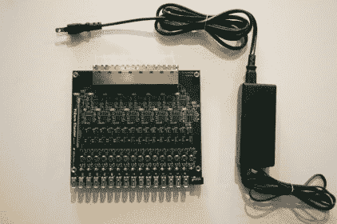
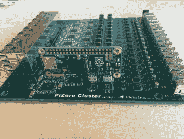

# 树莓派零集群包装一拳

> 原文：<https://hackaday.com/2016/01/25/raspberry-pi-zero-cluster-packs-a-punch/>

如果你真的可以买 16 个树莓派 0，你可能只需要 80 美元就能[构建你自己的树莓派集群](https://twitter.com/9_ties/status/689707306494271488/photo/1)！嗯…减去把它们绑在一起的板子的成本…

一家名为 [Idein](http://idein.jp/) 的日本公司正在开发一个名为 [Actbulb](http://actbulb.idein.jp/) 的树莓 Pi 模块，用于计算传感和数据分析。为了进行内部测试，他们决定让事情变得更简单，开发了一种主板，允许他们插入不是一个，不是两个，而是**16 个**Raspberry Pi 0:

> 由于我们会使用 Pi 的 GPU 进行图像处理、深度学习等。我们需要真正的 pi，但不仅仅是 Linux 机器。另一个原因。当我们不得不自己动手时，它可以用于通过 USB 端口刷新设备的 eMMCs。

该板有 PC 安装的微型 USB 连接器，每个 Pi 两个。这些显示为唯一的想法举行的 Pi 在适当的位置，但与 16 个安装你可以很容易地使用垫片和杆，使一个框架通过 Pi 安装孔。载板分出每个 USB 端口，并添加 16 个以太网连接器。未来的改进目标是在板上添加一个交换机，并将端口数量减少到 2 个。

    

不幸的是，他们现在只有一个零分。我们期待着看到他们填充其余的插座！对这个项目的极大兴趣使得该公司考虑在未来实际制造和销售这些产品。想象一下，用这个你能做出多少簇簇！？与这个 [120 个树莓派怪物](http://hackaday.com/2014/10/07/120-node-rasperry-pi-cluster-for-website-testing/)相比，你大概可以把 120 个树莓派 Zero 放进一个鞋盒里！

【谢谢倪钦！经由 [CNX 软件](http://www.cnx-software.com/2016/01/22/this-is-what-a-16-raspberry-pi-zero-cluster-board-looks-like/)