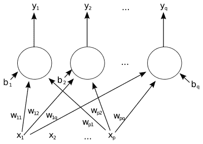

# 人工智能先驱马文·明斯基逝世，享年 88 岁

> 原文：<https://hackaday.com/2016/01/26/marvin-minsky-ai-pioneer-dies-at-88/>

神经网络的早期先驱之一马文·明斯基于周日去世，享年 88 岁。

《华盛顿邮报》的讣告为他的一生描绘了一幅奇妙的画面。明斯基是理查德·费曼、艾萨克·阿西莫夫、亚瑟·C·克拉克和斯坦利·库布里克的朋友。他师从克劳德·香农，与艾伦·图灵共事，与约翰·冯·诺依曼频繁交谈，并与阿尔伯特·爱因斯坦共进午餐。

“Single layer ann” by Mcstrother

明斯基的伟大想法真的很伟大。他建立了第一批人工神经网络之一，但他的目标更高——朝着能够真正思考而不仅仅是对数据进行分类的机器前进。这是他的书 [Perceptrons](https://en.wikipedia.org/wiki/Perceptrons_%28book%29) 背后的驱动力之一，该书展示了当时使用的神经网络类型(单层，前馈)的一些局限性。他想要更多。

明斯基的书 [The Society of Mind](https://en.wikipedia.org/wiki/Society_of_Mind) 很有趣，因为它将人类思维的问题从一个自上而下的过程重新定义为许多不同大脑区域、神经系统以及整个身体之间的合作。这个“[联结主义者](http://web.media.mit.edu/~minsky/papers/SymbolicVs.Connectionist.html)”的主题将对认知科学和机器人学产生影响。

简而言之，明克西相信复杂的问题往往有复杂的解决方案。在研究项目中，他着眼于长远，鼓励自下而上的设计程序，将许多较小的元素组合成一个复杂的整体。“某物含义的秘密在于它如何与我们已知的其他事物联系在一起。这就是为什么寻求任何事情的“真正意义”几乎总是错的。只有一种意义的事物几乎没有任何意义。”

 明斯基是一个非常深刻的思想家，但他同时也是一个有趣的发明家，这让他保持了脚踏实地的精神。明斯基被认为[发明了“终极机器”](http://www.wsj.com/articles/SB10001424127887323628804578348572687608806)，这将在[现代极客文化](https://www.youtube.com/results?search_query=useless+machine)中出现，并在 Hackaday [上被多次分享为“最无用的机器”](http://hackaday.com/2012/12/22/an-even-more-useless-machine/)。他启发克劳德·香农建造了一个。亚瑟·C·克拉克说，“一台什么都不做——绝对什么都不做——除了自动关机的机器有一种无法形容的邪恶。”

他还参与设计了 Triadex Muse ，这是一款早期的合成器、音序器和“自动作曲器”,可以用最少的输入创建相当复杂和原创的模式。这是他在人工智能探索中的一个明显的分支，在我们的必玩电子仪器清单上。

明斯基在麻省理工学院的网站上有许多他的文章，以及“心智社会”的全文，所有这些都可以让你享受阅读的乐趣。它值得你花一点时间，不仅仅是为了纪念一位伟大的思想家和古怪的发明家，还因为我们打赌你以后会看到一个有点不同的世界。这是一份永恒的遗产。