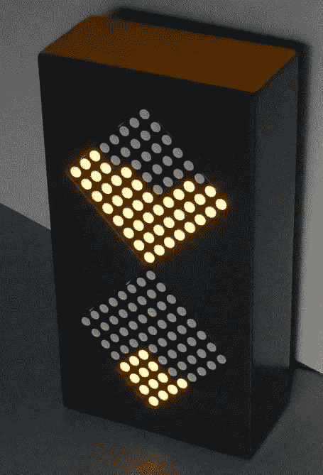

# 时间流动的像素不等人

> 原文：<https://hackaday.com/2016/01/28/the-flowing-pixels-of-time-wait-for-no-man/>

沙漏戏剧性地描绘了时间的流动；重力不可避免地把沙粒往下拉。弗兰克·安德烈的[比特时间项目](http://fab4u.de/en/projects/bits_of_time/start)也是如此。像素下降，只有当电池耗尽时才会停止。或者，当你的鸡蛋准备好了。([嘶，也在 Hackaday.io.](https://hackaday.io/project/9343-bits-of-time) )

Look, Ma! No GIF!

这个项目从几个[弗兰克的]像素块开始。通过串行总线连接后，一个处理器被添加到一个 PixBlock，作为两个 pix block 的控制器。带有去抖动电路的倾斜开关[连接到 IO 引脚。这告诉处理器盒子的方向，从而告诉处理器像素应该流向哪个方向。](http://hackaday.com/2015/12/09/embed-with-elliot-debounce-your-noisy-buttons-part-i/)

两个开关以 15 秒为增量设置计时器的持续时间。第三个启动计时器。当盒子旋转时，像素开始向相反的方向流动。通过 GitHub 上的[代码，系统可以被编程为其他效果，如改变颜色、闪烁，甚至是文本显示。](http://www.github.com/fab4U/Bits_of_Time)

你会同意这比我们去年讨论过的 [MacGyver-ish 厨房定时器](http://hackaday.com/2015/02/27/a-kitchen-timer-fit-for-macgyver/)少了一些威胁。

 [https://www.youtube.com/embed/oydJOX9quQs?version=3&rel=1&showsearch=0&showinfo=1&iv_load_policy=1&fs=1&hl=en-US&autohide=2&wmode=transparent](https://www.youtube.com/embed/oydJOX9quQs?version=3&rel=1&showsearch=0&showinfo=1&iv_load_policy=1&fs=1&hl=en-US&autohide=2&wmode=transparent)

