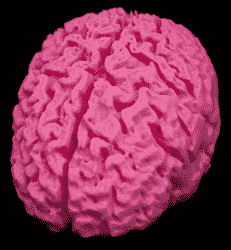
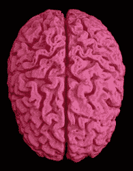
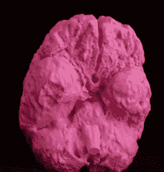

# 这是我 3D 打印的大脑！

> 原文：<https://hackaday.com/2016/01/30/this-is-my-3d-printed-brain/>

这个黑客是可怕和残忍的奇怪混合。[安德鲁·辛克]创造了他大脑的 3D 打印版本。他收到了一张核磁共振成像的光盘，里面有扫描得到的数据。由于不知道如何处理，他制作了一个大脑模型。

Out of a number of images, some missing various parts of his head, he selected the one that was most complete. This image he brought into OisriX, a Mac program for handling DICOM files. He worked on the image for an hour dissecting away his own eyes, skull, and skin. An STL file containing his brain was brought over to NetFabb to see how it looked. There was still more dissection needed so [Andrew] turned to Blender. More bits and pieces of his skull’s anatomy were dissected to pare it down to just the brain. But there were some lesions at the base of the brain that needed to be filled. With the help of [[Cindy Raggio](http://cindy-raggo.squarespace.com/)] these were filled in to complete the 3D image.

通常的步骤是将其发送到 3D 打印机，以 0.2 毫米的分辨率进行生产。全尺寸打印只花了 49 个小时。这个大脑是为了好玩而打印的，但我们已经看到了其他用于拯救生命的 3D 打印大脑。你知道有多少人有多余的大脑？