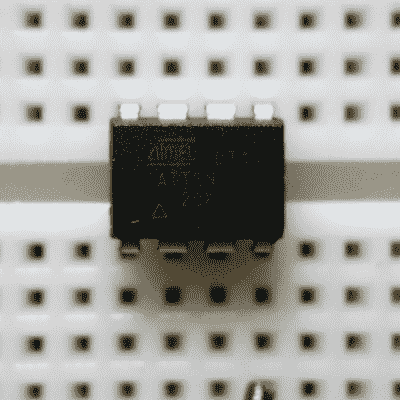
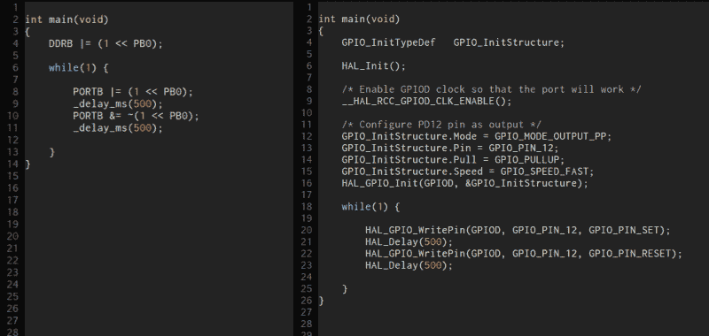

# 什么时候 8 位比 32 位多？

> 原文：<https://hackaday.com/2016/02/24/when-are-8-bits-more-than-32/>

每当我们在 Hackaday 上写下一个微控制器或微控制器项目的特性时，我们不可避免地会在评论中得到两种截然相反的意见。如果这篇文章以 8 位微控制器为特色，一大批人会说他们会在 32 位平台上做得更好、更快、更强、更省电。他们通常是对的。另一方面，如果这篇文章涉及 32 位处理器或单板计算机，8-bitters 会突然告诉你，他们可以用超频的 85 运行周期计数汇编来完成这项工作。你们中的一些人可能可以。(我们爱你们大家！)

当初学者走进这个荆棘丛生的地方，问从哪里开始时，可能会有点困惑。Arduino 推荐很容易做，因为有大量对新手友好的资料。Arduino 并不一定意味着 AVR，但当它意味着 AVR 时，这是一个不错的选择，因为该器件的电流源和吸电流相对灵活。推荐 Arduino 不会让你丢掉工作，而且很难让它冒烟。

但是这些天来，当一个刚接触微控制器的人问他们应该走什么路时，我开始用一个问题来回答:你对学习微控制器本身有多感兴趣，对学习制作碰巧使用它们的项目有多感兴趣？这就像“蓝色药丸或红色药丸”:这个问题的答案设定了一条路径，我不会向回答不同的人推荐同样的东西。

对于那些只想把事情做好的人来说，一个易于使用的固件库和一堆可供学习的例子是至关重要的。我猜回答“把事情做完”的人是 90%。对于这些人，我会毫不犹豫地推荐 Arduino 变体——因为社区支持非常好，有人已经为几乎所有你想附加的小发明编写了一个附加库。这是一个被广泛使用的领域，通常是即插即用的。

## 认识你自己

但另外 10%的人处境艰难。如果你真的想了解芯片发生了什么，硬件是如何工作的或者至少是它做了什么，并且超越简单地使用其他人的库，我会说 Arduino 环境是一个减速带。或者正如我的一个老朋友——一个嵌入式汇编程序员——会说的，“用 Arduino 写东西就像戴着拳击手套织毛衣一样。”

他的观点是，他知道芯片能做什么，只是想让它做自己的事情，而没有任何不必要的抽象层碍事。毕竟，设计这些微控制器的工程师和销售这些微控制器的公司都依赖于最终用户(工程师)想要的硬件功能，所以一切都在等着你。想打开 USART 外设吗？你不需要实例化一个正确类的对象，也不需要阅读 API，你只需要翻转正确的位。数据手册中有详细说明，无论如何都要阅读，确保不遗漏任何重要内容。

对于“搞定它”的人群，我非常乐意推荐一个简单易用的环境，它隐藏了芯片如何工作的许多细节。毕竟，这就是抽象的目的——在不理解内部结构的情况下提高效率。所有这些抽象可能会带来性能成本，但这就是更强大的芯片的用途。对于这些人来说，易于使用的环境和功能强大的芯片非常合适。

Sometimes small is beautiful

但我对真正想学芯片的相对新手的建议恰恰相反。选择一个最大限度地暴露芯片工作方式的环境，选择一个不会复杂到完全让你不知所措的芯片。这是完全相反的情况:我会推荐一个“困难”但强大的环境和一个简单的芯片。

如果你想成为一名赛车手，你不会从一级方程式赛车开始，因为那就像学习驾驶火箭船一样。但是你确实需要了解一辆车是如何操控和运行的，所以你也不会从一辆自动豪华轿车开始。你会很快驾驶舒适，但你失去了很多对传动系统的同理心和对牵引力控制的直觉。相反，我会给你开一辆动力不足的车，但要有良好的路况感和手动变速器。我的朋友们，这是一个 8-苦的直 C。

## 从小处着手…

我已经听到了 ARM fanboys 和 fangirls 的叫声！" 8 位芯片已经过时了，你只是在旧芯片上浪费时间."" 8 位芯片的编程应用编程接口已经过时而且笨拙."“他们甚至没有 DMA 或者我其他喜欢的外设。”全是真的！这才是重点。这是 8-bitters *所没有的*使他们成为理想的学习平台。

你们当中有多少人真正看过当你键入`HAL_Init()`或`systinit()`或其他什么的时候运行的代码？即使你有，你能记住它做的一切吗？我并不是说这是不可能的，但是仅仅为了让芯片运行起来，对一个初学者来说是很难做到的。复杂的芯片是复杂的，面对一个初学者大量的启动代码会让人不知所措。但是掩盖启动代码会让钻研集成电路的人感到沮丧。

 还是拿简单的 GPIO 引脚用法来说。通过翻转位来配置 bits 上的 GPIO 引脚方向对于一个刚刚起步的人来说是一件新鲜事，但了解硬件在幕后的工作方式是重要的一步。我不会用一个更抽象的命令来代替这种体验——部分是因为它将帮助你在未来配置许多其他不太用户友好的芯片。但是，考虑一下在 ARM 芯片上配置一个 GPIO 引脚，配以像样的外设。要完全指定 GPIO，需要设置多少位？您希望边缘以什么速度过渡？用上拉还是下拉？强还是弱？你记得打开 GPIO 端口的时钟了吗？

别让我开始谈论 ARM 芯片的定时器。它们数量很多，很棒，但是你永远不会说它们很容易配置。

学习用 C 编写 AVR 或 PIC 代码的好处是芯片“简单”,抽象层很薄。你应该直接读写芯片，但至少你知道你在做什么。这个系统足够小，你可以一下子把它都记在脑子里，C 语言的编码也没有精简到教不了你什么东西的地步。

这些库也是为你准备的——C 中 AVR 的库代码可能和 Arduino 中的一样多。(如果算上 Arduino 库本身，这是同义反复，其中许多库是用 C 或 C 风格的 C++编写的。)学习如何使用其他人的库肯定不像在 Arduino 中那么容易，在 Arduino 中，你只需下拉一个菜单。但在我看来，如果你是那种想真正了解筹码的人，这是一项值得学习的可转移技能。

## …但是要做大

所以，从你选择的 8 位芯片开始吧——它们足够便宜，你只需要比一个 Arduino 多一点点的价格就可以买到一个 25 位的芯片。或者，如果你想瞄准 8 位 AVR 平台，有一吨来自海外的廉价裸机板将节省你的焊接，而且只有两倍的(最低)成本。用同一个芯片构建 25 个项目，直到你对它的极限有所了解。你不必达到 [lft](https://www.youtube.com/watch?v=sFCxV5PsusQ) 的水平，甚至不必记住每个寄存器中每个位的可怕的“助记”宏名，但至少要知道定时器/计数器是如何工作的。在这个过程中，您将开发一个自己使用的代码库。

那就继续前进。因为*是*真的，8-bitters 是有限的。在这个过程中，你会养成一些奇怪的习惯——我仍然本能地害怕 32 位浮点乘法，即使是在带有 32 位 FPU 的芯片上——所以你不会想在 8 位世界停滞太久。

也许尝试一个 RTOS，也许使用你在小芯片上丢失的所有工具。尽情享受额外的位深度和速度！如果你喜欢的话，可以使用更高级的黑盒子库，因为如果你想通读这些库的话，你会对所有这些芯片的内部工作方式有足够的了解。如果你以另一种方式开始，那将会是胡言乱语——一个`digitalWrite()`都看不到！

在几个大芯片项目之后，你会对 8 位和 32 位芯片之间的真正界限有一个很好的感觉。不管我们的评论会让你相信什么，这不是任何人都可以告诉你的，因为它取决于你和手头的项目。我们大多数人时不时都是蓝药丸和红药丸微控制器用户，每个人对于什么项目需要什么微控制器都有不同的门槛。但是一旦你对这些工具有了一点掌握，你就会知道如何为自己选择。