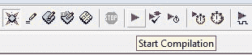
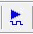

# 将 CPLD 插入试验板的更好方法

> 原文：<https://hackaday.com/2016/02/04/a-better-way-to-plug-a-cpld-into-a-breadboard/>

如果你读了我的第一篇关于简单的 CPLD 项目的文章，你可能记得当我制作 1 英寸宽的尺寸时，我真的很担心，这对于普通的无焊试验板来说太宽了。从那以后，我重新开始，解决了宽度问题，最终得到了一个看起来更可爱的模块。

简单地说，复杂可编程逻辑器件(CPLD)是一种很酷的硬件，可以用来学习逻辑或高级设计语言，或者替换过时的功能或芯片。但是，CPLD 需要一点支持基础设施才能变得可用，这就是我在这里将向您介绍的内容。因此，如果你对学习 CPLDs 感兴趣，或者只是为它们设计电路板，请继续阅读！

 [https://www.youtube.com/embed/1WsL3fqTk9I?version=3&rel=1&showsearch=0&showinfo=1&iv_load_policy=1&fs=1&hl=en-US&autohide=2&wmode=transparent](https://www.youtube.com/embed/1WsL3fqTk9I?version=3&rel=1&showsearch=0&showinfo=1&iv_load_policy=1&fs=1&hl=en-US&autohide=2&wmode=transparent)

Rev 2

该设计本身试图利用通孔器件和 CPLD 插座，以便您可以更容易地自己构建它，而无需大量的表面贴装焊接。也就是说，由于通孔振荡器的成本和尺寸，它是一种表面贴装器件(SMD)。

Rev 1

我还添加了一个 USB 迷你连接器，以便更容易为组件供电，就像为 Hackaday 制作视频一样。我只是部分满意 USB 连接器的方法，因为它只对 5V 版本有用，如果使用 3.3V CPLD 则很危险。我还在最后一刻添加了一个两针电源连接器，但我真的希望添加一个二极管来防止极性相反。

此外，由于上一篇文章的建议/评论，可以通过连接器轻松应用外部时钟源。

### 项目文件

 看着原理图，你会发现其实没什么大不了的:基本上就是 CPLD，用于在线编程的电路和一个驱动 CPLD 中逻辑的振荡器。

*   [简单 CPLD R2 原理图](https://hackaday.com/wp-content/uploads/2016/01/simple-cpld-r21.pdf)
*   [简单的 CPLD R2 PCB 布局](https://hackaday.com/wp-content/uploads/2016/01/pcb-large1.jpg)
*   [简单的 CPLD R2 BOM](https://hackaday.com/wp-content/uploads/2016/01/bill-of-materials-simplecpld.pdf)
*   [嘉宝文件简单 CPLD R2](https://hackaday.com/wp-content/uploads/2016/01/simplecpld-cadcam.zip)
*   [Gerber 文件简单 CPLD R2 (OSH Park 兼容)](https://hackaday.com/wp-content/uploads/2016/01/simple-cpldr2-oshpark.zip)
*   [简单的 CPLD R2 Proteus CAD 项目](https://hackaday.com/wp-content/uploads/2016/01/simple-cpldr2-oshpark.zip)
*   [CPLD R2 Quartus 设计文件](https://hackaday.com/wp-content/uploads/2016/01/u1-design.zip)
*   [Altera Quartus 9.1 网络版(免费)](https://wl.altera.com/download/software/quartus-ii-se/9.1)

[项目](https://hackaday.io/project/9215-simple-cpld-module-rev-2)也可以在 [Hackaday.io](https://hackaday.io/project/9215-simple-cpld-module-rev-2) 上找到

### 复杂可编程逻辑器件:安装在通孔插座上的表面贴装器件

 这款器件称为 EPM7032 或 EPM7064，采用 44 引脚塑料引脚芯片载体(PLCC)，由于引脚呈 J 形，有时也称为 J 引脚。这种封装可以插入通孔插座或直接焊接到 PCB 上。

从标准目录来源看，这些零件的价格往往在 8-9 美元之间。我有一批来自海外的便宜得多的价格，如果任何人都希望建立几个单位，那里有更便宜的来源回报，然后给我发消息。

### 振荡器

最初的板载振荡器是一个 25 MHz 的设备，主要是因为“快”通常是好的。在现实生活中，我认为 4 MHz 或一个特殊的频率，如 14.318 MHz (NTSC x 4)或 1.8432 MHz (UART)可能对较慢的逻辑更有用，因为时钟不需要进行分频。也就是说，很容易使用不同的 TCO 或对所提供的引脚应用外部时钟。

## CPLD 编程

10 针连接器和一些电阻组成编程电路，这种足迹通常被称为 JTAG 连接器。

 要对这样一个独立的 CPLD 进行编程，需要一个专门的程序员。一个被认可的“Altera USB Blaster”售价 50 美元，可以从 Digikey 等地方买到。我有几个从易贝得到的克隆，包括一个支持 Altera，Xilinx 和 Lattice 的克隆。

沿着这条路走下去，我希望做一个程序员克隆项目，零件就在我旁边的桌子上。

### 印刷电路板

PCB 是一种简单的双面设计，然而组装需要首先从底部安装 40 位置“加工”引脚，将引线剪短，然后从顶部安装插座。

### 3D 视图

## 大量的 I/O

使用这些 CPLD 模块时，首先突出的是 40 引脚封装中的大量输入/输出(I/O)线路，确切地说是 35 条 I/O 线路。本来可以有更多，但我想确保有几个接地引脚。顾名思义，I/O 线可以编程为输入、输出或双向，也可以三态和模拟集电极开路输出。

像这样的模块的另一个特点是速度；它在纳秒内切换，而不是许多微控制器中的微秒速度。

### CPLD 设计

[整个设计](https://hackaday.com/wp-content/uploads/2016/01/u1-design.zip)包含快速利用简单 CPLD 板所需的所有文件，包括引脚和器件分配。要使用这种设计，请下载 [Quartus Web 9.1](https://wl.altera.com/download/software/quartus-ii-se/9.1) 并安装。下载[设计](https://hackaday.com/wp-content/uploads/2016/01/u1-design.zip)，解压并打开项目 Simple-CPLD-Demo.qpf 。单击 Project Navigator 下的 Files 选项卡，您应该会看到三个重要的文件:

*   top . bdf–作为图形框图文件(BDF)的项目顶部
*   block 1 . v–名为`block1`o . BDF 的符号的 Verilog 文件
*   wave form 1 . VWF–驱动模拟的波形

lpm_counter0.qip 文件由编译器自动安装。

#### 示意图(bdf)

点击 top.bdf 调出首页。我仍然把最上面的表格做成图形表格，但是你可以放弃它，使用 Verilog 或者 VHDL。(25 年前我用过 AHDL)

在原理图上，我们可以看到一个名为`block1`的功能模块，代表其下的 Verilog 文件。图中还显示了代表芯片引脚本身的引脚。

#### 分配

 点击 Assignments，Ddevice 选择你是为 32 还是 64 宏单元设备编译。

点击 Assignments，Aassignment Editor 查看引脚名称到引脚编号的分配。同样，我以易于分配管脚号的方式命名管脚，即 IO11 是管脚 11。

#### Verilog 文件

 在 top.bdf 文件上，双击符号`block1`，底层 Verilog 文件在文本编辑器中打开。内置的文本编辑器非常合理，但是很多用户喜欢分配一个外部编辑器，在我的例子中，我使用 Notepad++和 Verilog colorizer 来调整我自己的颜色偏好。

这里所有的任务都是为了匹配块，匹配项目，匹配 PCB。

#### 收集

单击紫色的“播放”按钮编译设计。

#### 模拟

 点击文件 waveform1.vwf ，模拟的输入将在波形编辑器中打开。(我的预设是使用漂亮的颜色)。演示的唯一输入是时钟。例如，要更改时钟的计时，右键单击时钟波形并选择值、时钟，然后更改时钟频率和占空比。

#### 模拟

单击仿真图标，生成的波形将显示设计仿真的结果，本例中有几个计数器。

#### CPLD 编程

将编程器插入 10 针 JTAG 连接器，注意 PCB 上的针 1 定位点，该点应与编程器插头上的针 1 或电缆本身上的针 1 条纹对齐。

一旦对输出结果满意，或者如果你是喜欢冒险的人，想直接在实际硬件上尝试设计，只需点击程序员图标。你应该看到你的程序员列表(这里是 USB-Blaster)和文件 Simple-CPLD-Demo.pof 以及你之前选择的设备。如果它不存在，请点按“添加文件”并选择它。选择程序、配置和验证复选框，然后单击开始。

如果一切正常，你应该会在一直存在的消息框中看到一条关于成功的消息，对我来说，我的 led 开始闪烁。

## 结论

我想为初学者演示一个从头到尾的体验。从这个简单的 CPLD 模块开始，您可以在几分钟内启动并运行。您也可以使用提供的文件开始学习/编辑 Verilog，或者如果您更愿意使用原理图进行设计，可以在顶层替换或添加图形组件。

CPLD 是电可擦除的，这意味着您可以一次又一次地对其重新编程，它将保留配置，而不像许多 FPGAs 那样必须在每个电源周期进行编程，这使它成为中小型应用的理想选择。一起建吧，玩得开心！