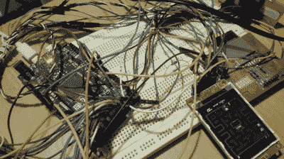

# 吃豆人证明了 Due 比 Uno 更重要

> 原文：<https://hackaday.com/2016/01/30/pacman-proves-due-is-more-than-uno/>

如果你想知道老的 Arduino Uno 和像 Arduino Due 这样的新学校 Arduino 之间的区别，这里有一个非常生动的例子:[DrNCX]为 Due 编写了一个令人惊叹的 Pacman 克隆，看起来就像街机一样玩。(视频嵌入休息下方。)

Uno 和 Due 的比较不太公平。Due 运行在一个 84 MHz、32 位 ARM Cortex-M3 处理器上。它和联合国组织不是一个级别的。尽管如此，我们认为这是一个例子，说明了从升级到更快的微处理器的扩展可能性。例如，视频同时输出到 ILI9341 TFT 屏幕*和*外部 8 位 VGA。

除了为部件使用一些非常好的(标准)库，看起来[DrNCX]并不需要诉诸任何特殊的诡计——只是大量的游戏逻辑编码。所有的代码都在 GitHub 上，你可以查看。

老的 Arduinos 能做到这一点吗？相比之下，我们在 AVR 平台上见过的最好的 Pacman 是基于 ATmega328 的 [RetroWiz](http://hackaday.com/2014/01/25/update-from-wayback-avga-reborn-as-retrowiz/) ，尽管它的时钟速度是股票 Uno 的两倍。然后还有 Hackaday Editor [Mike Szczys]的 [1 像素 Pacman](http://hackaday.com/2015/06/01/1-pixel-pacman/) ，但这是作弊，因为它使用了 Teensy 3.1，这是另一种快速 ARM 芯片。人们总是问 8 位和 32 位项目的界限在哪里。一个正派的吃豆人是试金石吗？

 [https://www.youtube.com/embed/2Hdzr6m4QdU?version=3&rel=1&showsearch=0&showinfo=1&iv_load_policy=1&fs=1&hl=en-US&autohide=2&wmode=transparent](https://www.youtube.com/embed/2Hdzr6m4QdU?version=3&rel=1&showsearch=0&showinfo=1&iv_load_policy=1&fs=1&hl=en-US&autohide=2&wmode=transparent)

