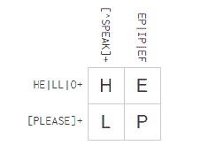

# 纵横字谜帮助你学习正则表达式

> 原文：<https://hackaday.com/2016/01/31/crosswords-help-you-learn-regular-expressions/>

正则表达式可能看起来晦涩难懂，但是如果你做任何类型的软件，它们都是强大的黑客工具。显然，如果您正在编写软件或使用 grep、awk、sed、Perl 或任何编程语言之类的工具，正则表达式可以简化许多任务。即使您不直接需要它们，正则表达式搜索也可以帮助您分析源代码、搜索网表，甚至分析从传感器捕获的数据。

如果你已经使用正则表达式很长时间了，它们不会很难。但是第一次学习它们可能会很乏味。除非你尝试过[正则表达式填字游戏](https://regexcrossword.com/)。线索是正则表达式，行和列都必须匹配相应的正则表达式。

例如，考虑这个谜题(已经填好了):

这个谜题有一个主题(披头士)。第一条交叉线索表明这两个字符必须是 he 或 LL 或者一个或多个 o(在本例中是两个)。第一个向下的线索说，字符不能是 S，P，E，A 或 k。因此，即使第二个交叉线索说，左下角的单元格可以是 A(请)，这将违反向下的线索。

当然，这是一个超级简单的谜题，但该网站还有更多难度不断增加的谜题。如果你更喜欢你的硬件里的[拼图，那也没问题。如果你想解决不同类型的难题，你可以看看](http://hackaday.com/2014/05/14/electronic-puzzle-box-uses-only-discrete-components/)[我们的综合](http://hackaday.com/2015/12/23/the-hackaday-2015-omnibus-a-puzzle-so-dense-even-we-dont-know-the-answer/)。