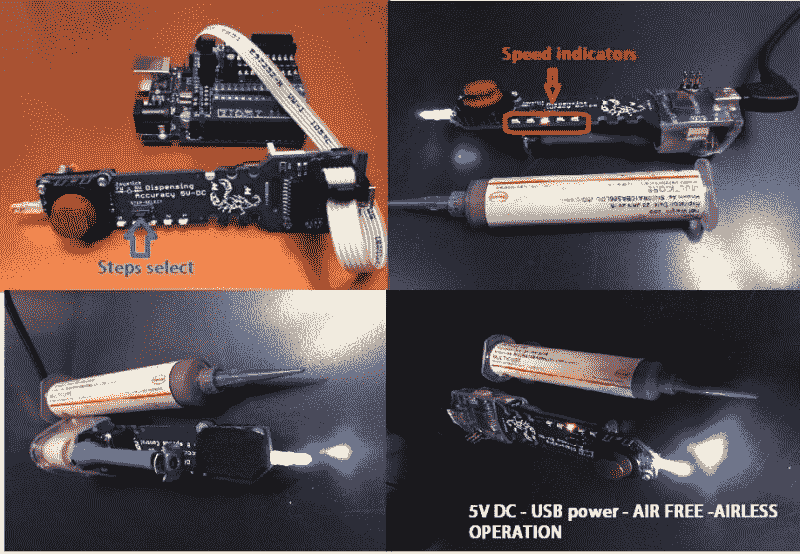

# 锡膏分配器没有 3D 打印零件！

> 原文：<https://hackaday.com/2016/02/03/solder-paste-dispenser-has-no-3d-printed-parts/>

如果你从未使用过锡膏分配器，那你就错过了。想想总是用蹩脚的烙铁，然后第一次用高端的。突然间，你真的不擅长焊接东西了！有点像那样。

大多数锡膏分配器使用压缩空气，这需要额外的设置来使用，你可能没有。[这个项目](https://hackaday.io/project/9404-solder-paste-dispenser-5v-power-usb)的目标是制造一个锡膏分配器，它不使用压缩空气，也没有任何 3D 打印部件(以防你没有 3D 打印机)——看起来发明者【MikeM】成功了！

这是一个非常简单的装置，建在印刷电路板上。您可以选择所采取的步骤，并使用小操纵杆控制输出。自制线性致动器(螺纹杆和螺母)允许您非常精确地分配任何基于注射器的焊膏、胶水或环氧树脂。

这里有一些照片，让您更好地了解 PCB 如何与注射器配合工作。您可以查看[MikeM]的博客以获取更多照片。

当然，还有一个快速演示:

 [https://www.youtube.com/embed/QcRrEAo1YXs?version=3&rel=1&showsearch=0&showinfo=1&iv_load_policy=1&fs=1&hl=en-US&autohide=2&wmode=transparent](https://www.youtube.com/embed/QcRrEAo1YXs?version=3&rel=1&showsearch=0&showinfo=1&iv_load_policy=1&fs=1&hl=en-US&autohide=2&wmode=transparent)

这与我们几年前分享的这个[其他设计](http://hackaday.com/2014/07/05/electric-solder-paste-dispenser-speeds-up-reflow-prep/)非常相似。想知道哪个效果更好？