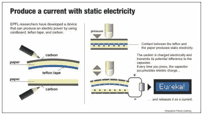

# 纸的力量

> 原文：<https://hackaday.com/2016/02/02/power-from-paper/>

喜剧演员史蒂夫·赖特曾经说过(以他单调的方式):

> “我们住在靠静电运行的房子里。如果我们想做饭，我们必须很快脱下毛衣。如果我们想运行搅拌机，我们必须在头上摩擦气球。”

事实证明，你只需要一些纸、特氟隆胶带和一支铅笔就能产生一点电。来自 EPFL 的一个团队与东京大学的研究人员合作，在一次 MEMS 会议上展示了这样一种设备。(看看他们的视频，在休息时间下面。)

 你可能不会从他们的设备中获得足够的电力来驱动你的搅拌机，但它确实可以应用于为高效的可穿戴设备发电。史蒂夫·赖特所做的是利用[摩擦电效应](https://en.wikipedia.org/wiki/Triboelectric_effect)——一个将两个绝缘体摩擦在一起充电的奇特名字。在 EPFL 装置中，纸和特氟隆是绝缘体。铅笔状石墨作为导体将电荷带走。有趣的部分是这样的:通过使用砂纸印迹，研究人员在胶带和纸上都产生了粗糙的表面，增加了电荷产生的面积。根据经验，产量增加了六倍多。一个电容器稳定电流，因为当纸和胶带接触时，该设备输出脉冲。

以每秒 1.5 次的速度推动纸和特氟隆三明治，就能产生足够的能量来驱动微型传感器。该设备大约 3 英寸乘 1 英寸，可以产生高达 3 伏的电压。您可以在下面的视频中了解更多信息，您将看到该设备操作一个小 LCD，并且有足够的细节，您应该能够复制该设备。

 [https://www.youtube.com/embed/LHcRJ3SyZeU?version=3&rel=1&showsearch=0&showinfo=1&iv_load_policy=1&fs=1&hl=en-US&autohide=2&wmode=transparent](https://www.youtube.com/embed/LHcRJ3SyZeU?version=3&rel=1&showsearch=0&showinfo=1&iv_load_policy=1&fs=1&hl=en-US&autohide=2&wmode=transparent)

