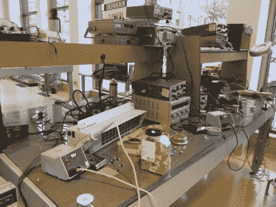
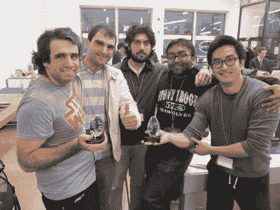
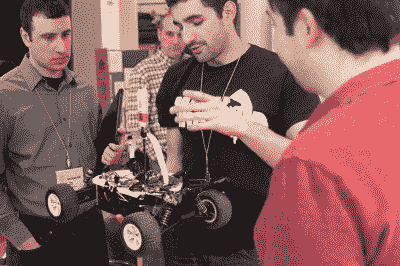
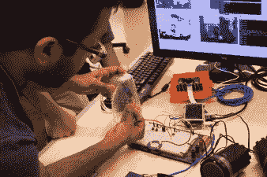
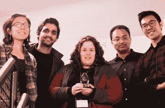
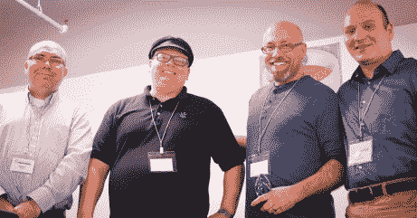

# 这是你如何运行一个黑客马拉松:科技谷的重心

> 原文：<https://hackaday.com/2016/02/04/this-is-how-you-run-a-hackathon-tech-valley-center-of-gravity/>

黑客马拉松有什么不让人喜欢的？为周末提供能量的垃圾食品和咖啡因；伴随成功而来的高潮和释放蓝色烟雾时的低谷；随着时间的流逝，绝望地寻找灵感；向评委们绞尽脑汁，希望演示中一切正常。黑客马拉松是黑客世界的接触运动，带来顶级竞争者和渴望的暴发户，如果做得好，你可能会吸引感兴趣的“平民”和其他新手，他们会从他们目睹的事情中抓住黑客漏洞。

这就是 1 月最后一个周末在纽约特洛伊的[科技谷重心](http://www.tvcog.net/)的场景。作为 2016 年的新活动，CoG 今年将举办四场硬件黑客马拉松，每场都有不同的主题。这次活动的主题是“物联网”，号召所有人都来竞争吹牛的权利和超过 1000 美元的奖金。参与竞争的动机包括一些知名的企业赞助商，比如 AT & T，以及像 SparkFun 的【杰夫·布兰森】这样的公司提供的评判和指导。还有源源不断的食物和饮料，当地媒体的饱和报道，以及你卑微的 Hackaday 作家和他的儿子，他们带着一小包 Hackaday 赃物和好奇心去特洛伊旅行，看看自从我们上次在[参观他们辉煌的新家](http://hackaday.com/2015/08/21/tech-valley-center-of-gravity/)的盛大开业以来，CoG 怎么样了。我们没有失望。

### 玻璃下的黑客行为

Hacking at street level – one of the electronics benches at CoG.

当我去年参观 TVCoG 时，首先打动我的是空间本身。CoG 坐落在一个旧的市中心百货商店里，被亲切地修复成昔日的辉煌，在我在 Hackaday 上看到的评论和亲自参观的黑客空间中是独一无二的。大多数黑客空间都是孤立的地方，隐藏在旧工厂或仓库的角落里。事实上，CoG 以前的家是一个废弃的麦当劳，位于停车场的地下室，看起来更像我见过的黑客空间。但这个新空间位于一个繁华的市中心，黑客攻击发生在一个巨大的、灯火通明的房间里，房间背后是临街的大窗户。

这种地面上的工作条件可能会让一些黑客感到不安，但我可以立即看到这种安排的好处:人们只是从街上走进来，环顾四周，看看所有的喧闹是什么。这对于社区来说有着巨大的价值，无论是在招募新的付费会员方面，还是在“正常化”公众对黑客的看法方面。当人们看到黑客行为到底是什么时，它会改变他们的事情，即使它不会激励他们自己拿起烙铁，至少他们会有这样的印象，即我们所做的大多是无害的。向 CoG 致敬，它利用了这个位置，并将自己融入了社区。

### 如果他们举办了一个黑客马拉松，却没有人出现呢？

CoG 在黑客马拉松之前的公关工作做得很好。CoG 董事会主席埃里卡·伊恩诺蒂(Erica Iannotti)领导了让黑客马拉松受到关注的努力，其中包括在活动开始前的早期接触黑客日。我很乐意在这里拍拍哈卡戴的背；多名与会者引用了我们关于黑客马拉松的故事，作为他们了解该活动的方式。事实上，最终赢得两项大奖的团队是在看到我们的帖子后从纽约市赶来的。

当地媒体的报道也是活动成功的关键。不仅新闻机构在黑客马拉松期间被邀请，而且事先也有很好的报道。当地早间电视新闻节目在前一天设置了一个遥控器，每半小时进行一次剪辑，并号召 CoG 成员在长凳上为摄像机工作。这种努力似乎在当地对这一事件的讨论中得到了回报——[多家](http://blog.timesunion.com/business/noise-pollution-target-of-troy-weekend-hackers/72496/) [报纸](http://www.troyrecord.com/technology/20160131/hackathon-unleashes-techies-creativity) [报道](http://muse.union.edu/makerweb/2016/02/01/we-won-best-smart-city-solution-at-the-2016-iot-hackathon/) [报道](http://www.union.edu/news/stories/2016/02/union-hackers-take-home-prize.php)黑客马拉松。如果你计划在你的空间举办一次黑客马拉松，这里有很多关于如何正确完成的知识。

### 十三支队伍，五个奖项

十三个队组成比赛。其中一些是特设团队，人们只是出现，并把其他人拉进来，在活动开始时为一些不成熟的想法工作。一些团队对他们要做的工作有一个很好的想法，甚至有一些工具包放在一起开始。不幸的是，我没能来参加活动的开幕式；我只是在那里见证结果，看颁奖典礼。但我有机会与几个团队交谈，我对相当多的团队印象深刻，其中大多数都在一个或多个类别中获奖。

Team Flame Warden with their two awards.

当晚的大赢家是[火焰守护者](http://devpost.com/software/fire-alarm-iot)，获得了“最佳智能建筑解决方案”和“最有可能获得商业成功”的奖项。最近，一对母子因一氧化碳中毒死于大雪封山的汽车中，受到这一悲剧的启发,《火焰守护者》希望在建筑火灾后帮助避免类似的中毒事件。基本上是一个带有一套传感器的增强型烟雾探测器，火焰看守员将观察房间的火灾迹象-一氧化碳水平，烟雾颗粒和可见火焰的图像分析。它还可以监控房间的占用情况，并能够通过智能手机应用程序提醒消防员有人可能需要救援。对于一个 36 小时的构建来说，这是一个相当完美的项目。

【德鲁】把路虎扔给评委。图片来源:伊森·西利

我的另一个最爱，也是“最佳智能交通解决方案”的获奖者是由【德鲁·皮尔彻】一人团队设计的 [4G 路虎](http://devpost.com/software/4g-earth-rover)。设想作为一个移动探索平台，当 4G 连接到 RC 车载相机被证明滞后时，地球漫游者遇到了一些现实世界的限制。[Drew]设法解决了大部分的问题，并在两个街区外的一个废弃的停车场上运行漫游车。

其他奖项是“最佳智能医疗解决方案”，授予[Chris]和[Robert]他们的[基于光子的 WiFi 空气质量监测系统](http://devpost.com/software/cog-hackathon-air-quality)；[Amanda]、[Arsal]、[Htoo]和[Gab]因其[“嘈杂或美好”](http://devpost.com/software/noisy-or-nice)街道噪音监测装置获得“最佳智能城市解决方案”；罗伯特凭借[【一个更好的捕鼠器】](http://devpost.com/software/a-better-mousetrap)获得“人民选择”奖，每当一只老鼠被活的捕鼠器捕获时，它就会给你发短信。我喜欢那个，因为它让我想起了 2015 年 Hackaday 奖的小规模版[野猫陷阱](http://hackaday.com/2015/08/23/hackaday-prize-entry-feral-cats-phone-home-with-das-katzetelegraf/)。

 [![[Gab] works on "Noisy or Nice"](img/6c6631c9202b4862072e3aa2b4bc21e3.png "Gabi Noisy or Nice-8763")](https://hackaday.com/2016/02/04/this-is-how-you-run-a-hackathon-tech-valley-center-of-gravity/gabi-noisy-or-nice-8763/) [Gab] works on “Noisy or Nice”  Flame Warden demo [![[Severin] and the "Twitch Deathbot"](img/f848efa49131c04754f2e1cdb6d334e2.png "Battle Bot Construction-8787")](https://hackaday.com/2016/02/04/this-is-how-you-run-a-hackathon-tech-valley-center-of-gravity/battle-bot-construction-8787/) [Severin] and the “Twitch Deathbot”  “Best Smart City” winners  “People’s Choice” winners [")](https://hackaday.com/2016/02/04/this-is-how-you-run-a-hackathon-tech-valley-center-of-gravity/winner-healthcare-9609-1/) “Best Smart Healthcare Solution” winner

所有图库照片的照片致谢:[伊森·西利]

这是一个伟大的事件，我认为[杰夫·布兰森]真的抓住了它，当他说，“我见过更大的黑客马拉松，但没有更好的。”祝贺所有的参与者、获胜者，以及第一次尝试就取得胜利的 CoG。请务必为 4 月 16 日和 17 日的下一次黑客马拉松制定计划，主题是“虚拟和增强现实”如果是像这样的，那将会是一场爆炸，你会吃得很好。