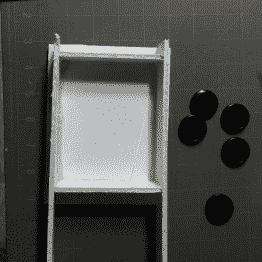
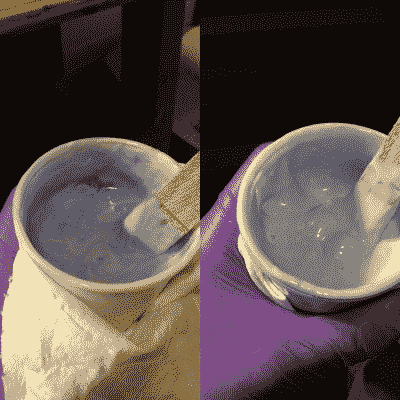
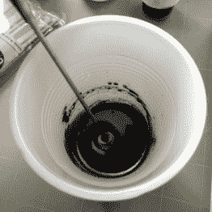

# 学习树脂铸造技术:复制塑料零件

> 原文：<https://hackaday.com/2016/02/09/learn-resin-casting-techniques-duplicating-plastic-parts/>

树脂铸造使您能够生产出没有完整的 CNC 和注射成型装置就无法生产的零件。一台好的 3d 打印机要花费 300 到 600 美元。这是用于原材料、树脂、染料、压力室和可选的真空脱气装置。一个好的树脂铸造装置将使你生产出比注射成型更坚固的零件，并且具有惊人的精度、耐温性和强度。我将从黑客的角度讲述使用树脂浇铸的各种技术，从简单到高级。

The coat just isn’t the same without the full set.

今天我将复制一部分。我在家里寻找一个悬而未决的项目。我希望我有一个更令人兴奋的部分来复制，比如一个坏掉的铰链或者一个我想要不同颜色的塑料盒，但是我在我最喜欢的外套上掉了一个扣子。所以我要做一套配套的按钮。

你需要一个基本的树脂铸造装置。对于原材料，我复制了《游击队指南》中的建议——在你自己的车间里制作东西的标准手册。到目前为止，一切进展顺利。我也有很多乐趣铸造聚氨酯橡胶的车轮和灵活的部分，但这是另一个章节。

我建议在一个方面偏离游击指南。如果你预算有限，绝对不要购买真空脱气室。购买压力铸造设备。只要你在压力下固化你的模具和树脂，你就不会有很多问题。最物有所值的将是一个由颜料罐和打折压缩机制成的[廉价压力铸造](http://wp.me/pk3lN-Nhf)室。我在当地的进口商店等待 20%的折扣，花了大约 150 美元买了一套设备，包括大麻、呼吸器、压缩机等等。

我发现还有一些其他的配件非常方便。一个是[微型调漆机](http://www.amazon.com/Badger-Air-Brush-Co-121-Paint/dp/B000BROV02)；我的大部分树脂浇铸都是小规模完成的。硅树脂不太在意，但树脂要求混合非常非常好，否则会固化不正确(通常具有奇怪和令人困惑的材料属性，像奇怪的橡胶，或者同时超级脆和粘)。我还推荐一盒丁腈手套，外科医生可能会用的那种[好手套。这些化学物质中的大多数今天不会伤害你，但是你可能会因为持续暴露而对它们过敏，这在明天会非常不方便。此外，值得信赖的电子精密秤。我花 25 美元在易贝买了一个二手的美国制造+-0.01 克的秤。它极大地提高了我的成绩。我还建议购买一块软橡皮泥砖。这是一种油基的、永不干涸的模型粘土。确保你买了一个特别提到不含硫的，否则会影响你的硅胶。你可以用粘土对塑料部件做各种各样的魔术。它也可以重复使用。最后，一些铅块或子弹袋和一吨橡皮筋；这些是用来把你的模具固定在一起的。](http://www.amazon.com/Haylard-Health-Kimberly-Clark-Purple-Nitrile/dp/B00E4UOKNK/r)

### 准备要复制的零件

Remove the parts you want to duplicate and clean them thoroughly.

一旦你有了自己的设置，这个过程就相对简单了。首先从组件中取出塑料部件，并彻底清洁。硅树脂会发现非常小的缺陷。你会复制指纹和灰尘。相当壮观。你可能也想利用这段时间用[脱模剂](http://www.moldmoreparts.com/specialized/a324.html)喷塑料。你会想让释放干燥和抛光了。它通常是可选的，因为硅树脂不能很好地粘在许多热塑性塑料上，但是如果你有一个可疑的纹理表面，你也可以这样做。这可能会导致一些细节丢失。

大多数复制的零件需要两部分模具。你将保持零件在适当的位置，铸造模具的一半，然后，将零件留在硅胶中，你将在顶部铸造配套的硅胶模具。我采用了两种方法。我通常的做法是使用像橡胶水泥或蓝色大头钉这样的轻质胶水将零件固定在一个平面上，然后在这个平面上用模型粘土制作键和浇口。我通常用这种方法在两半模具之间得到更好的密封。

不幸的是，我生成了一个[周失败](http://hackaday.com/2016/01/15/fail-of-the-week-not-all-mold-releases-release-all-molds/)；因此，在本教程中，我将采用另一种方法，即将零件嵌入粘土模型的底部。我发现这种方法对于非雕塑家来说很难在平面上工作，而且粘土到处都是。它工作得很好，但不要因此而却步。我甚至会说这是两种方法中更好的一种。如果你想玩得开心，就不要用硬粘土做模型。

  Method 1: Glue to a flat surface.  Method 2: Build base out of modeling clay.

### 制作零件的模具

所以，首先拿一些泡沫芯，把你的零件放在上面。想想倒酒的方向。你将取代空气，代之以气泡。你需要一条畅通的路径让空气离开，让树脂进入。倾倒完成后还会有一些闪烁。你做的模具越好，闪光就越少。在这种情况下，我做了一件可耻的工作，所以在我的工作完成之前，有一堆清理工作要做。我认为按钮的边缘是最容易修复的缺陷，所以我选择它作为我的两部分模具的分界线。

然后我在模具底部铺上橡皮泥。我的粘土非常硬，所以我把它放在一个塑料袋里，放在热水浴中软化。我将按钮无聊的一面朝下压入模具。我想先把硅胶最难的一面拍下来。然后我用食指在粘土上按了几个索引孔。这将有助于我稍后排列模具。我会建议使用更精确的东西，比如笔帽，但这是当时手头上的东西。最后，我拿起一根牙签，小心翼翼地雕刻粘土，在每个按钮周围画出一条漂亮的线条。我还清除了按钮孔，因为这是一个好主意，有困难的几何图形只在模具的一边捕捉。

  Layout your parts.  Build a box using hot glue and foam core to fit your mold.  Press the parts into the clay. Make sure they are sealed all the way around.  Finally, press in some alignment pins with a finger, or preferrably a more precise shape, like the back of a pen.

Stir forever.

接下来是有趣的部分。浇注模具的前半部分。对此，我估计大约 190 克就足够了。我用了一个非常复杂的方程式得出了这个数字；我的秤只能重达 200 克，这看起来很多。仔细称出硅树脂的两种成分。同样，当你不这样做的时候，非常非常令人费解的事情就会发生。接下来，永远搅拌。在硅树脂开始凝固之前你有一段时间，所以要搅拌。搅拌到手臂发烫。你不能做得过分。你应该得到一种颜色非常均匀、充满气泡的黏液。如果你有一个真空脱气室，现在是时候这样做了。接下来是倒酒时间。

如果你要压铸树脂，你必须在压铸树脂的压力下压铸模具。这样，任何滞留在模具中的空气都会在铸造压力下压缩到合适的尺寸。对于一个详细的模具，拿一把刷子，轻轻地将硅树脂刷在最详细的表面上。然后，拿起硅胶，尽可能地把它举得比正面高，开始往模具里注入一股细流。这打破了大部分较大的气泡，并把它们换成对压铸过程影响不大的较小气泡。倒入直到填满模具，然后将模具尽可能水平地放入压力室。

  Start low.  Pour as high and as thin a stream as you can.  These bubbles don’t matter.  Put it level in your pressure chamber. As you can see, I have a very high-tech way of leveling my molds.

取决于你的硅胶，现在来了等待。我的需要 12 个小时来治愈。一旦这一阶段结束，将模具从腔室中取出，并将其从泡沫芯中取出。把它翻过来，小心地去掉粘土。理想情况下，您可以这样做，而不会干扰您想要复制的项目。现在，你可以继续铸造模具的下半部分，然后在模具中雕刻出浇口，或者你可以现在用模型粘土制作浇口。两者各有利弊。对于这一个，我决定用粘土模型制作云杉。

请注意浇口是如何放置的，以便空气可以向上流出模具，而不会留下气泡。我拿了一把剃刀，压在浇口的边缘，以尽量减少与零件的接触面积。

  Spray the cleaned mold with release. Get all sides of the mold as some silicone will leak over during the next step.  I find this is a really good way to make tiny sprues using clumsy human hands.  Try to get the area where the sprues touch to be as small as possible.  Time for another pour!  And, back to the pressure chamber for another 12 hours.

一旦霉菌固化，是时候看看我们所有的工作是否有回报了。首先，通过简单地从模具边缘切掉四分之一英寸(6 毫米)来分开两半模具。然后小心地剥开两半。一旦你把它们分开，就把所有的原件和粘土都取出来。如果你决定不制作陶土云杉，这就是你用凿子在云杉上雕刻的地方。

将模具的两半合在一起，并把它们夹在不可弯曲的东西中间。用橡皮筋包裹整个组件。

### 终于到了扮演角色的时候了！

准备好你所有的装备。规模是最重要的。权衡利弊，以获得一个好的估计，你需要多少树脂来填充模具。然后在这个数字上加上一个合适的数目，在这种情况下，我只是增加了一倍，对于短期来说，浪费总比重做好。

把一个塑料杯放在秤上，然后归零。往杯子里滴几滴着色剂。对于这种大小的东西，只要将搅拌器的一端浸入颜料罐中，就足以将所有部分染色。再次去皮。按照你的树脂描述的比例倒入 A 和 B 部分。然后永远混下去。同样，你混合得越多，结果就越好。

将树脂倒入模具，直到填满为止，然后轻敲模具侧面。树脂的水平应该下降。轻敲和填充，直到你再也不能。然后将整个组件放入压力室，再次进行压力铸造。现在我们等着。

  The equipment you’ll need for this step. A scale. Mixing sticks or a mixer. Dye. The two parts of the resin. A cup. Coffee.  Weigh the item you are duplicating. I typically double the value for my first pour.  Take all the orginals and clay out of your model. If you didn’t add clay sprues this is the point where you’ll be carving sprues into one of the sides.  We’ve captured the detail pretty well.  The amount of dye/pigment you’ll need. It’s very small.  The same amount of dye around the bottom of the cup.  Stir Forever. FOR. EVER. Or two minutes-ish, whichever comes first.  This caused some flashing issues. Too many bands, and the foam core should be flush with the ends of the mold.  Finally, pour!

一旦我们达到了树脂的脱模时间(这通常可以在数据表中找到)，就可以安全脱模了。取下所有橡皮筋，分离模具。因为我用了太多的橡皮筋和厚木板，所以我有一些严重的闪光问题。虽然这些很容易脱落，但我不得不花更多的时间打磨边缘。

Flashing issues caused by too many rubber bands.

Broke out the buttons. One was a goner.

To polish small parts I like to chuck a glue stick in my drill and then melt the end with a lighter.

A scotch-brite pad followed by some steel wool matched the polish of the original buttons.

各部分完成后，我把扣子缝回了外套上。我不是最擅长剪裁的，所以我肯定我会再掉一个扣子，但没关系，因为我有三个多余的等待那一天！即使我失去了它们，我还有一个模子。如果我想看起来像门房，我甚至可以给它们涂上不同的颜色。相当酷！

  The new buttons mixed in with the old. The differences are hard to spot if you don’t know to look.  Back to its former glory.