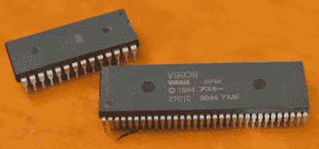

# 黑客日链接:2016 年 2 月 7 日

> 原文：<https://hackaday.com/2016/02/07/hackaday-links-january-7-2016/>

很长一段时间以来，星舰企业号最初的 11 英尺长的屏幕模型来自*星际迷航*最初的系列——*NCC 1701。没有血腥的 A、B、C、*或 *D、*”——被收藏在 DC 华盛顿州的史密森尼航空航天博物馆。最近的参观者可能已经注意到企业号不再展出。世界上最好的飞机管理员正在修复它。有几个很棒的视频展示了恢复一个文化偶像要花多少钱。

上周末，哈卡戴参观了加州富勒顿的 Sparklecon。这意味着这个月的最后一个星期六我在洛杉矶。那有什么特别的？W6TRW 交换会议在雷东多海滩诺斯罗普·格鲁曼公司举行。[这是从那个](https://hackaday.io/page/1490-a-visit-to-w6trw)拍的照片。我找到的最好的东西？一个*木制*声耦合器调制解调器售价 15 美元。一旦我告诉摊位上的伙计这是什么，价格就涨到了 20 美元。还是值得的。

现代电脑最糟糕的是什么？它们都是液晶显示器，这意味着更差的分辨率，糟糕的色彩空间，以及非常宽的显示器。这样做的结果是完全没有屏幕保护程序。不要害怕，[因为飞行烤面包机回来了](http://mcuoneclipse.com/2016/01/31/the-return-of-the-3d-printed-flying-toaster/)，这次是作为 SD 卡持有者。这是 3D 打印的，所以如果你有一些白色，银色和黑色的灯丝，你知道该怎么做。

[本周，USB 黑仔不知何故几次触发了提示热线](http://hackaday.com/2015/10/10/the-usb-killer-version-2-0/)。我们以前见过它，*但是我们没有再见过它。*令人惊讶的是，除了不应该存在的奇怪的 Indiegogo 活动，没有人[制造出自己的 USB 杀手。这是你的行动呼吁:建立一个 USB 杀手，我会测试出来。](http://hackaday.com/2015/11/06/the-usb-killer-now-a-crowdfunding-campaign/)

An SDIP-64 chip compared to a DIP-28 chip. Note the finer lead spacing on the SDIP device.

标准 DIP 封装芯片的种类比你想象的要多。其中最奇怪的——至少在涉及到性能板结构时——是 SDIP，或超薄双列直插式封装。SDIP 的引线间距不是标准的 0.1 英寸，而是 0.070 英寸。[查克]在寻找 SDIP DIP 适配器时遇到了一些问题，直到他发现了连接器公司不想让你知道的这个 *[惊人的技巧](https://www.element14.com/community/thread/43589/l/sdip-ic-to-dip-conversion?displayFullThread=true)。*只需将芯片以 45 度角插入，弯曲几个引脚，就可以开始了。